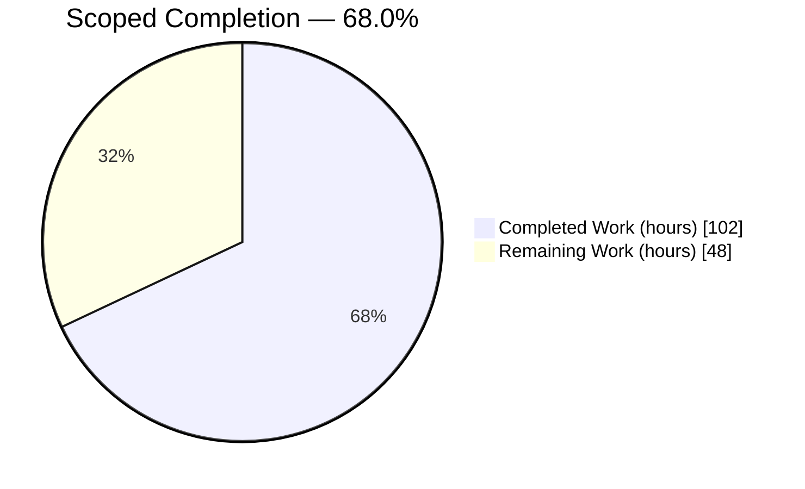
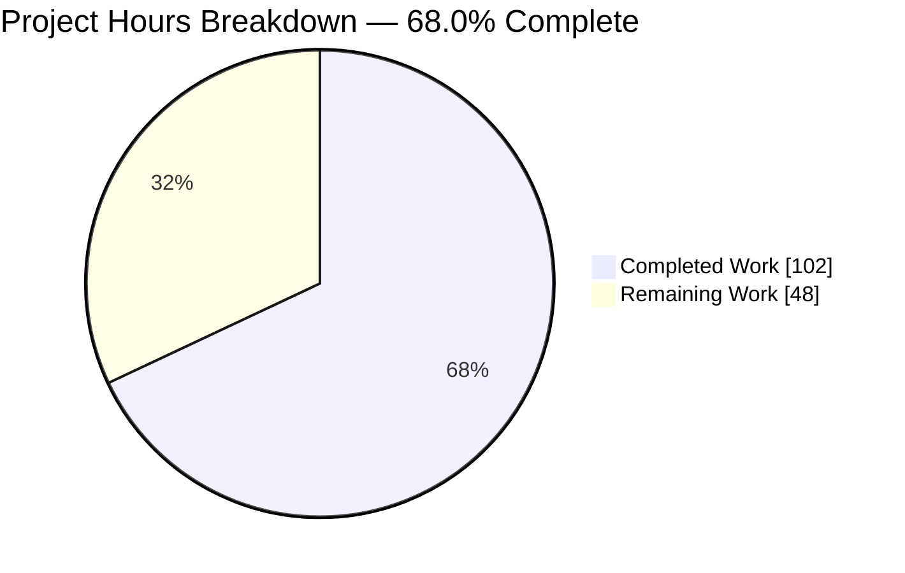
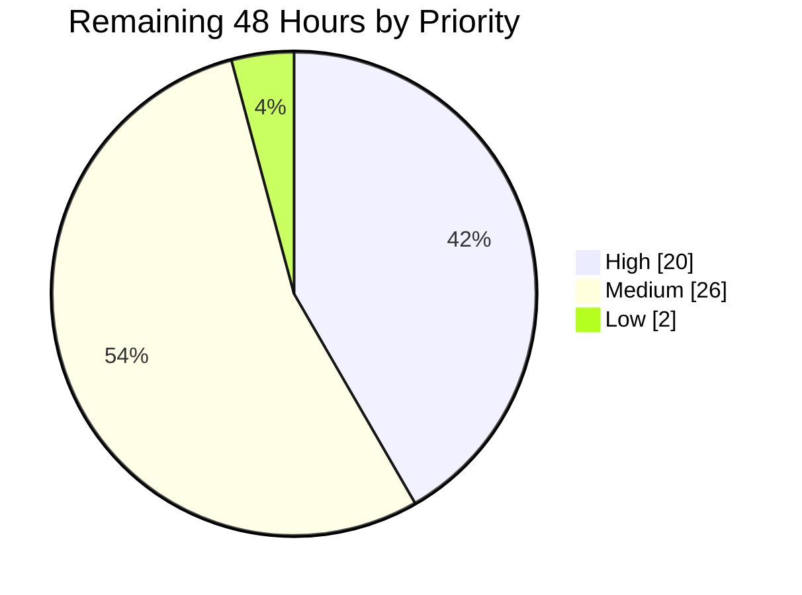
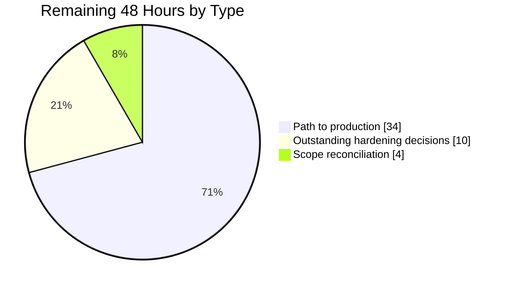

# 1. Executive Summary

## 1.1 Project Overview

`server.js` is the only application file in `hao-backprop-test`, a zero-dependency Node.js HTTP endpoint. It began as a fourteen-line scaffold answering every request `200 OK`, with no error handling, shutdown path, request validation or resource ceilings. This project hardened all five concerns while holding the observable contract fixed: `GET /` still returns a `200 text/plain` fourteen-byte `Hello, World!\n`, and the startup log is unchanged. Scope is one file on Node's core `http` and `process` APIs.

## 1.2 Completion Status



*Completed: Dark Blue `#5B39F3` · Remaining: White `#FFFFFF`*

| Metric | Value |
|---|---|
| **Total Hours** | **150** |
| Completed Hours (AI + Manual) | 102 |
| Remaining Hours | 48 |
| **Percent Complete** | **68.0%** |

`102 / (102 + 48) × 100 = 68.0%`, covering scoped hardening and the path to production.

## 1.3 Key Accomplishments

- ✅ **Error handling** — bind failures, process exceptions and rejections, stream faults and handler throws all contained.
- ✅ **Graceful shutdown** — both signals drain and exit `0`, with a repeated-signal guard and forced-stop deadline.
- ✅ **Input validation** — only `GET` and `HEAD` served; every other method gets `405` with `Allow`.
- ✅ **Resource cleanup** — idle sockets released at shutdown; ports release reliably.
- ✅ **Robust processing** — explicit request, header and keep-alive deadlines, granularity pinned.
- ✅ **Request-line validation** — malformed lines, duplicate `Host` fields and invalid targets refused `400`.
- ✅ **Protocol-layer refusals** — unrecognised methods and `CONNECT` get the same `405`, byte for byte.
- ✅ **Contract preserved** — response, headers, startup log and manifests unchanged; zero dependencies.

## 1.4 Critical Unresolved Issues

**Eight items remain open** — five across four of the five concern areas reviewed (error handling is closed), and three at delivery level.

| Issue | Impact | Owner | ETA |
|---|---|---|---|
| **Input validation:** no route validation or `404` contract; every path answers `200` (`server.js:406-413`) | No path-scoped monitoring, cache policy or future control point. Exposure is bounded: one static response, no data sink, target never reflected | Backend + product owner | 1 day |
| **Resource cleanup:** no connection-cardinality ceiling; concurrent sockets unbounded | On an exposed bind a peer can hold sockets toward the descriptor limit. Every socket stays bounded in time | Backend | 1–2 days |
| **Robust processing (2 items):** runtime version not pinned; `server.timeout` remains `0`, so no per-socket inactivity guard | A deployment may run an unintended Node version; an idle established socket has no inactivity ceiling | Platform + Backend | 1–2 days |
| **Graceful shutdown:** an orderly drain with one active incomplete socket exits `1`, not `0` (`server.js:459-472`) | An orchestrator treating non-zero as a crash flags a routine rolling restart as a failure | Platform | 0.5 day |
| **Delivery:** OS-level signal delivery not exercised on a target platform | Handler registration and drain behaviour are verified; the platform's own delivery is not | Platform | 0.5 day |
| **Delivery:** no automated regression suite guards the response and timing contracts | Both reap ceilings, the forced deadline and drain ordering would not be caught by CI | Backend / QA | 2 days |
| **Delivery:** delivered scope is 785 lines against a specified ~110 and awaits sign-off | Review and maintenance burden. No functional defect | Tech lead | 1 day |

The robust-processing row carries two items, so seven rows cover all eight. See Sections 5.2 and 2.2.

## 1.5 Access Issues

**No access issues identified.** Nothing blocks build, verification or deployment — this project has no external dependency.

| System/Resource | Type of Access | Issue Description | Resolution Status | Owner |
|---|---|---|---|---|
| Provisioned secret `cxzczx` | Runtime environment | Present in the environment but read nowhere in the codebase | Informational — no consumer exists | Platform |
| `HOST` / `PORT` | Runtime environment | Optional overrides defaulting to `127.0.0.1:3000`; neither is required | Not blocking | Platform |
| Remote branch publication | Git remote | Publishing requires the operator's own remote credentials | Not blocking | Operator |

## 1.6 Recommended Next Steps

1. **[High]** Sign off or reduce the delivered scope against the specified change (4h).
2. **[High]** Decide the route and `404` contract, and the connection-ceiling and inactivity policy (10h).
3. **[High]** Pin the runtime in the deployment image and CI; verify OS-level signal delivery (6h).
4. **[Medium]** Stand up a regression harness for the response and timing contracts (8h).
5. **[Medium]** Configure edge bounding, TLS and log shipping before non-loopback exposure (11h).

# 2. Project Hours Breakdown

## 2.1 Completed Work Detail

| Component | Hours | Description |
|---|---:|---|
| Error handling across server, process, stream and handler layers | 10 | `server.on('error')` with `EADDRINUSE`/`EACCES`/generic branches, `uncaughtException` and `unhandledRejection` nets, `req`/`res` stream listeners, and a handler catch-all mapping to `500` (`server.js:329-339, 414-423, 517-540`) |
| Log-safe diagnostic rendering and bounded client-fault emitter | 12 | Allowlisted `name`/`code`/`syscall` tokens plus a sanitised, quoted, 200-character-capped message; stacks and `cause` withheld; socket faults rate-limited to ten records per sixty-second window with a suppressed-count line on every terminal path (`server.js:43-199`) |
| One-shot state-aware response path | 6 | A single responder for all five response classes, gated on response state rather than intent, with write-failure escalation to the handler catch (`server.js:283-320`) |
| Graceful shutdown, connection draining and forced-stop deadline | 11 | Signal handlers registered before `listen()`, exit-status escalation, repeated-signal guard, `closeIdleConnections()` in a `finally`, and an unref'd ten-second hard stop calling `closeAllConnections()` (`server.js:445-518`) |
| HTTP method validation and `HEAD` parity | 4 | `GET`/`HEAD` allow-list returning `405` with `Allow: GET, HEAD`; `HEAD` answers `200` with headers only (`server.js:384-412`) |
| Request-line, `Host` and request-target validation | 10 | HTTP/0.9 refusal, RFC 7230 §5.4 `Host` grammar with duplicate detection over `rawHeaders`, and request-target form validation — all length-bounded and non-backtracking (`server.js:201-255, 356-405`) |
| Protocol-layer refusal contract | 12 | `clientError` and `connect` listeners answering unrecognised method tokens and `CONNECT` with a byte-identical `405`, plus the four runtime parser replies reproduced verbatim and a raw socket responder (`server.js:542-769`) |
| Explicit timeout policy and enforcement granularity | 5 | Request, header and keep-alive deadlines assigned before `listen()`, with the connection scan interval pinned so each deadline is a stated ceiling rather than a version-dependent one (`server.js:14-31, 431-443`) |
| Environment-overridable bind configuration | 2 | `HOST` and `PORT` overrides preserving the `127.0.0.1:3000` defaults (`server.js:8-12`) |
| Baseline response-header policy | 3 | A single declared header set applied by the responder ahead of each call site's own map, and mirrored into the raw protocol response from that same constant (`server.js:33-41, 610-624`) |
| Inline documentation and root-cause annotation | 8 | 421 comment lines — 53.6% of the file — with each change block tagged to the concern it addresses and the reasoning recorded in place |
| Verification protocol execution and regression confirmation | 16 | The full protocol exercised across HTTP contract, lifecycle, configuration, timeout and fault-injection dimensions, with happy-path byte-identity re-confirmed each time |
| Scope discipline and zero-dependency invariant | 3 | Manifests held byte-identical, the dependency-free invariant maintained, and the eight unrelated repository fixtures left untouched |
| **Total** | **102** | |

## 2.2 Remaining Work Detail

| Category | Hours | Priority |
|---|---:|---|
| Route validation and `404` contract | 4 | High |
| Connection ceilings and per-socket inactivity guard | 6 | High |
| Runtime version pinning (deployment image and CI matrix) | 3 | High |
| OS-level signal delivery verification on the target platform | 3 | High |
| Scope reconciliation sign-off | 4 | High |
| Automated regression harness for response and timing contracts | 8 | Medium |
| Edge connection bounding and TLS termination | 6 | Medium |
| Structured log shipping and observability integration | 5 | Medium |
| Node 18.x / 20.x compatibility validation on real runtimes | 4 | Medium |
| Process supervision and restart-policy alignment | 3 | Medium |
| Non-loopback bind and DNS host validation | 2 | Low |
| **Total** | **48** | |

Priority split: **High 20h**, **Medium 26h**, **Low 2h**.

## 2.3 Estimation Methodology

Hours were derived per deliverable rather than from file size alone. Each completed component was sized against its category — a validation grammar or a protocol-layer contract carries substantially more effort per line than configuration — and the verification line reflects a protocol exercised repeatedly against the endpoint rather than written once. Remaining hours are sized the same way: the two outstanding hardening decisions are small in code and dominated by the authorisation they need, while the path-to-production items carry the effort of a first deployment of this service.

Confidence is **high** for twelve of the thirteen completed components and for seven of the eleven remaining items, whose scope is directly visible in the file. It is **medium** for the verification component, whose total spans repeated exercise of the same protocol and is therefore the least precisely attributable figure here, and for the four remaining items that depend on a target platform or a policy decision not yet taken — compatibility validation, edge configuration, observability integration and the regression harness. No estimate was padded to absorb unknowns; the areas of genuine uncertainty are named instead.

Total project hours are therefore **102 completed + 48 remaining = 150**, giving **68.0%** completion.

# 3. Test Results

All figures below were produced by executing the verification protocol against the delivered `server.js` on Node.js v22.23.1. The project intentionally carries no test runner — `npm test` is required to remain the npm placeholder that exits `1` — so verification is executed as a protocol of direct runtime checks rather than through a framework, and no coverage instrumentation exists to report.

| Area / Category | Framework | Tests | Passed | Failed | Coverage | What This Proves |
|---|---|---:|---:|---:|---|---|
| Build and static gates | Node `--check`, npm scripts | 4 | 4 | 0 | Not instrumented | The file parses clean, installs with zero dependencies, and the required `npm test` placeholder is intact |
| Happy path and method validation | Node core `http` client | 23 | 23 | 0 | Not instrumented | `GET /` returns the exact original response; `HEAD` sends headers only; seven other methods are refused `405` with `Allow`; dispatch is path-independent |
| Request-line, `Host` and target validation | Raw socket client | 12 | 12 | 0 | Not instrumented | Nine malformed request forms are refused `400` while valid HTTP/1.0 and absolute-form requests still succeed; a hostile encoded target is never reflected |
| Protocol-layer and parser limits | Raw socket client | 8 | 8 | 0 | Not instrumented | Unrecognised method tokens and `CONNECT` receive the same `405`; genuinely malformed tokens stay `400`; an oversized header block returns `431`; pipelined requests answer in order |
| Process lifecycle and shutdown | In-process signal driver | 7 | 7 | 0 | Not instrumented | Both signals drain and exit `0`; repeated signals log once; both fatal nets drain and exit `1`; the forced deadline fires when a drain cannot complete |
| Bind failure and configuration | Process-level probes | 4 | 4 | 0 | Not instrumented | The default bind is `127.0.0.1:3000`, overrides are honoured, a bound port yields one clean message and exit `1`, and an out-of-range port is caught rather than thrown |
| Timeouts and resource cleanup | Live object read, held sockets | 5 | 5 | 0 | Not instrumented | All three deadlines are in force and observably reap stalled sockets with `408`; idle keep-alive sockets close on schedule; ports release after shutdown |
| Fault injection and recovery | Instrumented response path | 4 | 4 | 0 | Not instrumented | A request-stream fault yields `400` and a response-write failure yields `500`, each with a sanitised single-line diagnostic, and the process keeps serving afterwards |
| **Total** | | **67** | **67** | **0** | | |

Measured timings worth recording: a partial-header socket was reaped at **24,503 ms** against a 20-second deadline, an incomplete-body socket at **31,132 ms** against a 30-second deadline, and an idle keep-alive socket closed **6,014 ms** after its response completed. These are ceilings, not exact instants — each deadline is its configured value plus up to one five-second connection scan.

### Not Covered

The following are delivered but exercised by no test, and should be covered before release:

- **OS-level `SIGTERM`/`SIGINT` delivery.** Handler registration, drain ordering and exit codes are all verified, but the signals were raised in-process. The operating system's own delivery path on the target platform is untested.
- **Behaviour on Node 18.x and 20.x.** Every API used predates Node 18 and the two Node 18.2 APIs are guarded by `typeof` checks, so compatibility holds by construction — but it has been executed only on v22.23.1.
- **The `EACCES` bind branch** (`server.js:527`). Privileged-port binds succeed in the verification environment, so the insufficient-privileges message has never been produced.
- **The synchronous `listen()` failure path** (`server.js:778-785`). No reachable configuration makes `listen()` throw synchronously rather than emit.
- **Two response-path edge branches:** the responder's write-failure route when the socket is already dead, and the release of a rejected socket whose peer never drains it.
- **The `413` parser reply** (`server.js:595`). This endpoint answers before body parsing, so the oversized-chunk-extension case cannot be reached.
- **Non-loopback binds and DNS-resolvable `HOST` values.** Only loopback binds have been exercised.
- **Concurrent-load behaviour at scale.** With no connection ceiling in place, the socket count a real deployment sustains has not been characterised.

# 4. Runtime Validation & UI Verification

The endpoint was started, driven and stopped repeatedly during verification. It exposes no user interface — it is a headless HTTP service returning `text/plain` — so there are no screens to verify; the flows below are the whole of its observable surface.

- ✅ **Start-up** — `node server.js` logs `Server running at http://127.0.0.1:3000/` on stdout with stderr empty, and binds loopback only.
- ✅ **Primary request flow** — `GET /` returns `200`, `Content-Type: text/plain`, `X-Content-Type-Options: nosniff`, `Content-Length: 14` and the body `Hello, World!\n`, byte-identical to the original endpoint.
- ✅ **`HEAD` flow** — returns `200` with the same headers and zero body bytes.
- ✅ **Method refusal** — `POST`, `PUT`, `DELETE`, `PATCH`, `OPTIONS`, `TRACE` and `PROPFIND` all return `405` with `Allow: GET, HEAD` and the body `Method Not Allowed\n`.
- ✅ **Malformed-request refusal** — duplicate, empty and out-of-grammar `Host` fields, HTTP/0.9 request lines and asterisk-form targets all return `400 Bad Request`; an oversized header block returns `431`.
- ✅ **Protocol-layer refusal** — unrecognised method tokens and `CONNECT` receive the handler's `405` byte for byte, where previously one produced a bare `400` and the other closed silently.
- ✅ **Graceful shutdown** — both signals log the drain and completion lines and exit `0`; repeated signals produce one sequence; the ten-second forced stop fires and exits `1` when a held socket prevents the drain.
- ✅ **Fault containment** — an injected request-stream fault returns `400` and an injected response-write failure returns `500`, each logging one sanitised line carrying no stack or path, after which the endpoint continues serving normally.
- ✅ **Bind failure and configuration** — a second instance on a bound port prints one line and exits `1` with no stack trace; `HOST`/`PORT` overrides bind as directed; an out-of-range port is reported and exits `1`.
- ⚠ **Not driven at runtime** — operating-system signal delivery (signals were raised in-process), non-loopback and DNS-resolved binds, the insufficient-privileges bind branch, and execution on Node 18.x or 20.x.

# 5. Compliance & Quality Review

## 5.1 Compliance Matrix

| Deliverable | Benchmark | Status | Evidence |
|---|---|---|---|
| Error handling — bind, process, stream, handler | Every failure class contained; no unhandled `'error'` event | ✅ Pass | `server.js:329-339, 414-423, 517-540`; a bound port yields one clean line and exit `1` with no stack |
| Graceful shutdown | Signals drain in-flight work and exit `0`; repeated signals idempotent | ✅ Pass | `server.js:445-518`; both signals verified, sequence logged once |
| Input validation — method | Only `GET`/`HEAD` served; `405` carries `Allow` | ✅ Pass | `server.js:384-387`; seven methods refused |
| Input validation — route/path | Path-scoped dispatch and a `404` contract | ❌ Not delivered | Excluded by specification; `req.url` read only for target form (`server.js:402`) |
| Resource cleanup — shutdown | Idle sockets released; all connections closed on forced stop | ✅ Pass | `server.js:466, 504`; ports release reliably |
| Resource cleanup — ceilings | Bounded concurrent connections and requests per socket | ❌ Not delivered | No `maxConnections`/`maxRequestsPerSocket`; time deadlines and loopback default are the compensating controls |
| Robust processing — timeouts | Explicit request, header and keep-alive deadlines | ✅ Pass | `server.js:441-443`; all three read live and observed reaping stalled sockets |
| Robust processing — inactivity guard | Non-zero per-socket inactivity ceiling | ❌ Not delivered | `server.timeout` unassigned, remains `0` |
| Configuration | Bind overridable without losing the original default | ✅ Pass | `server.js:8-12`; default and override both verified |
| Zero-dependency and scope freeze | No dependencies; manifests and unrelated files untouched | ✅ Pass | Sole `require` is core `http`; both manifests byte-identical; only `server.js` in the branch diff |
| Happy-path preservation | Response, headers and startup log unchanged | ✅ Pass | `200 text/plain`, 14 bytes, `Hello, World!\n`; startup line byte-identical |
| Code hygiene and documentation | No incomplete markers, stubs or unsafe patterns; changes annotated | ✅ Pass | Zero occurrences across thirteen incompleteness markers; no `var`; no empty catch; 421 annotated comment lines |

## 5.2 AAP & Rule Divergences and Gaps

| What the AAP/Rule Required | What Was Delivered Instead | Why It Diverged | Impact | Remediation |
|---|---|---|---|---|
| §0.5.2: the file "grows from 14 to ~110 lines"; §0.8: "make the exact specified change only" | 785 lines — 324 code, 421 comment, 40 blank | The specified implementation leaves the hardening surface incomplete in thirteen places; each was closed, and the size rule was never re-reconciled against the result | Review and maintenance burden; no functional defect | Scope sign-off (4h) |
| §0.2 RC3/RC5 name ignored `req.url` and missing `404` handling as part of the condition being fixed | No route validation and no `404`; every path answers the same `200` | The specification contradicts itself — four prescriptive sections forbid path routing outright, one in the words "do not add 404 path routing". The prescriptive text was taken as governing | Bounded: one static response, no data sink, target never reflected. No route-scoped control point | Route contract (4h) |
| §0.5.1 RC3 is the method allow-list alone | Additional `400` refusals for HTTP/0.9 request lines, duplicate or invalid `Host`, and invalid target forms | A collapsed duplicate `Host` is the standing precondition for header poisoning and front-end desynchronisation, which the allow-list alone does not address | A request both malformed and non-`GET`/`HEAD` now returns `400` where the specification would return `405` | Confirm the answer for that class |
| §0.5.1 registers exactly one server-level listener, `'error'` | `clientError` and `connect` also registered (`server.js:734, 746`) | Two request forms never reach a request listener, so the handler's `405` cannot cover them | Refusals now observable where one was a bare `400` and the other a silent close; this file answers every parser rejection | Covered by scope sign-off |
| §0.5.1 specifies no response headers beyond `Content-Type` | `X-Content-Type-Options: nosniff` on every response class (`server.js:41, 618-624`) | A `text/plain` response is still one a browser may decide to treat as another type | An added header on a contract §0.6.2 froze | Covered by scope sign-off |
| §0.5.1: `console.error('Request stream error:', err.message)` | Allowlisted token rendering with a sanitised, capped, quoted message; stacks withheld; socket faults rate-limited (`server.js:43-199`) | A thrown value's message, `cause` chain and enumerable properties can carry credentials, and a socket fault costs an unauthenticated peer nothing to trigger | Diagnostics differ from the specified format; operators must not expect stacks | Log parse rules (5h) |
| §0.5.1's inline writes and guard-first `shutdown()` | One-shot state-aware responder; exit status and hard deadline armed before the guard; eight `let` bindings where one was allowed | Inline writes permit two terminal responses per request, and a guard-first shutdown reports a fatal trigger arriving mid-drain as a clean stop | Stricter and better ordered than specified, but not the specified structure | Covered by scope sign-off |
| Node 18.x+ baseline stated three times; §0.2 RC5 names `server.timeout=0`; §0.5.1 sets three timeouts | No runtime floor, no connection ceilings, `server.timeout` still `0`; scan interval added at `server.js:257` | The scope freeze bars `package.json` and forbids new files, so no declarative floor is possible; ceilings would add responses the freeze excluded | Runtime drift possible; unbounded socket count on an exposed bind; no per-socket inactivity ceiling | Runtime pin (3h), ceilings (6h), edge bounding (6h) |

**Scope against the specified size.** The target was roughly 110 lines; the delivered file is 785 — 324 code lines against roughly 70 specified, a 4.6× expansion in code and 7.1× in total length, with 421 comment lines carrying the reasoning inline. Every addition serves a named hardening purpose, nothing in the file is unreachable or unfinished, and hygiene is clean: no incompleteness markers, no stubs, no empty catch clauses. What is unresolved is governance — this is a substantially larger artifact than was authorised, and a tech lead should accept it or revert specific additions. Read `server.js` end to end before deciding; the reasoning for each block is stated at that block.

**Route validation and the `404` contract.** The requirement's diagnostic sections identify the handler's failure to read `req.url` and its lack of `404` handling as part of the condition being fixed, while its implementation, change instructions, exhaustive change table and exclusion list each forbid path routing. This is an internal contradiction, and the prescriptive text was treated as governing. The result is at `server.js:402`, where `req.url` is read once to validate the request-target *form* and never as a dispatch input. Exposure is small: one static response, no data sink, and the target is never reflected. What is absent is a place to attach path-scoped authorization, rate limiting or cache policy. Authorise the branch and it is roughly six lines.

**Validation beyond the method allow-list.** The specified validation was a `GET`/`HEAD` allow-list returning `405`. Delivered validation also refuses HTTP/0.9 request lines (`server.js:356`), duplicate or out-of-grammar `Host` fields against the RFC 7230 §5.4 grammar with occurrence counting over `rawHeaders` (`server.js:226-241`), and request targets belonging to no defined form (`server.js:402`). The observable consequence is a contract change the scope freeze did not sanction: a request that is both malformed and non-`GET`/`HEAD` now receives `400` rather than `405`. Confirm that ordering is the answer you want. The grammars are length-bounded and non-backtracking, so they add no denial-of-service surface of their own.

**Protocol-layer listeners.** The specification registers one server-level listener. The delivered file adds `clientError` (`server.js:746`) and `connect` (`server.js:734`) so the two request forms that never reach a request listener — an unrecognised method token, rejected by the parser, and `CONNECT`, routed to its own event — receive the same `405` with `Allow` every other refused method gets. Registering `clientError` makes this file answerable for *every* parser rejection, which is why the four runtime replies at `server.js:593-596` are reproduced verbatim. An `upgrade` listener is deliberately absent, with the RFC 7230 §6.7 reasoning recorded at `server.js:562-566`. A contract improvement, but an expansion of the specified listener set.

**Response-header baseline.** `X-Content-Type-Options: nosniff` appears on every response this server emits, applied by the responder from a single declared constant and mirrored into the hand-assembled protocol response by deriving the lines from that same constant (`server.js:41, 618-624`), so a header added later cannot be silently omitted from one class. It is deliberately *not* added to the four verbatim parser replies, which carry no body and declare no `Content-Type` for `nosniff` to act upon. The decision is whether an added response header is tolerable on a contract that was otherwise frozen; functionally it is a strict improvement.

**Diagnostic rendering.** The specification logs `err.message` directly. The delivered file renders faults through an allowlist of `name`, `code` and `syscall` tokens plus a sanitised, quoted, 200-character-capped message with control characters collapsed, withholding stacks and `cause` chains entirely (`server.js:43-151`), and rate-limits remotely triggerable socket faults to ten records per sixty-second window with the suppressed count reported on every terminal path (`server.js:153-199`). Operators must know two things: diagnostics carry no stack traces, and a burst of socket faults is summarised by count rather than logged individually.

**Response path and shutdown ordering.** All five response classes route through one state-aware responder gated on `responseSpent`, `res.destroyed`, `res.writableEnded` and `res.headersSent` (`server.js:283-320`) rather than inline writes, so each request yields exactly one terminal response and a write failure that sent nothing escalates to the handler's catch as a `500`. Shutdown escalates the exit status and arms the hard deadline *before* the duplicate guard (`server.js:492-495`), treats `ERR_SERVER_NOT_RUNNING` as a clean stop (`server.js:480`), and drains rather than exits when an error arrives on a listening server (`server.js:536`). Each is stricter than the specified shape, and none is that shape.

**Controls the scope freeze made undeclarable.** Three related gaps share one cause. The Node 18.x+ baseline is stated three times, yet an `engines` declaration is barred by the freeze on `package.json` and an `.npmrc` by "Files CREATED: none" — and neither would enforce anyway, since Node never reads `engines` and npm only warns. Connection ceilings would introduce `Keep-Alive … max=N` and a `503`, response behaviours the freeze excluded. And `server.timeout` remains `0` (`server.js:431-443` sets only the other three), so there is no per-socket inactivity guard, though §0.2 RC5 names exactly that. Compensating controls are real: three time deadlines bound every socket and the default bind is loopback-only.

# 6. Risk Assessment

Risks below are forward-looking: what could still go wrong once this endpoint is deployed and operated.

| Risk | Category | Severity | Probability | Mitigation | Status |
|---|---|---|---|---|---|
| Unbounded concurrent connections on an exposed bind — an unauthenticated peer can hold sockets toward the process descriptor limit | Security | High | Medium | Every socket is bounded in time by the three deadlines and the default bind is loopback-only; bound cardinality at a reverse proxy or platform before exposure | Open — accepted with compensating controls |
| No automated regression suite protects the response and timing contracts, so a later change could break a deadline or the one-response guarantee silently | Technical | High | Medium | The protocol was exercised at full depth by hand; stand up an out-of-repository harness, or authorise one in-tree | Open |
| An orderly drain with an active incomplete socket exits non-zero, which an orchestrator may read as a crash and answer with backoff | Operational | Medium | Medium | Align the restart policy with the exit semantics, or map the exit code at the supervisor | Open |
| The package entry point names a file that does not exist, so `node .` and any tooling that resolves the package entry fail | Integration | Medium | Medium | Launch as `node server.js`; `npm start` also works through npm's default. Correcting the manifest needs authorisation, as the scope freeze covers it | Open — pre-existing |
| Runtime version is not pinned, so a deployment may run an unintended or unpatched Node build | Security | Medium | Medium | Pin the version in the deployment image and the CI matrix; no in-repository mechanism is available or enforcing | Open |
| Diagnostics are unstructured single lines with no request correlation and, by design, no stack traces, limiting incident triage | Operational | Medium | High | Ship and parse the lines against the documented format; correlation identifiers need authorisation | Open |
| Plain HTTP with no TLS, and a non-loopback bind that has never been exercised | Security / Integration | Medium | High if exposed | Terminate TLS at the edge and validate the bind on the target network before exposure | Open — outside the scoped change |
| Residual coverage and expectation gaps: cross-version execution, OS-level signal delivery, exact-deadline monitoring thresholds, no dedicated health endpoint, and no route-scoped control point | Technical / Operational | Low–Medium | Low–Medium | Deadline ceilings are documented in the file (set alarms at 25s/35s); Node 18.2 APIs are `typeof`-guarded; probe `GET /` for liveness only | Open — individually bounded |

# 7. Visual Project Status

### Overall Progress



*Completed = Dark Blue `#5B39F3` · Remaining = White `#FFFFFF`*

### Remaining Work by Priority



### Remaining Work by Type



### Delivery Profile

| Dimension | Value |
|---|---|
| Files modified on this branch | 1 (`server.js`) |
| Lines added / removed | +779 / −8 |
| Delivered file size | 785 lines — 324 code, 421 comment, 40 blank |
| Runtime and development dependencies | 0 (unchanged) |
| Verification checks executed | 67 passed, 0 failed |
| Scoped deliverables completed | 24 of 34 |

The three remaining-work charts each total 48 hours, matching the remaining hours in Section 1.2 and the sum of Section 2.2.

# 8. Summary & Recommendations

**What was delivered.** All five concerns raised against `server.js` have been addressed in the file, and four of them are closed outright. Error handling now contains every failure class the endpoint can encounter — a bind failure prints one line and exits `1` rather than emitting an unhandled `'error'` event, process-level exceptions and rejections drain the server before exiting, and request-stream faults and unexpected handler throws are answered `400` and `500` with the process still serving afterwards. Graceful shutdown drains in-flight work on either signal and exits `0`, guards against repeated signals, and falls back to a ten-second forced stop. Input validation restricts the endpoint to `GET` and `HEAD` and refuses malformed request lines and invalid `Host` fields. Resource cleanup releases idle sockets at shutdown, and explicit request, header and keep-alive deadlines replace the version-dependent defaults with stated ceilings. Throughout, the original contract is intact: `GET /` returns the same fourteen bytes with the same headers, the startup log is byte-identical, both manifests are unchanged, and the project still has zero dependencies.

**What was verified.** Sixty-seven checks were executed against the delivered file on Node.js v22.23.1, and all sixty-seven passed. They cover the happy path and `HEAD` parity, seven refused methods, nine malformed request forms, protocol-layer refusals and parser limits, both signal paths and both fatal nets, the repeated-signal guard and the forced deadline, bind failure and configuration override, live timeout values with observed socket reaping at 24.5 and 31.1 seconds, and injected faults on both the request and response paths with recovery confirmed after each. Code hygiene is clean: no incompleteness markers, no stubbed returns, no empty catch clauses, no hardcoded credentials, and every change block annotated in place.

**The remaining gaps.** Forty-eight hours remain, and they divide cleanly. Ten hours are two hardening decisions the requirement itself deferred: there is no route validation or `404` contract, and there are no connection-cardinality ceilings or per-socket inactivity guard. Both are absent because the specification forbade them while its own diagnostic text named them — a contradiction documented in Section 5.2 that a human must now settle. Thirty-four hours are ordinary path-to-production work for a service being deployed for the first time: pinning the runtime, validating signal delivery and cross-version behaviour on the target platform, bounding connections and terminating TLS at the edge, integrating log shipping, aligning the restart policy, and standing up a regression harness. The final four hours are governance — the delivered file is 785 lines against a specified target of roughly 110, and that expansion needs a sign-off rather than a fix.

**Critical path to production.** Take the decisions first, because code follows from them: sign off the scope, then settle the route contract and the connection-ceiling policy. In parallel, pin the runtime version and verify operating-system signal delivery on the platform this will actually run on — that is the single largest coverage gap, since every shutdown guarantee here was proven with in-process signals. Then close the deployment items in the order exposure demands: edge bounding and TLS before any non-loopback bind, log shipping before the first incident, and the regression harness before the next change to this file. Success is measurable: the sixty-seven checks re-run green on the target runtime, a rolling restart completes without the supervisor flagging a failure, and a sustained-load probe establishes the socket ceiling the deployment can hold.

**Production readiness.** The project stands at **68.0% complete** across the scoped hardening work and the path to production. The code itself is production-grade for its stated purpose — defensively written, thoroughly annotated, dependency-free, and verified in every dimension available on the verification host. It is **ready for a loopback or internal fixture deployment now**, which is what this endpoint exists to serve. It is **not yet ready for an exposed deployment**, and the blockers are configuration and policy rather than code: no connection ceiling, no TLS, no pinned runtime and no regression safety net. Nothing in the remaining work suggests a defect in what was built; it is the work of putting a verified component into a specific operating environment.

# 9. Development Guide

Every command below was executed against this repository and the outputs shown are the ones observed. Commands are written for Windows PowerShell, which has no `&&` — chain with `;` or use `cmd /c`. On Linux or macOS substitute `curl` for `curl.exe`, `/dev/null` for `NUL`, and ordinary `PORT=… node server.js` for the `cmd /c set` form.

### 9.1 System Prerequisites

| Requirement | Version | Notes |
|---|---|---|
| Node.js | 18.x LTS or newer (verified on **v22.23.1**) | The only runtime requirement |
| npm | 10.x (verified on **10.9.8**) | Needed only for the manifest scripts |
| git | 2.x (verified on **2.55.0**) | Optional, for source control |

No database, cache, message broker, container runtime or build toolchain is required. Confirm your toolchain:

```bash
node --version    # v22.23.1
npm --version     # 10.9.8
```

### 9.2 Environment Setup

No environment variable is required. Two optional overrides exist:

```bash
# Optional — defaults are used when unset, empty or non-numeric
HOST=127.0.0.1   # default 127.0.0.1 (loopback only)
PORT=3000        # default 3000
```

`PORT` is resolved as `Number(PORT) || 3000`, so an empty or non-numeric value falls back to `3000` rather than failing. `HOST` accepts any non-empty value.

### 9.3 Dependency Installation

This project has zero dependencies, so installation is a no-op you may skip entirely:

```bash
# From the repository root
CI=true npm ci --no-audit --no-fund
```

Expected output — nothing is downloaded and no `node_modules` directory is created:

```
up to date in 504ms
```

### 9.4 Verifying the Source Parses

There is no build step; `npm run build` fails with `Missing script: "build"` because none exists. Use the parse gate instead:

```bash
node --check server.js    # exit 0, no output
```

The declared test step is an intentional placeholder that must keep failing:

```bash
CI=true npm test
# > echo "Error: no test specified" && exit 1
# "Error: no test specified"
# exit code 1  — this is the expected, required behaviour
```

### 9.5 Application Startup

Run in the foreground:

```bash
node server.js
# Server running at http://127.0.0.1:3000/
```

`npm start` works too — npm resolves it to `node server.js` by default. Do **not** use `node .`, which fails because the manifest's `main` field names a file that does not exist.

Run detached with captured logs (PowerShell — choose your own scratch directory):

```powershell
$log = "$HOME\server-logs"; New-Item -ItemType Directory -Force -Path $log | Out-Null
$p = Start-Process -FilePath node -ArgumentList "server.js" -PassThru -NoNewWindow `
     -RedirectStandardOutput "$log\srv.out" -RedirectStandardError "$log\srv.err"
Start-Sleep -Seconds 2
Get-Content "$log\srv.out"     # Server running at http://127.0.0.1:3000/
```

Bind elsewhere:

```powershell
cmd /c "set PORT=3100&& set HOST=127.0.0.1&& node server.js"
# Server running at http://127.0.0.1:3100/
```

### 9.6 Verification Steps

```powershell
# Happy path — status, size and content type
curl.exe -s -o NUL -w "http=%{http_code} size=%{size_download} type=%{content_type}`n" http://127.0.0.1:3000/
# http=200 size=14 type=text/plain

# Response body
curl.exe -s http://127.0.0.1:3000/
# Hello, World!

# Response headers
curl.exe -s -I http://127.0.0.1:3000/
# HTTP/1.1 200 OK
# X-Content-Type-Options: nosniff
# Content-Type: text/plain
# Date: <RFC 1123 timestamp>
# Connection: keep-alive
# Keep-Alive: timeout=5

# HEAD returns headers only
curl.exe -s -o NUL -w "http=%{http_code} size=%{size_download}`n" -I http://127.0.0.1:3000/
# http=200 size=0

# Method validation — every other method is refused
foreach ($m in 'POST','PUT','DELETE','PATCH') {
  curl.exe -s -o NUL -w "$m http=%{http_code}`n" -X $m http://127.0.0.1:3000/
}
# POST http=405 / PUT http=405 / DELETE http=405 / PATCH http=405

# The refusal advertises what is supported
curl.exe -s -I -X POST http://127.0.0.1:3000/ | Select-String -Pattern '^Allow'
# Allow: GET, HEAD

# Dispatch is method-only — any path returns the same greeting
curl.exe -s -o NUL -w "http=%{http_code} size=%{size_download}`n" "http://127.0.0.1:3000/any/path?q=1"
# http=200 size=14
```

### 9.7 Exercising Graceful Shutdown

On Windows, `Stop-Process` terminates the runtime abruptly and does **not** run the shutdown handlers. To exercise them, raise the signal in-process from the repository root:

```powershell
# SIGTERM — exits 0
cmd /c "set PORT=3101&& node -e ""require('./server.js'); setTimeout(function(){process.emit('SIGTERM');}, 700);"""
# Server running at http://127.0.0.1:3101/
# SIGTERM received: closing server gracefully...
# Server closed. Exiting.

# SIGINT — same, exits 0
cmd /c "set PORT=3102&& node -e ""require('./server.js'); setTimeout(function(){process.emit('SIGINT');}, 700);"""

# Repeated signals — the sequence is logged exactly once, exits 0
cmd /c "set PORT=3103&& node -e ""require('./server.js'); setTimeout(function(){process.emit('SIGTERM');process.emit('SIGTERM');process.emit('SIGINT');}, 700);"""
```

On Linux or macOS, use the real signal:

```bash
node server.js &
kill -TERM $!    # logs both lines, exits 0
```

### 9.8 Stopping a Detached Instance

```powershell
Stop-Process -Id $p.Id

# Or resolve the owner of the port
$owner = (Get-NetTCPConnection -LocalPort 3000 -State Listen).OwningProcess
Stop-Process -Id $owner

# Confirm the port released
(Get-NetTCPConnection -LocalPort 3000 -State Listen -ErrorAction SilentlyContinue | Measure-Object).Count   # 0
```

### 9.9 Troubleshooting

| Symptom | Cause | Resolution |
|---|---|---|
| `Port 3000 is already in use on 127.0.0.1.` then exit `1` | Another listener holds the port. This single line with no stack trace is the intended behaviour | Stop the existing listener, or set `PORT` to a free port |
| `Server error: name=RangeError code=ERR_SOCKET_BAD_PORT message="options.port should be >= 0 and < 65536. …"` then exit `1` | `PORT` is numeric but outside the valid range | Use a port between 1 and 65535. Empty or non-numeric values fall back to `3000` silently by design |
| `Error: Cannot find module '…\index.js'. Please verify that the package.json has a valid "main" entry` | `node .` resolves the manifest's `main`, which names a file that does not exist | Launch with `node server.js` or `npm start` |
| `npm error Missing script: "build"` | There is no build step; nothing is compiled or transpiled | Use `node --check server.js` as the parse gate |
| `npm test` exits `1` with `"Error: no test specified"` | The npm placeholder, which is required to remain in place | Not a failure. Use the verification commands in §9.6 |
| A stalled request seems to hang past its deadline | Header and request deadlines are enforced on a five-second connection scan, so each is its configured value plus up to one interval | Expect `408` by 25 seconds for headers and 35 seconds for a request body; set monitoring thresholds accordingly |
| A burst of socket faults produces fewer log lines than expected, then `Client fault records suppressed: N.` | Remotely triggerable faults are rate-limited to ten records per sixty-second window; the remainder are counted | Working as designed. The count is reported when the window rolls and on every shutdown path |
| Diagnostics contain no stack traces | Deliberate — records carry only `name`, `code`, `syscall` and a sanitised, capped message | Use the message and code tokens for triage; stacks are withheld to avoid leaking internal paths |

# 10. Appendices

## A. Command Reference

| Purpose | Command | Expected result |
|---|---|---|
| Check toolchain | `node --version; npm --version` | `v22.23.1`, `10.9.8` |
| Install dependencies | `CI=true npm ci --no-audit --no-fund` | exit `0`, `up to date`, nothing installed |
| Parse gate (no build exists) | `node --check server.js` | exit `0`, no output |
| Declared test step | `CI=true npm test` | exit `1`, `"Error: no test specified"` — required |
| Start (foreground) | `node server.js` | `Server running at http://127.0.0.1:3000/` |
| Start (npm default) | `npm start` | resolves to `node server.js` |
| Start on another port | `cmd /c "set PORT=3100&& node server.js"` | `Server running at http://127.0.0.1:3100/` |
| Probe happy path | `curl.exe -s -o NUL -w "%{http_code} %{size_download}`n" http://127.0.0.1:3000/` | `200 14` |
| Read body | `curl.exe -s http://127.0.0.1:3000/` | `Hello, World!` |
| Read headers | `curl.exe -s -I http://127.0.0.1:3000/` | `200` with `nosniff`, `text/plain`, `Keep-Alive: timeout=5` |
| Check method refusal | `curl.exe -s -o NUL -w "%{http_code}`n" -X POST http://127.0.0.1:3000/` | `405` |
| Check `Allow` header | `curl.exe -s -I -X POST http://127.0.0.1:3000/ \| Select-String '^Allow'` | `Allow: GET, HEAD` |
| Exercise shutdown | `cmd /c "node -e ""require('./server.js'); setTimeout(function(){process.emit('SIGTERM');},700);"""` | exit `0`, drain and close lines |
| Find port owner | `(Get-NetTCPConnection -LocalPort 3000 -State Listen).OwningProcess` | the listening pid |
| Review branch changes | `git diff --stat origin/4-June...HEAD` | `server.js \| 787 +++…`, `+779 / −8` |

## B. Port Reference

| Port | Service | Protocol | Configurable | Notes |
|---|---|---|---|---|
| 3000 | HTTP endpoint | HTTP/1.1 | Yes, via `PORT` | Default. Binds `127.0.0.1` only unless `HOST` is set |

No database, cache, broker, metrics or admin port is used. There is no TLS listener.

## C. Key File Locations

| Path | Role |
|---|---|
| `server.js` | The entire application — 785 lines, the only file modified on this branch |
| `package.json` | Manifest. No dependencies; `test` is the npm placeholder; `main` names a non-existent `index.js` |
| `package-lock.json` | Lockfile version 3, root package only, zero installed packages |
| `README.md` | Project note |
| `100Pages.pdf`, `LoginTest.java`, `demo.jpg`, `industry.csv`, `sample.doc`, `test.py.txt`, `test.txt.txt` | Unrelated repository fixtures, untouched by this work |

Notable regions within `server.js`:

| Lines | Region |
|---|---|
| 1–41 | Header, configuration, timeout constants, baseline response headers |
| 43–199 | Log-safe error rendering and the bounded client-fault emitter |
| 201–255 | `Host` and request-target validation grammars |
| 257–429 | Request handler — responder, stream listeners, validation prologue, dispatch, catch-all |
| 431–443 | Timeout assignments |
| 445–518 | Shutdown, forced-stop deadline, signal and fatal handlers |
| 520–540 | Server `'error'` handling |
| 542–769 | Protocol layer — `clientError` and `connect` refusals, verbatim parser replies |
| 771–785 | `listen()` with synchronous-failure containment |

## D. Technology Versions

| Component | Version | Notes |
|---|---|---|
| Node.js | v22.23.1 | Verified runtime; project baseline is 18.x+ LTS |
| npm | 10.9.8 | Used only for manifest scripts |
| git | 2.55.0 | Optional |
| Runtime dependencies | 0 | Core `http` and `process` only |
| Development dependencies | 0 | No framework, build tool, linter, formatter, type checker or test runner |

## E. Environment Variable Reference

| Variable | Required | Default | Semantics |
|---|---|---|---|
| `HOST` | No | `127.0.0.1` | Any non-empty value overrides the default. Unset or empty keeps loopback |
| `PORT` | No | `3000` | Resolved as `Number(PORT) \|\| 3000`; empty, `0` or non-numeric falls back to `3000`. A numeric value outside 1–65535 is reported and exits `1` |

No secret, credential, API key or connection string is read anywhere in the codebase.

## F. Developer Tools Guide

- **`node --check <file>`** — the parse and syntax gate, standing in for a build step this project does not have.
- **`curl.exe`** on Windows — always `-o NUL`, never `-o /dev/null`. `-w` format strings are the cleanest way to assert status and body size.
- **`Start-Process -PassThru -NoNewWindow -RedirectStandardOutput … -RedirectStandardError …`** — the reliable way to run the endpoint detached and still read its logs.
- **`Get-NetTCPConnection -LocalPort <n> -State Listen`** — resolves the owning pid of a port, which is the safe way to identify a process to stop.
- **`node -e "require('./server.js'); …"`** — raises signals in-process, the only way to exercise the shutdown handlers on Windows.
- **`git diff --numstat origin/4-June...HEAD`** — per-file line accounting for the branch.

## G. Glossary

| Term | Meaning |
|---|---|
| Origin-form / absolute-form target | The two request-target shapes this endpoint accepts — a path beginning `/`, or a full `scheme://authority/...` |
| Asterisk-form target | The `*` target reserved for a server-wide `OPTIONS`; refused here as `400` |
| Request deadline | Maximum time for a complete request to arrive — 30 seconds |
| Headers deadline | Maximum time for the header block to arrive — 20 seconds |
| Keep-alive deadline | Idle time before a persistent connection is closed — 5 seconds |
| Connection scan interval | How often expired deadlines are reaped — 5 seconds, making each deadline a ceiling of its value plus one interval |
| Drain | Refusing new connections while letting in-flight requests finish |
| Forced stop | The 10-second hard deadline that closes all connections and exits `1` if a drain cannot complete |
| Allow-list | The `GET`/`HEAD` method restriction; everything else receives `405` |
| `nosniff` | `X-Content-Type-Options`, holding a browser to the declared content type |
| Parser rejection | A malformed message refused by the runtime's HTTP parser before application code runs |
| Protocol-layer refusal | A response assembled as raw bytes for request forms that never reach the request handler |
| Suppressed fault count | The tally of rate-limited socket-fault records, reported when the window rolls and on every shutdown path |
