# Technical Specification

# 1. Introduction

This Technical Specification documents `hao-backprop-test`, a minimal Node.js HTTP server designed explicitly as a test project for validating Backprop integration capabilities. As stated in the repository's README.md, this project carries a deliberate "Do not touch!" warning, indicating its role as a stable testing artifact that should remain unchanged to serve as a reliable baseline.

## 1.1 Executive Summary

### 1.1.1 Project Overview

The `hao-backprop-test` project is a deliberately minimalist "Hello World" HTTP server implementation in Node.js. Its primary purpose is not to deliver production functionality, but rather to serve as a controlled test environment for integrating with Backprop—a tool or service used for code analysis, refactoring, or AI-assisted development workflows.

| Attribute | Value |
|-----------|-------|
| **Project Name** | hao-backprop-test |
| **Version** | 1.0.0 |
| **Author** | hxu |
| **License** | MIT |

### 1.1.2 Core Problem Being Solved

This project addresses a fundamental need in software tooling validation: providing a **stable, predictable test fixture** for integration testing. When evaluating code analysis tools like Backprop, engineers require:

- A known, unchanging codebase with predictable structure
- Minimal complexity to isolate integration behavior from application logic
- Zero external dependencies to eliminate environmental variables
- A functioning runtime component to validate end-to-end tool capabilities

The `hao-backprop-test` project satisfies all these requirements by design, functioning as a baseline artifact against which Backprop's integration capabilities can be reliably measured.

### 1.1.3 Key Stakeholders and Users

| Stakeholder | Role | Interest |
|-------------|------|----------|
| **Backprop Development Team** | Primary Users | Validate integration features against stable test target |
| **QA Engineers** | Test Execution | Execute automated integration test suites |
| **DevOps Engineers** | Infrastructure | Ensure CI/CD pipelines correctly process minimal Node.js projects |
| **Technical Evaluators** | Assessment | Benchmark Backprop capabilities using known baseline |

### 1.1.4 Business Impact and Value Proposition

While this project does not deliver direct business value as a production system, it provides critical **testing infrastructure value**:

- **Reduced Integration Risk**: Validates Backprop tooling before deployment to production codebases
- **Accelerated Development Cycles**: Provides instant feedback on integration changes without complex setup
- **Reproducible Results**: Stable baseline enables consistent regression testing
- **Documentation Artifact**: Serves as reference implementation for minimal Node.js project structure

---

## 1.2 System Overview

### 1.2.1 Project Context

#### Business Context and Market Positioning

This project exists within the **developer tooling ecosystem**, specifically supporting the validation and quality assurance of Backprop—a code analysis and AI-assisted development tool. The project is positioned as:

- A **test fixture**, not a deployable application
- A **minimal viable example** of a Node.js HTTP server
- A **reference baseline** for integration testing workflows

#### Current System Context

The project represents a standalone test artifact with no predecessor system being replaced or upgraded. Its simplicity is intentional and fundamental to its purpose. The "Do not touch!" directive in README.md explicitly preserves this minimal state for testing reliability.

#### Integration with Existing Landscape

The project is designed to integrate with:

| Integration Point | Purpose | Status |
|-------------------|---------|--------|
| **Backprop Tool** | Primary integration target for code analysis validation | Active |
| **Node.js Runtime** | Execution environment | Built-in support |
| **npm Ecosystem** | Package management and script execution | Configured |

### 1.2.2 High-Level System Description

#### Primary System Capabilities

The system implements a single, focused capability:

1. **HTTP Server Endpoint**: Listens for incoming HTTP requests on localhost
2. **Static Response Generation**: Returns "Hello, World!" as plain text for all requests
3. **Health Indication**: Provides a running server process that confirms successful startup

#### Major System Components

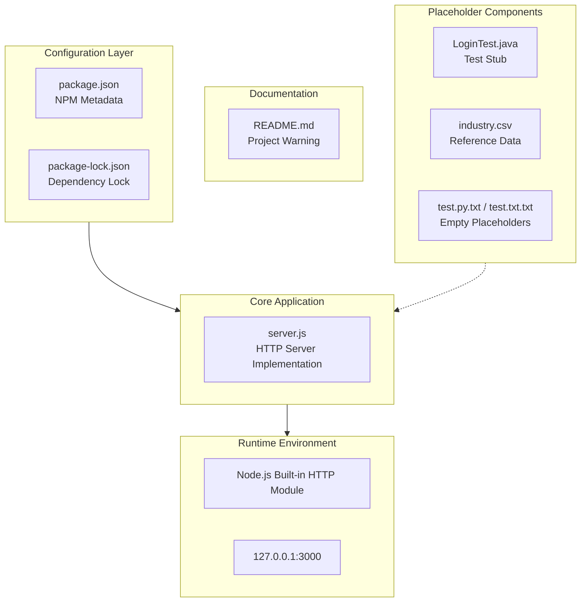

| Component | File | Description |
|-----------|------|-------------|
| **HTTP Server** | `server.js` | Core implementation using Node.js built-in `http` module |
| **NPM Configuration** | `package.json` | Project metadata, entry point, and script definitions |
| **Dependency Lock** | `package-lock.json` | Ensures deterministic installations (lockfileVersion 3) |
| **Documentation** | `README.md` | Project identification and preservation warning |

#### Core Technical Approach

The system employs a **zero-dependency architecture** utilizing only Node.js core modules:

- **HTTP Module**: Native `http` module for server creation
- **No Framework Overhead**: Direct use of low-level APIs
- **Single-File Implementation**: All server logic contained in `server.js`
- **Localhost Binding**: Server restricted to `127.0.0.1:3000` for security isolation

### 1.2.3 Success Criteria

#### Measurable Objectives

| Objective | Metric | Target |
|-----------|--------|--------|
| Server Startup | Time to first response | < 1 second |
| Response Accuracy | Correct "Hello, World!" output | 100% |
| Integration Compatibility | Successful Backprop analysis | Pass/Fail |
| Stability | Uptime during test execution | 100% |

#### Critical Success Factors

1. **Immutability**: Project must remain unchanged to serve as reliable test baseline
2. **Predictability**: Server behavior must be consistent across all invocations
3. **Simplicity**: Zero external dependencies ensures environmental consistency
4. **Accessibility**: Localhost binding enables local testing without network configuration

#### Key Performance Indicators (KPIs)

- **Integration Test Pass Rate**: Percentage of Backprop integration tests passing against this project
- **Setup Time**: Time required to clone, install, and run the project
- **Response Latency**: HTTP response time for "Hello, World!" endpoint

---

## 1.3 Scope

### 1.3.1 In-Scope Elements

#### Core Features and Functionalities

The following capabilities are **in-scope** for this project:

| Feature | Description | Implementation |
|---------|-------------|----------------|
| **HTTP Server** | Single endpoint responding to all requests | `server.js` |
| **Static Response** | Returns "Hello, World!\n" with 200 status | Built-in |
| **Content-Type Header** | Sets response as `text/plain` | Built-in |
| **Localhost Binding** | Server accessible only via 127.0.0.1 | Configuration |

#### Primary User Workflows

1. **Start Server**: Execute `node server.js` to launch HTTP server
2. **Verify Response**: Send HTTP request to `http://127.0.0.1:3000/`
3. **Observe Output**: Receive "Hello, World!" response with 200 OK status
4. **Integration Testing**: Run Backprop tools against running server or codebase

#### Essential Technical Requirements

- Node.js runtime environment (any modern version)
- Available port 3000 on localhost
- npm for package management (optional, for metadata access)

#### Implementation Boundaries

| Boundary | Coverage |
|----------|----------|
| **System Boundaries** | Single HTTP server process; localhost network interface only |
| **User Groups** | Developers and QA engineers performing Backprop integration testing |
| **Geographic Coverage** | Local development environments only |
| **Data Domains** | No persistent data; ephemeral HTTP request/response cycle |

### 1.3.2 Out-of-Scope Elements

#### Excluded Features and Capabilities

The following are **explicitly out-of-scope** by design:

| Exclusion | Rationale |
|-----------|-----------|
| **Authentication/Authorization** | Test fixture requires no security layer |
| **Database Integration** | No persistent storage needed |
| **Multiple Routes/Endpoints** | Single response simplifies testing |
| **External Dependencies** | Zero dependencies ensures consistency |
| **Production Deployment** | Project is test-only, not production-ready |
| **HTTPS/TLS** | HTTP sufficient for localhost testing |
| **Load Balancing** | Single-instance test server only |
| **Logging Framework** | Console output sufficient for testing |

#### Placeholder Components (Future Consideration)

Several placeholder files exist but are non-functional in the current scope:

| Component | Status | Notes |
|-----------|--------|-------|
| `LoginTest.java` | Non-functional | Stub class with syntax error; may indicate future test expansion |
| `test.py.txt` | Empty (0 bytes) | Placeholder for potential Python test files |
| `test.txt.txt` | Empty (0 bytes) | Placeholder for additional test assets |
| `industry.csv` | Reference data only | Contains 43 industry categories; not used by server |

#### Integration Points Not Covered

- External API integrations
- Third-party service connections
- Database connections
- Message queue systems
- Cloud service integrations

#### Unsupported Use Cases

1. **Production Traffic Handling**: Not designed for production workloads
2. **Multi-User Access**: Localhost binding prevents external access
3. **Data Processing**: No business logic beyond static response
4. **Automated Testing Execution**: Default npm test returns error (`"echo \"Error: no test specified\" && exit 1"`)

---

## 1.4 References

The following files and folders were examined to compile this Introduction section:

#### Files Examined

| File Path | Relevance |
|-----------|-----------|
| `README.md` | Project name, purpose statement, preservation warning |
| `package.json` | NPM metadata: name, version, description, author, license, scripts |
| `package-lock.json` | Lock file version (3), confirmation of zero dependencies |
| `server.js` | Complete HTTP server implementation details |
| `LoginTest.java` | Java test stub structure, package identifier (com.blitzyTest) |
| `industry.csv` | Reference data containing 43 industry categories |
| `test.py.txt` | Confirmed empty placeholder file |
| `test.txt.txt` | Confirmed empty placeholder file |

#### Repository Structure

| Path | Type | Contents |
|------|------|----------|
| `/` (root) | Directory | 8 files, 0 subdirectories |

# 2. Product Requirements

## 2.1 Feature Catalog

### 2.1.1 Feature Overview

The `hao-backprop-test` project implements a deliberately minimal feature set designed to serve as a stable, predictable test fixture for Backprop integration testing. The system contains a single core functional feature, with intentional constraints to ensure testing reliability.

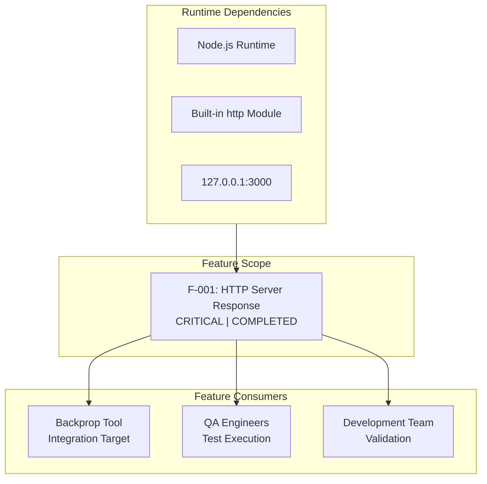

### 2.1.2 F-001: HTTP Server Response

#### Feature Metadata

| Attribute | Value |
|-----------|-------|
| **Unique ID** | F-001 |
| **Feature Name** | HTTP Server Response |
| **Feature Category** | Core Infrastructure |
| **Priority Level** | Critical |
| **Status** | Completed |

#### Description

| Aspect | Details |
|--------|---------|
| **Overview** | Single HTTP endpoint that responds to all incoming requests with a static "Hello, World!" message. Implemented in `server.js` using Node.js built-in `http` module. |
| **Business Value** | Provides a stable, unchanging test target for validating Backprop integration capabilities against a known baseline codebase. |
| **User Benefits** | Enables instant feedback on integration changes without complex setup; ensures reproducible testing results across all environments. |
| **Technical Context** | Zero-dependency implementation using only Node.js core modules; server binds exclusively to localhost (127.0.0.1) on port 3000. |

#### Dependencies

| Dependency Type | Details |
|-----------------|---------|
| **Prerequisite Features** | None (foundational feature) |
| **System Dependencies** | Node.js runtime environment (any modern version) |
| **External Dependencies** | None (zero external npm packages by design) |
| **Integration Requirements** | Available port 3000 on localhost; Backprop tooling for intended use case |

---

## 2.2 Functional Requirements

### 2.2.1 F-001 Requirements Table

#### Core Requirements

| Req ID | Description | Priority |
|--------|-------------|----------|
| F-001-RQ-001 | Server Initialization | Must-Have |
| F-001-RQ-002 | Request Handling | Must-Have |
| F-001-RQ-003 | Response Generation | Must-Have |
| F-001-RQ-004 | Console Logging | Should-Have |

### 2.2.2 F-001-RQ-001: Server Initialization

#### Requirement Details

| Attribute | Specification |
|-----------|---------------|
| **Requirement ID** | F-001-RQ-001 |
| **Description** | The HTTP server shall successfully initialize and bind to the configured hostname and port upon execution of `node server.js`. |
| **Acceptance Criteria** | Server process starts without errors; Console displays startup confirmation message; Server accepts incoming connections. |
| **Priority** | Must-Have |
| **Complexity** | Low |

#### Technical Specifications

| Parameter | Specification |
|-----------|---------------|
| **Input Parameters** | None (configuration hardcoded in `server.js` lines 3-4) |
| **Output/Response** | Console log: `Server running at http://127.0.0.1:3000/` |
| **Performance Criteria** | Startup time < 1 second |
| **Data Requirements** | None |

#### Validation Rules

| Rule Type | Specification |
|-----------|---------------|
| **Business Rules** | Server must bind to exactly 127.0.0.1:3000 as defined in `server.js` |
| **Data Validation** | N/A (no data input required) |
| **Security Requirements** | Localhost-only binding prevents external network access |
| **Compliance Requirements** | None |

### 2.2.3 F-001-RQ-002: Request Handling

#### Requirement Details

| Attribute | Specification |
|-----------|---------------|
| **Requirement ID** | F-001-RQ-002 |
| **Description** | The server shall accept HTTP requests on all URL paths and HTTP methods without differentiation. |
| **Acceptance Criteria** | All GET, POST, PUT, DELETE requests receive identical response; All URL paths (/, /test, /any/path) return same response; No request body parsing occurs. |
| **Priority** | Must-Have |
| **Complexity** | Low |

#### Technical Specifications

| Parameter | Specification |
|-----------|---------------|
| **Input Parameters** | Any HTTP request to http://127.0.0.1:3000/* |
| **Output/Response** | Request passed to response handler (F-001-RQ-003) |
| **Performance Criteria** | Request acceptance < 10ms |
| **Data Requirements** | None (request body ignored) |

#### Validation Rules

| Rule Type | Specification |
|-----------|---------------|
| **Business Rules** | No URL routing logic; all requests treated identically |
| **Data Validation** | None (no request validation performed) |
| **Security Requirements** | No authentication or authorization checks |
| **Compliance Requirements** | None |

### 2.2.4 F-001-RQ-003: Response Generation

#### Requirement Details

| Attribute | Specification |
|-----------|---------------|
| **Requirement ID** | F-001-RQ-003 |
| **Description** | The server shall return a standardized HTTP response containing the static message "Hello, World!\n" for every request received. |
| **Acceptance Criteria** | HTTP status code is exactly 200; Content-Type header is "text/plain"; Response body is exactly "Hello, World!\n" |
| **Priority** | Must-Have |
| **Complexity** | Low |

#### Technical Specifications

| Parameter | Specification |
|-----------|---------------|
| **Input Parameters** | HTTP request object (contents ignored) |
| **Output/Response** | HTTP 200 OK with text/plain body |
| **Performance Criteria** | Response generation < 5ms |
| **Data Requirements** | Static string: "Hello, World!\n" |

#### Response Specification

| Component | Value | Source |
|-----------|-------|--------|
| **Status Code** | 200 | `server.js` line 7 |
| **Content-Type** | text/plain | `server.js` line 8 |
| **Body** | Hello, World!\n | `server.js` line 9 |

#### Validation Rules

| Rule Type | Specification |
|-----------|---------------|
| **Business Rules** | Response must be identical for every request |
| **Data Validation** | N/A (static content only) |
| **Security Requirements** | No sensitive data exposed |
| **Compliance Requirements** | None |

### 2.2.5 F-001-RQ-004: Console Logging

#### Requirement Details

| Attribute | Specification |
|-----------|---------------|
| **Requirement ID** | F-001-RQ-004 |
| **Description** | The server shall output a startup confirmation message to the console upon successful initialization. |
| **Acceptance Criteria** | Message displays correct hostname and port; Message appears only once per startup; Format matches expected pattern. |
| **Priority** | Should-Have |
| **Complexity** | Low |

#### Technical Specifications

| Parameter | Specification |
|-----------|---------------|
| **Input Parameters** | hostname (127.0.0.1), port (3000) |
| **Output/Response** | Console output: "Server running at http://127.0.0.1:3000/" |
| **Performance Criteria** | Immediate upon server ready |
| **Data Requirements** | Server configuration values |

---

## 2.3 Feature Relationships

### 2.3.1 Feature Dependencies Map

Given the minimal, single-feature nature of this project, the feature dependency map is straightforward:

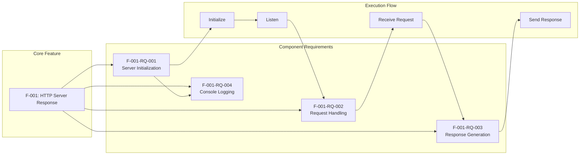

### 2.3.2 Integration Points

| Integration Point | Type | Feature |
|-------------------|------|---------|
| **Backprop Tool** | Primary Consumer | F-001 |
| **Node.js http Module** | Runtime Dependency | F-001 |
| **npm Ecosystem** | Configuration | F-001 |

### 2.3.3 Shared Components

| Component | Location | Used By |
|-----------|----------|---------|
| **HTTP Server Instance** | `server.js` | All requirements (F-001-RQ-*) |
| **Configuration Values** | `server.js` lines 3-4 | F-001-RQ-001, F-001-RQ-004 |
| **Response Handler** | `server.js` lines 6-10 | F-001-RQ-002, F-001-RQ-003 |

### 2.3.4 Common Services

This project intentionally uses no common services or external dependencies. All functionality is self-contained within `server.js` using only the Node.js built-in `http` module.

| Service Category | Status |
|------------------|--------|
| **External APIs** | Not Used |
| **Databases** | Not Used |
| **Caching** | Not Used |
| **Logging Frameworks** | Not Used |
| **Authentication Services** | Not Used |

---

## 2.4 Implementation Considerations

### 2.4.1 Technical Constraints

| Constraint | Description | Rationale |
|------------|-------------|-----------|
| **Immutability** | Project code must not be modified | README.md: "Do not touch!" directive |
| **Zero Dependencies** | No external npm packages allowed | Ensures environmental consistency |
| **Single File** | All server logic in `server.js` | Simplifies test fixture analysis |
| **Localhost Only** | Binding restricted to 127.0.0.1 | Security isolation for testing |
| **Fixed Port** | Port 3000 hardcoded | Predictable configuration for tests |

### 2.4.2 Performance Requirements

| Metric | Target | Measurement Method |
|--------|--------|-------------------|
| **Server Startup Time** | < 1 second | Time from `node server.js` to console output |
| **Response Latency** | < 10ms | Time from request receipt to response sent |
| **Response Accuracy** | 100% | Exact match of "Hello, World!\n" output |
| **Uptime During Testing** | 100% | No crashes during test execution |

### 2.4.3 Scalability Considerations

| Aspect | Current State | Notes |
|--------|---------------|-------|
| **Concurrent Connections** | Limited by Node.js defaults | Sufficient for testing purposes |
| **Horizontal Scaling** | Not Supported | Single-instance test fixture |
| **Load Balancing** | Not Applicable | Localhost-only binding |
| **Clustering** | Not Implemented | Out of scope by design |

**Note:** Scalability is intentionally not a consideration for this test fixture. The project serves a single purpose: providing a stable baseline for Backprop integration testing.

### 2.4.4 Security Implications

| Security Aspect | Implementation | Risk Level |
|-----------------|----------------|------------|
| **Network Exposure** | Localhost binding (127.0.0.1) | Low |
| **Authentication** | None required | N/A (test fixture) |
| **Authorization** | None required | N/A (test fixture) |
| **Data Protection** | No sensitive data handled | Low |
| **Input Validation** | None (all input ignored) | Low |

#### Security by Design

The project inherently mitigates security risks through:
- **Network Isolation**: Binding to `127.0.0.1` prevents remote access
- **No Data Storage**: Ephemeral request/response cycle only
- **Static Response**: No dynamic content generation eliminates injection risks
- **Zero Dependencies**: No supply chain vulnerabilities

### 2.4.5 Maintenance Requirements

| Maintenance Aspect | Requirement |
|--------------------|-------------|
| **Code Changes** | Prohibited (test fixture must remain stable) |
| **Dependency Updates** | None required (zero external dependencies) |
| **Documentation** | Minimal; README.md provides essential warning |
| **Monitoring** | Not required for test fixture usage |
| **Backup/Recovery** | Source control (Git) sufficient |

---

## 2.5 Traceability Matrix

### 2.5.1 Feature-to-Requirement Traceability

| Feature ID | Requirement ID | Description | Status |
|------------|----------------|-------------|--------|
| F-001 | F-001-RQ-001 | Server Initialization | Complete |
| F-001 | F-001-RQ-002 | Request Handling | Complete |
| F-001 | F-001-RQ-003 | Response Generation | Complete |
| F-001 | F-001-RQ-004 | Console Logging | Complete |

### 2.5.2 Requirement-to-Implementation Traceability

| Requirement ID | Implementation Location | Lines |
|----------------|------------------------|-------|
| F-001-RQ-001 | `server.js` | 3-4, 12-14 |
| F-001-RQ-002 | `server.js` | 6 |
| F-001-RQ-003 | `server.js` | 7-9 |
| F-001-RQ-004 | `server.js` | 13 |

### 2.5.3 Requirement-to-Test Criteria Traceability

| Requirement ID | Test Criteria | Verification Method |
|----------------|--------------|---------------------|
| F-001-RQ-001 | Server starts successfully | Execute `node server.js`; observe console output |
| F-001-RQ-002 | All requests accepted | Send various HTTP methods/paths; verify response |
| F-001-RQ-003 | Correct response returned | Verify status 200, Content-Type, body content |
| F-001-RQ-004 | Startup message displayed | Check console for formatted URL message |

---

## 2.6 Assumptions and Constraints

### 2.6.1 Assumptions

| ID | Assumption | Impact if Invalid |
|----|------------|-------------------|
| A-001 | Node.js runtime is available in the test environment | Server cannot start |
| A-002 | Port 3000 is available on localhost | Server binding fails |
| A-003 | Project is used solely for Backprop integration testing | Misuse in production environments |
| A-004 | Test execution occurs in local development environments | Network access issues |

### 2.6.2 Constraints

| ID | Constraint | Type | Source |
|----|------------|------|--------|
| C-001 | Project must remain unchanged | Operational | README.md |
| C-002 | Zero external dependencies | Technical | package.json |
| C-003 | Localhost-only binding | Security | server.js |
| C-004 | Single-feature implementation | Design | Project purpose |

### 2.6.3 Placeholder Components

The following files exist in the repository but are non-functional and excluded from product requirements:

| Component | Status | Notes |
|-----------|--------|-------|
| `LoginTest.java` | Non-functional | Contains syntax error; test stub only |
| `test.py.txt` | Empty (0 bytes) | Placeholder file |
| `test.txt.txt` | Empty (0 bytes) | Placeholder file |
| `industry.csv` | Unused | Reference data not utilized by server |

---

## 2.7 Related Documents

### 2.7.1 Process Flowcharts

The server operation flow is documented in Section 1.2.2 (High-Level System Description) with the major system components diagram.

### 2.7.2 Technical Specifications

| Section | Content | Relevance |
|---------|---------|-----------|
| 1.1 Executive Summary | Project overview, stakeholders | Business context |
| 1.2 System Overview | System capabilities, KPIs | Technical context |
| 1.3 Scope | In-scope/out-of-scope elements | Boundary definition |

---

## 2.8 References

#### Files Examined

| File Path | Relevance |
|-----------|-----------|
| `server.js` | Core HTTP server implementation; source for all functional requirements |
| `package.json` | NPM metadata; confirms zero dependencies and project configuration |
| `package-lock.json` | Dependency lock file; validates zero external packages |
| `README.md` | Project purpose statement; "Do not touch!" constraint source |
| `LoginTest.java` | Identified as non-functional placeholder component |
| `industry.csv` | Confirmed as unused reference data |
| `test.py.txt` | Confirmed as empty placeholder file |
| `test.txt.txt` | Confirmed as empty placeholder file |

#### Technical Specification Sections Referenced

| Section | Purpose |
|---------|---------|
| 1.1 Executive Summary | Project context, stakeholders, business value |
| 1.2 System Overview | System capabilities, integration points, success criteria |
| 1.3 Scope | Feature boundaries, exclusions, placeholder identification |
| 1.4 References | File inventory verification |

# 3. Technology Stack

## 3.1 Overview

The `hao-backprop-test` project implements a **zero-dependency architecture** by deliberate design. As a test fixture for Backprop integration testing, the technology stack is intentionally minimal to ensure environmental consistency, predictable behavior, and elimination of supply chain vulnerabilities. This section documents the technologies actually employed in the project while providing context for why standard enterprise technologies are explicitly excluded.

### 3.1.1 Technology Stack Summary

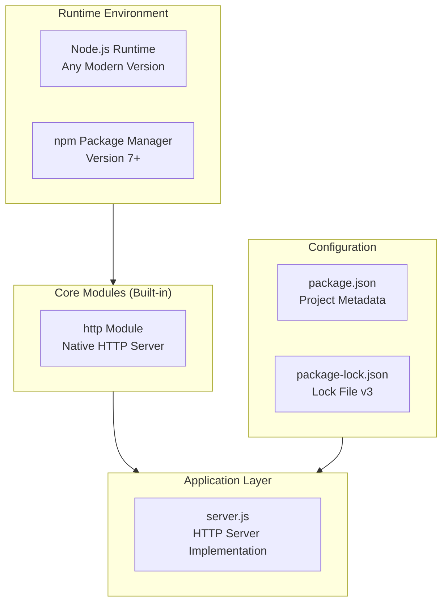

| Layer | Technology | Version | Status |
|-------|------------|---------|--------|
| **Runtime** | Node.js | Any modern LTS | Required |
| **Package Manager** | npm | 7+ (lockfileVersion 3) | Configured |
| **HTTP Server** | Node.js `http` module | Built-in | Active |
| **External Dependencies** | None | N/A | By Design |

### 3.1.2 Design Rationale

The zero-dependency architecture serves the project's core purpose as a test fixture:

| Principle | Implementation | Benefit |
|-----------|----------------|---------|
| **Environmental Consistency** | Zero external packages | Eliminates version conflicts across test environments |
| **Predictable Behavior** | Built-in modules only | Removes third-party variability |
| **Supply Chain Security** | No npm dependencies | Zero attack surface from external packages |
| **Instant Setup** | No `npm install` required | Immediate execution capability |
| **Immutability** | Static implementation | Reliable baseline for regression testing |

---

## 3.2 Programming Languages

### 3.2.1 Primary Language: JavaScript (Node.js)

JavaScript running on Node.js is the sole functional programming language in this project.

#### Language Specification

| Attribute | Specification | Evidence |
|-----------|---------------|----------|
| **Language** | JavaScript (ECMAScript) | `server.js` |
| **Runtime** | Node.js | Execution requirement |
| **Module System** | CommonJS (`require()`) | `server.js` line 1 |
| **Syntax Level** | ES5+ compatible | No modern syntax dependencies |

#### Selection Justification

| Criterion | Rationale |
|-----------|-----------|
| **Ubiquity** | Node.js is standard in development environments where Backprop operates |
| **Simplicity** | Minimal boilerplate for HTTP server creation |
| **Built-in HTTP** | Native `http` module eliminates framework dependencies |
| **Cross-Platform** | Consistent behavior across Windows, macOS, and Linux |
| **Test Fixture Suitability** | Represents common target codebase for code analysis tools |

#### Version Compatibility

| Node.js Version | Codename | Status | End of Support | Compatibility |
|-----------------|----------|--------|----------------|---------------|
| **24.x** | Krypton | Active LTS | April 2028 | ✓ Recommended |
| **22.x** | Jod | Active LTS | April 2027 | ✓ Supported |
| **20.x** | Iron | Maintenance | April 2026 | ✓ Supported |
| **18.x** | Hydrogen | Maintenance | April 2025 | ✓ Minimum |

The project specifies no version constraint (Assumption A-001: "Node.js runtime is available in the test environment"), enabling compatibility with any modern Node.js installation.

### 3.2.2 Placeholder Languages (Non-Functional)

The repository contains placeholder files in additional languages that are **not functional** and exist solely as test assets:

| Language | File | Status | Notes |
|----------|------|--------|-------|
| **Java** | `LoginTest.java` | Non-functional | Contains syntax error; package `com.blitzyTest` |
| **Python** | `test.py.txt` | Empty (0 bytes) | Placeholder file |

These files serve as test assets for Backprop's multi-language analysis capabilities and are explicitly excluded from the functional technology stack.

---

## 3.3 Frameworks & Libraries

### 3.3.1 Framework Strategy: Zero-Framework Architecture

The project deliberately avoids external frameworks in favor of Node.js core modules.

#### Framework Exclusion Rationale

| Typical Framework | Status | Exclusion Rationale |
|-------------------|--------|---------------------|
| Express.js | Not Used | Routing complexity unnecessary for single endpoint |
| Koa | Not Used | Middleware architecture adds overhead |
| Fastify | Not Used | Performance optimization irrelevant for test fixture |
| Hapi | Not Used | Enterprise features out of scope |

#### Zero-Framework Benefits

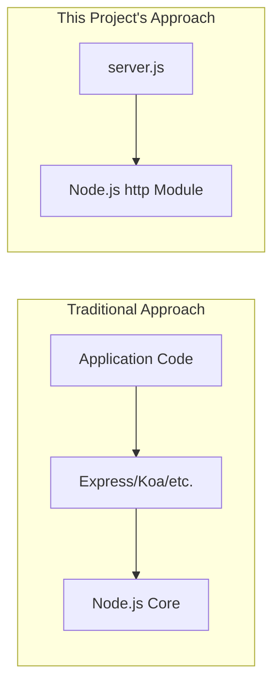

| Benefit | Description |
|---------|-------------|
| **Reduced Complexity** | Direct API usage eliminates abstraction layers |
| **No Version Conflicts** | Framework updates cannot break test fixture |
| **Smaller Footprint** | No `node_modules` directory required |
| **Predictable Behavior** | Node.js core module behavior is well-documented |
| **Security** | No third-party code vulnerabilities |

### 3.3.2 Core Module: Node.js HTTP

The only library utilized is the built-in Node.js `http` module.

#### Module Specification

| Attribute | Value | Source |
|-----------|-------|--------|
| **Module Name** | `http` | `server.js` line 1: `const http = require('http');` |
| **Type** | Node.js Core Module | Built into runtime |
| **Version** | Matches Node.js version | Implicit |
| **Installation** | None required | Part of Node.js |

#### HTTP Module Usage

| API | Usage | Location |
|-----|-------|----------|
| `http.createServer()` | Creates HTTP server instance | `server.js` line 6 |
| `server.listen()` | Binds server to hostname:port | `server.js` line 12 |
| `res.statusCode` | Sets HTTP response code | `server.js` line 7 |
| `res.setHeader()` | Sets response headers | `server.js` line 8 |
| `res.end()` | Sends response body | `server.js` line 9 |

---

## 3.4 Open Source Dependencies

### 3.4.1 External Dependencies: None

The project maintains a **zero-dependency policy** as documented in `package.json` and verified by `package-lock.json`.

#### Dependency Verification

**package.json Analysis:**

| Field | Value | Implication |
|-------|-------|-------------|
| `dependencies` | Not present | No runtime dependencies |
| `devDependencies` | Not present | No development dependencies |
| `peerDependencies` | Not present | No peer requirements |
| `optionalDependencies` | Not present | No optional packages |

**package-lock.json Analysis:**

| Attribute | Value | Implication |
|-----------|-------|-------------|
| `lockfileVersion` | 3 | Generated with npm 7+ |
| `packages` | Single entry (root only) | Confirms empty dependency graph |
| `dependencies` | Not present | No locked dependencies |

#### Zero-Dependency Architecture Diagram

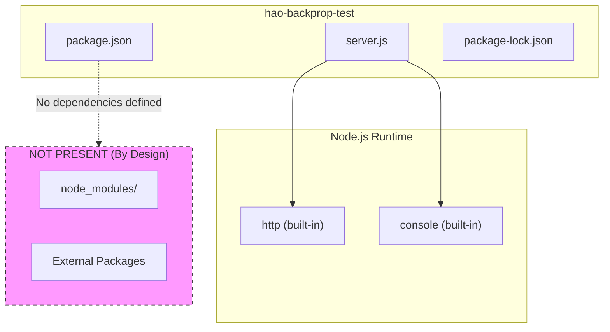

### 3.4.2 Package Registry Configuration

| Attribute | Value | Source |
|-----------|-------|--------|
| **Registry** | npm (default) | Implicit |
| **Package Name** | hello_world | `package.json` |
| **Version** | 1.0.0 | `package.json` |
| **License** | MIT | `package.json` |
| **Author** | hxu | `package.json` |

### 3.4.3 Dependency Security Implications

| Security Aspect | Status | Rationale |
|-----------------|--------|-----------|
| **Supply Chain Risk** | None | No external code executed |
| **Vulnerability Scanning** | Not Required | No packages to scan |
| **Dependency Updates** | Not Required | Nothing to update |
| **License Compliance** | Simplified | Only MIT license (project itself) |
| **Audit Results** | Clean | `npm audit` returns no vulnerabilities |

---

## 3.5 Third-Party Services

### 3.5.1 External Service Integration: None

The project operates in complete isolation from external services, consistent with its role as a test fixture.

#### Service Exclusion Summary

| Service Category | Status | Rationale |
|------------------|--------|-----------|
| **External APIs** | Not Used | No business logic requiring external data |
| **Authentication Services** | Not Used | No user authentication required (Constraint C-003) |
| **Monitoring Tools** | Not Used | Console output sufficient for test fixture |
| **Cloud Services** | Not Used | Localhost-only operation (Constraint C-003) |
| **Logging Services** | Not Used | Native `console.log()` adequate |
| **Analytics** | Not Used | Out of scope for test fixture |

### 3.5.2 Integration Target: Backprop

While not consuming external services, the project is designed as an **integration target** for Backprop.

| Integration Aspect | Description |
|--------------------|-------------|
| **Integration Direction** | Backprop analyzes this project (not vice versa) |
| **Integration Type** | Static code analysis and/or runtime testing |
| **Project Role** | Passive test fixture providing stable baseline |
| **API Exposure** | HTTP endpoint for potential health checks |

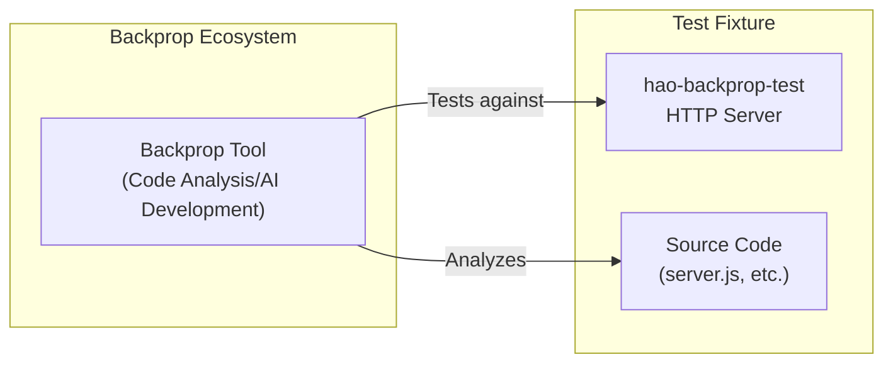

---

## 3.6 Databases & Storage

### 3.6.1 Data Persistence Strategy: Stateless

The project implements a **fully stateless architecture** with no data persistence requirements.

#### Storage Exclusion Summary

| Storage Category | Status | Rationale |
|------------------|--------|-----------|
| **Primary Database** | Not Used | No persistent data requirements |
| **Secondary Database** | Not Used | Out of scope |
| **Caching Solutions** | Not Used | All requests return identical static response |
| **File Storage** | Not Used | No file upload/download functionality |
| **Session Storage** | Not Used | No user sessions tracked |
| **In-Memory Store** | Not Used | No state maintained between requests |

#### Data Flow Architecture

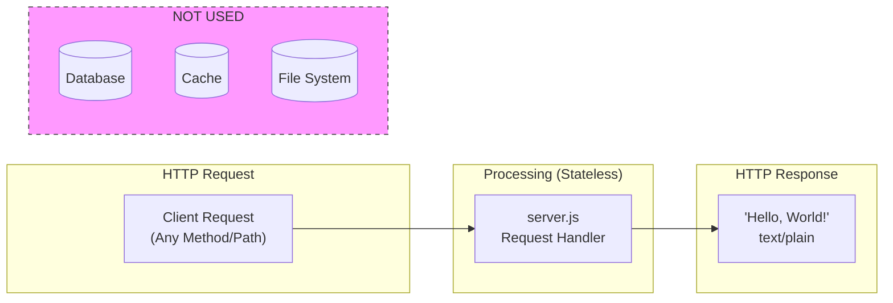

### 3.6.2 Stateless Design Justification

| Principle | Implementation | Benefit for Testing |
|-----------|----------------|---------------------|
| **Ephemeral Data** | Request/response cycle only | No state cleanup between tests |
| **Deterministic Response** | Same output for every request | Predictable test assertions |
| **No Side Effects** | No data written | Tests cannot interfere with each other |
| **Instant Recovery** | No data to restore | Server restart returns to known state |

---

## 3.7 Development & Deployment

### 3.7.1 Development Tools

#### Runtime Requirements

| Tool | Version | Purpose | Required |
|------|---------|---------|----------|
| **Node.js** | 18.x+ LTS recommended | JavaScript runtime | Yes |
| **npm** | 7+ (lockfileVersion 3 compatibility) | Package management | Optional |
| **Git** | Any modern version | Source control | Optional |

#### Version Control

| Attribute | Value | Evidence |
|-----------|-------|----------|
| **System** | Git | `.git` directory present |
| **Repository Type** | Single-branch (presumed) | Minimal test project |
| **Branching Strategy** | Not applicable | Immutable by design |

### 3.7.2 Build System

#### Build Strategy: No Build Required

The project requires no build step, compilation, or transpilation.

| Build Aspect | Status | Rationale |
|--------------|--------|-----------|
| **Compilation** | Not Required | Native JavaScript |
| **Transpilation** | Not Required | No TypeScript, no modern syntax |
| **Bundling** | Not Required | Single-file implementation |
| **Minification** | Not Required | Development/testing only |
| **Asset Processing** | Not Required | No static assets served |

#### Execution Model

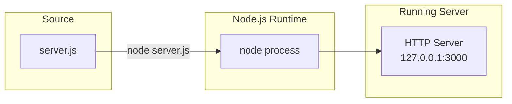

### 3.7.3 npm Scripts Configuration

| Script | Command | Purpose | Status |
|--------|---------|---------|--------|
| `test` | `echo "Error: no test specified" && exit 1` | Placeholder | Default/Unimplemented |
| `start` | Not defined | Server startup | Use `node server.js` |

#### Execution Commands

| Action | Command | Notes |
|--------|---------|-------|
| **Start Server** | `node server.js` | Primary execution method |
| **Verify Metadata** | `npm info` | Displays package.json contents |
| **Check Dependencies** | `npm ls` | Returns empty tree (no dependencies) |
| **Security Audit** | `npm audit` | Returns clean (no packages to audit) |

### 3.7.4 Containerization

#### Container Strategy: Not Implemented

Containerization is explicitly out of scope for this test fixture.

| Container Technology | Status | Rationale |
|----------------------|--------|-----------|
| **Docker** | Not Used | Adds unnecessary complexity |
| **Kubernetes** | Not Used | Enterprise orchestration not required |
| **Docker Compose** | Not Used | Single-process application |

#### Containerization Exclusion Justification

| Factor | Consideration |
|--------|---------------|
| **Project Purpose** | Local test fixture, not production deployment |
| **Dependency Management** | Zero dependencies eliminates container benefits |
| **Environment Consistency** | Node.js LTS provides sufficient consistency |
| **Complexity vs. Value** | Container overhead exceeds test fixture requirements |

### 3.7.5 CI/CD Requirements

#### CI/CD Status: Not Configured

| CI/CD Aspect | Status | Notes |
|--------------|--------|-------|
| **Automated Testing** | Not Implemented | `npm test` returns error |
| **Continuous Integration** | Not Configured | No CI configuration files present |
| **Continuous Deployment** | Not Applicable | Local-only test fixture |
| **GitHub Actions** | Not Configured | No `.github/workflows/` directory |

#### CI/CD Exclusion Rationale

Per Constraint C-001 ("Project must remain unchanged"), continuous integration would be counterproductive:

| Rationale | Explanation |
|-----------|-------------|
| **Immutability** | Project changes are prohibited by design |
| **No Deployments** | Test fixture has no deployment target |
| **No Test Suite** | Formal automated tests not required |
| **Baseline Preservation** | CI could inadvertently modify test baseline |

---

## 3.8 Technology Stack Comparison

### 3.8.1 Comparison with Enterprise Standards

The following table compares this project's minimal stack against typical enterprise Node.js applications:

| Category | Enterprise Standard | This Project | Rationale |
|----------|---------------------|--------------|-----------|
| **Framework** | Express.js / NestJS | None (core `http`) | Single endpoint; no routing needed |
| **Database** | MongoDB / PostgreSQL | None | Stateless by design |
| **ORM** | Mongoose / Prisma | None | No data persistence |
| **Authentication** | JWT / OAuth2 / Auth0 | None | Test fixture; no users |
| **Caching** | Redis | None | Static response; no caching benefit |
| **Logging** | Winston / Pino | `console.log()` | Minimal output sufficient |
| **Testing** | Jest / Mocha | None | Test fixture is the test target |
| **TypeScript** | Typically Yes | No | Complexity reduction |
| **Docker** | Typically Yes | No | Local execution only |
| **CI/CD** | GitHub Actions / Jenkins | None | Immutable project |

### 3.8.2 Technology Decision Matrix

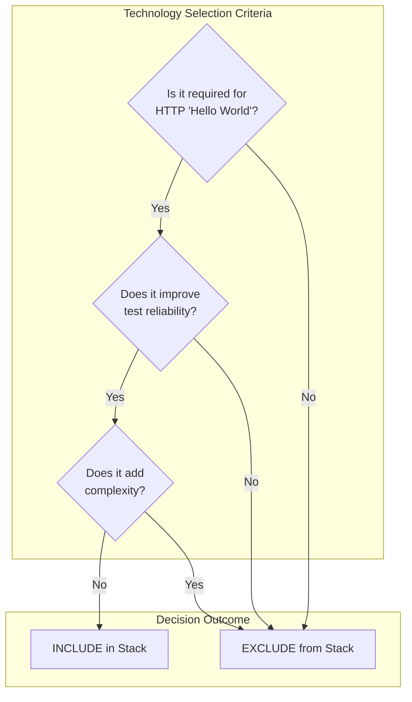

---

## 3.9 Security Considerations

### 3.9.1 Security by Simplicity

The minimal technology stack inherently mitigates common security risks:

| Security Vector | Mitigation | Implementation |
|-----------------|------------|----------------|
| **Supply Chain Attacks** | Zero dependencies | No `node_modules` directory |
| **Remote Access** | Localhost binding | Server bound to `127.0.0.1` only |
| **Injection Attacks** | Static response | No user input processing |
| **Data Breaches** | No data storage | Stateless architecture |
| **Authentication Bypass** | No authentication | No protected resources |
| **Dependency Vulnerabilities** | No dependencies | Nothing to patch |

### 3.9.2 Node.js Security Recommendations

For production use of similar Node.js applications (not applicable to this test fixture):

| Recommendation | Rationale |
|----------------|-----------|
| Use LTS Versions | Long-term security patches |
| Regular Updates | Address discovered vulnerabilities |
| npm Audit | Scan dependencies for known issues |
| Network Isolation | Bind to specific interfaces |
| Input Validation | Sanitize all user inputs |

---

## 3.10 References

### 3.10.1 Project Files Examined

| File Path | Relevance to Technology Stack |
|-----------|-------------------------------|
| `server.js` | HTTP module import, server configuration, API usage patterns |
| `package.json` | Project metadata, npm configuration, dependency declarations (empty) |
| `package-lock.json` | Lock file version (npm 7+ indicator), dependency graph verification |
| `README.md` | Project purpose, preservation constraints |
| `LoginTest.java` | Placeholder language identification (non-functional) |
| `test.py.txt` | Placeholder language identification (empty) |

### 3.10.2 Technical Specification Sections Referenced

| Section | Information Utilized |
|---------|----------------------|
| 1.1 Executive Summary | Project purpose, author, license |
| 1.2 System Overview | Zero-dependency architecture rationale, technical approach |
| 1.3 Scope | In-scope/out-of-scope technologies, exclusions |
| 2.2 Functional Requirements | HTTP module API usage specifications |
| 2.4 Implementation Considerations | Technical constraints, security implications |
| 2.6 Assumptions and Constraints | Runtime assumptions, design constraints |

### 3.10.3 External Resources

| Resource | Information Utilized |
|----------|----------------------|
| Node.js Official Release Schedule | Current LTS versions and support timelines |
| npm Documentation | lockfileVersion 3 interpretation (npm 7+) |

# 4. Process Flowchart

This section provides comprehensive process flowcharts and workflow documentation for the `hao-backprop-test` project—a minimal "Hello World" Node.js HTTP server serving as a test fixture for Backprop integration testing. Given the deliberately simple architecture, the process flows are intentionally straightforward with a single functional pathway and no complex decision trees.

## 4.1 System Workflow Overview

### 4.1.1 High-Level System Architecture Flow

The system implements a zero-dependency architecture with a single execution pathway from server initialization through request handling to response generation.

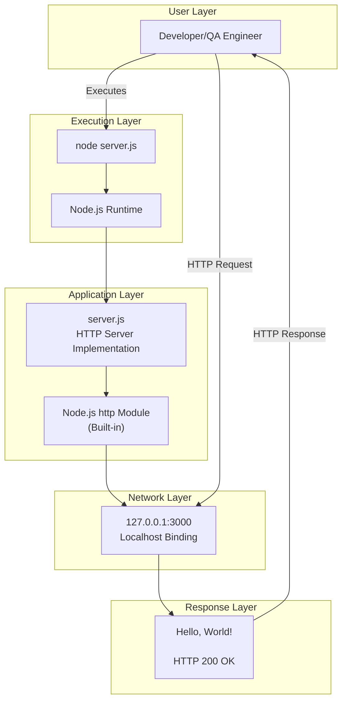

### 4.1.2 Process Flow Summary

| Process Phase | Components | Duration | Output |
|---------------|------------|----------|--------|
| **Initialization** | Node.js Runtime, http module, server.js | < 1 second | Running server |
| **Listening** | HTTP Server on localhost:3000 | Continuous | Ready state |
| **Request Handling** | Request handler callback | < 10ms | Request accepted |
| **Response Generation** | Response builder | < 5ms | HTTP 200 + "Hello, World!" |

### 4.1.3 System Boundaries

| Boundary | Scope | Implementation |
|----------|-------|----------------|
| **Network** | Localhost only (127.0.0.1) | Hardcoded in `server.js` line 3 |
| **Port** | Port 3000 only | Hardcoded in `server.js` line 4 |
| **Protocol** | HTTP only (no HTTPS) | Node.js http module |
| **Process** | Single Node.js process | Single-threaded event loop |

---

## 4.2 Core Business Processes

### 4.2.1 Server Lifecycle Process

The server lifecycle represents the complete execution flow from initialization to active listening state.

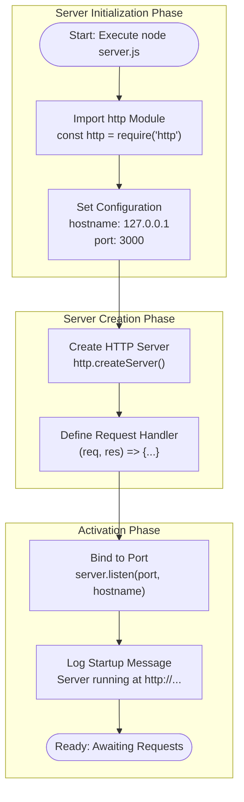

#### Lifecycle Stage Details

| Stage | Code Location | Description | Success Criteria |
|-------|---------------|-------------|------------------|
| **Module Import** | `server.js` line 1 | Loads Node.js built-in http module | Module loaded without errors |
| **Configuration** | `server.js` lines 3-4 | Sets hostname and port constants | Variables defined |
| **Server Creation** | `server.js` line 6 | Instantiates HTTP server with handler | Server object created |
| **Handler Definition** | `server.js` lines 6-10 | Defines request/response callback | Callback function registered |
| **Port Binding** | `server.js` line 12 | Binds server to localhost:3000 | Port successfully bound |
| **Logging** | `server.js` line 13 | Outputs startup confirmation | Message displayed |

### 4.2.2 Request/Response Process

The request/response cycle represents the core business functionality—handling incoming HTTP requests and generating static responses.

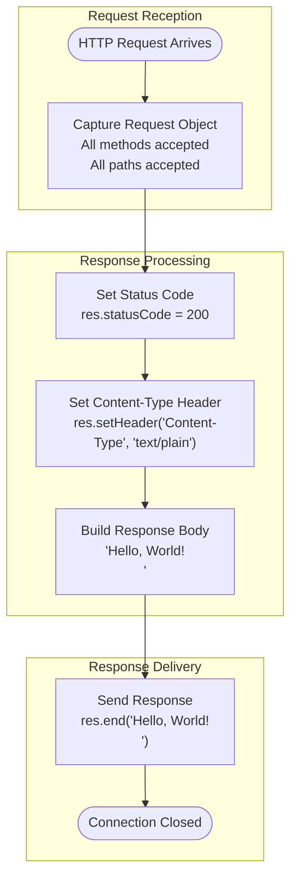

#### Request/Response Specifications

| Step | Implementation | Code Reference | Performance Target |
|------|----------------|----------------|-------------------|
| **Request Acceptance** | All HTTP methods, all URL paths | `server.js` line 6 | < 10ms |
| **Status Code Assignment** | HTTP 200 OK (always) | `server.js` line 7 | Immediate |
| **Header Configuration** | Content-Type: text/plain | `server.js` line 8 | Immediate |
| **Response Body** | Static "Hello, World!\n" | `server.js` line 9 | < 5ms |
| **Connection Termination** | `res.end()` completes response | `server.js` line 9 | Immediate |

### 4.2.3 End-to-End User Journey

This flowchart illustrates the complete user journey from project setup through Backprop integration testing.

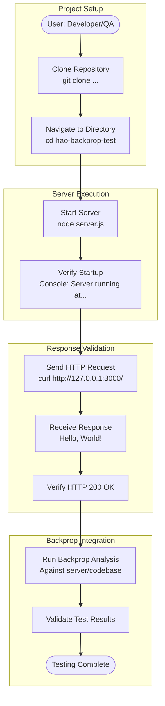

#### User Touchpoints

| Touchpoint | User Action | System Response | Expected Outcome |
|------------|-------------|-----------------|------------------|
| **Repository Clone** | `git clone <repository>` | Repository downloaded | All 8 files present |
| **Server Start** | `node server.js` | Console output | "Server running at http://127.0.0.1:3000/" |
| **HTTP Request** | `curl http://127.0.0.1:3000/` | HTTP response | "Hello, World!" with 200 status |
| **Backprop Testing** | Execute Backprop tools | Analysis results | Integration test pass/fail |

---

## 4.3 Integration Workflows

### 4.3.1 Backprop Integration Flow

The primary integration point for this project is Backprop code analysis tooling. The following diagram illustrates the integration workflow.

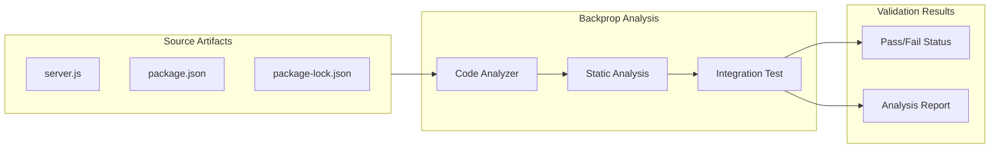

### 4.3.2 Data Flow Between Systems

Given the zero-dependency architecture, data flow is minimal and contained within the Node.js runtime.

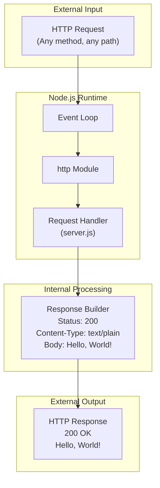

### 4.3.3 Integration Points Matrix

| Integration Point | Type | Direction | Data Format | Status |
|-------------------|------|-----------|-------------|--------|
| **Backprop Tool** | Primary Consumer | Inbound Analysis | Source Code | Active |
| **Node.js http Module** | Runtime Dependency | Internal | JavaScript Objects | Built-in |
| **npm Ecosystem** | Configuration | Read-only | JSON | Configured |
| **HTTP Client** | Test Consumer | Request/Response | HTTP/1.1 | Active |

---

## 4.4 State Transition Diagrams

### 4.4.1 Server State Machine

The server operates with a minimal state machine, transitioning from initialization to a persistent ready state.

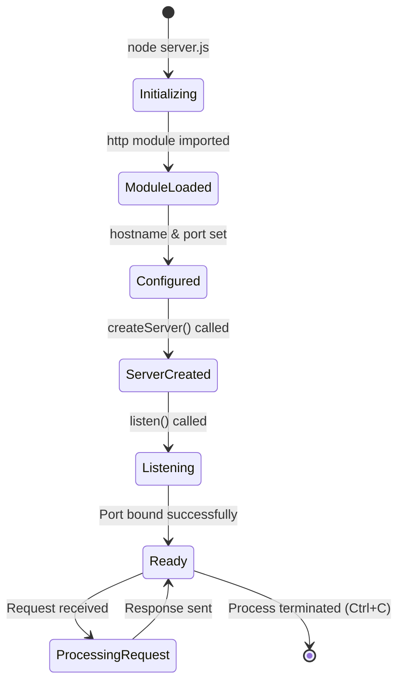

### 4.4.2 Request Lifecycle States

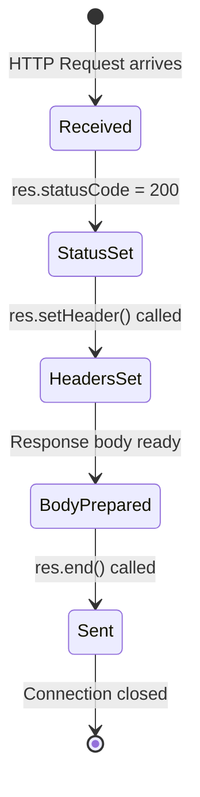

### 4.4.3 State Persistence Points

| State | Persistence | Duration | Recovery |
|-------|-------------|----------|----------|
| **Initializing** | None (transient) | Milliseconds | Restart process |
| **Ready** | Memory only | Until termination | Restart process |
| **Processing** | None (ephemeral) | < 10ms | Automatic completion |

**Note:** This is a stateless architecture with no data persistence. All state is ephemeral and exists only in memory during the process lifecycle.

---

## 4.5 Error Handling Flowcharts

### 4.5.1 Error Handling Architecture

**Critical Design Note:** This project implements **no explicit error handling** by design. As a minimal test fixture, error management is delegated entirely to the Node.js runtime defaults.

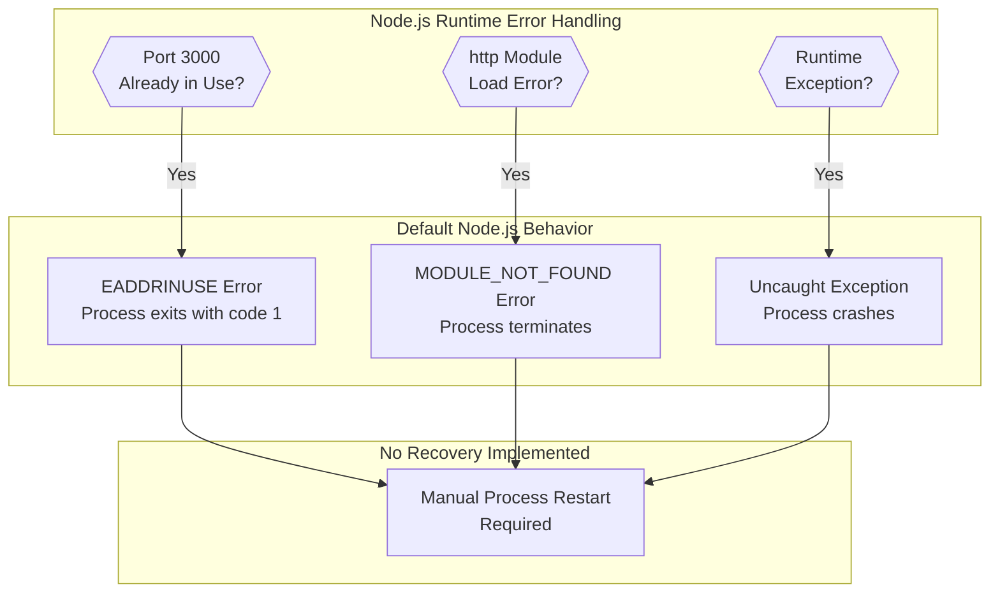

### 4.5.2 Potential Error Scenarios

| Error Scenario | Error Code | Default Behavior | Mitigation |
|----------------|------------|------------------|------------|
| **Port Already Bound** | EADDRINUSE | Process exit (code 1) | Ensure port 3000 available |
| **Invalid Module** | MODULE_NOT_FOUND | Process crash | Verify Node.js installation |
| **Memory Exhaustion** | ENOMEM | Process killed by OS | Adequate system resources |
| **Permission Denied** | EACCES | Process exit | Run with appropriate permissions |

### 4.5.3 Error Handling Exclusions

The following error handling mechanisms are **explicitly not implemented**:

| Mechanism | Status | Rationale |
|-----------|--------|-----------|
| **Try-Catch Blocks** | Not Implemented | Synchronous code has no throwing paths |
| **Error Event Handlers** | Not Implemented | Test fixture simplicity |
| **Graceful Shutdown** | Not Implemented | Manual termination sufficient |
| **Retry Logic** | Not Implemented | Not required for test fixture |
| **Fallback Processes** | Not Implemented | Single-feature design |
| **Error Notification** | Not Implemented | Console output sufficient |
| **Health Checks** | Not Implemented | Out of scope |

---

## 4.6 Technical Implementation Details

### 4.6.1 Request Processing Sequence Diagram

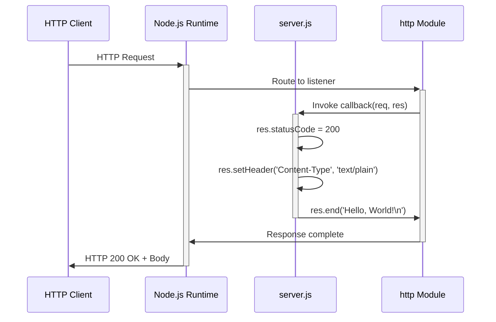

### 4.6.2 Execution Timeline

```mermaid
gantt
    title Server Execution Timeline
    dateFormat ss
    axisFormat %S
    
    section Initialization
    Import http module       :init1, 00, 1s
    Set configuration        :init2, after init1, 1s
    Create server           :init3, after init2, 1s
    
    section Binding
    Bind to port 3000       :bind1, after init3, 1s
    Log startup message     :bind2, after bind1, 1s
    
    section Ready State
    Server listening        :ready, after bind2, 5s
```

### 4.6.3 Transaction Boundaries

| Boundary Type | Scope | Implementation |
|---------------|-------|----------------|
| **Request Transaction** | Single HTTP request/response | Atomic operation in callback |
| **Server Lifecycle** | Process start to termination | Node.js process boundary |
| **Resource Scope** | Memory allocation per request | Garbage collected after response |

**Note:** No database transactions, distributed transactions, or multi-resource transactions exist in this architecture.

---

## 4.7 Validation Rules and Checkpoints

### 4.7.1 Business Rules Flowchart

```mermaid
flowchart TD
    subgraph ValidationRules["Validation Rules"]
        Rule1["Network Binding<br/>Must bind to 127.0.0.1:3000"]
        Rule2["Response Consistency<br/>Identical response for all requests"]
        Rule3["HTTP Status<br/>Must be exactly 200"]
        Rule4["Content-Type<br/>Must be text/plain"]
        Rule5["Response Body<br/>Must be 'Hello, World!\n'"]
    end
    
    subgraph Verification["Verification Points"]
        Verify1["Startup console message"]
        Verify2["HTTP response comparison"]
        Verify3["Status code check"]
        Verify4["Header inspection"]
        Verify5["Body string match"]
    end
    
    Rule1 --> Verify1
    Rule2 --> Verify2
    Rule3 --> Verify3
    Rule4 --> Verify4
    Rule5 --> Verify5
```

### 4.7.2 Validation Requirements Matrix

| Validation Point | Rule | Expected Value | Verification Method |
|------------------|------|----------------|---------------------|
| **Server Binding** | F-001-RQ-001 | 127.0.0.1:3000 | Console output check |
| **Status Code** | F-001-RQ-003 | 200 | HTTP response inspection |
| **Content-Type** | F-001-RQ-003 | text/plain | Header inspection |
| **Response Body** | F-001-RQ-003 | "Hello, World!\n" | String comparison |
| **Startup Message** | F-001-RQ-004 | "Server running at..." | Console verification |

### 4.7.3 Authorization and Compliance Checkpoints

| Checkpoint Type | Status | Implementation |
|-----------------|--------|----------------|
| **Authentication** | Not Implemented | Test fixture requires no auth |
| **Authorization** | Not Implemented | No protected resources |
| **Data Validation** | Not Applicable | No data input accepted |
| **Regulatory Compliance** | Not Applicable | Test fixture only |
| **Audit Logging** | Not Implemented | Out of scope |

---

## 4.8 Timing and SLA Considerations

### 4.8.1 Performance Requirements Flow

```mermaid
flowchart LR
    subgraph SLATargets["SLA Targets"]
        Startup["Server Startup<br/>< 1 second"]
        Acceptance["Request Acceptance<br/>< 10ms"]
        Generation["Response Generation<br/>< 5ms"]
        Accuracy["Response Accuracy<br/>100%"]
        Uptime["Uptime During Testing<br/>100%"]
    end
    
    subgraph Measurement["Measurement Points"]
        M1["Time to console output"]
        M2["Request arrival to handler"]
        M3["Handler to res.end()"]
        M4["Response body verification"]
        M5["Process availability"]
    end
    
    Startup --> M1
    Acceptance --> M2
    Generation --> M3
    Accuracy --> M4
    Uptime --> M5
```

### 4.8.2 Timing Specifications

| Metric | Target | Measurement Method | Threshold |
|--------|--------|-------------------|-----------|
| **Server Startup** | < 1 second | Time from `node server.js` to console output | Critical |
| **Request Acceptance** | < 10ms | Event loop to handler invocation | Normal |
| **Response Generation** | < 5ms | Handler start to `res.end()` | Normal |
| **Total Latency** | < 15ms | Request arrival to response sent | Aggregate |

---

## 4.9 Summary of Process Characteristics

### 4.9.1 Workflow Characteristics Matrix

| Characteristic | Status | Notes |
|----------------|--------|-------|
| **Decision Points** | None | All requests handled identically |
| **Branching Logic** | None | Single execution path |
| **Error Recovery** | None | Relies on Node.js defaults |
| **State Persistence** | None | Stateless architecture |
| **External Integrations** | None | Zero dependencies |
| **Data Transformations** | None | Static response only |
| **Authentication Flow** | None | Not implemented |
| **Authorization Flow** | None | Not implemented |
| **Batch Processing** | None | Real-time request/response only |
| **Event Processing** | Minimal | Node.js event loop only |

### 4.9.2 Design Philosophy

The absence of complex process flows is a deliberate design choice supporting the project's purpose as a test fixture for Backprop integration testing:

| Design Principle | Implementation | Benefit |
|------------------|----------------|---------|
| **Simplicity** | Single execution path | Predictable behavior |
| **Immutability** | No state changes | Reliable test baseline |
| **Isolation** | Localhost binding | Security through design |
| **Zero Dependencies** | Built-in modules only | Environmental consistency |

---

## 4.10 References

### 4.10.1 Source Files Referenced

| File Path | Relevance |
|-----------|-----------|
| `server.js` | Core HTTP server implementation; all process flows originate here |
| `package.json` | Project metadata and npm script configuration |
| `package-lock.json` | Dependency lock confirming zero external dependencies |
| `README.md` | Project identification and "Do not touch!" directive |

### 4.10.2 Technical Specification Sections Referenced

| Section | Information Utilized |
|---------|---------------------|
| 1.2 System Overview | High-level architecture, system components |
| 1.3 Scope | User workflows, in-scope/out-of-scope elements |
| 2.2 Functional Requirements | Requirements F-001-RQ-001 through F-001-RQ-004 |
| 2.3 Feature Relationships | Dependencies map, execution flow |
| 2.4 Implementation Considerations | Performance requirements, security implications |
| 2.6 Assumptions and Constraints | Project constraints affecting process design |
| 3.1 Overview | Technology stack summary |
| 3.7 Development & Deployment | Build system, execution model |
| 3.9 Security Considerations | Security mitigations |

### 4.10.3 Related Documentation

| Document | Relationship |
|----------|--------------|
| Section 2.2 Functional Requirements | Defines the requirements implemented by these flows |
| Section 2.3 Feature Relationships | Maps feature dependencies visualized in flowcharts |
| Section 3.7 Development & Deployment | Describes execution model shown in diagrams |

# 5. System Architecture

## 5.1 High-Level Architecture

### 5.1.1 System Overview

#### Architecture Style and Rationale

The `hao-backprop-test` project implements a **Zero-Dependency, Stateless, Single-Process Architecture** specifically designed to serve as a test fixture for Backprop integration testing. This architectural style was deliberately chosen to achieve maximum simplicity, predictability, and environmental consistency across diverse testing environments.

The architecture follows a **monolithic single-file design pattern** where all functional server logic resides within a single 15-line JavaScript file (`server.js`). This approach fundamentally differs from production-grade architectures by intentionally avoiding modularity, scalability patterns, and enterprise features in favor of absolute minimalism.

| Architecture Attribute | Implementation Approach | Design Rationale |
|------------------------|------------------------|------------------|
| **Deployment Model** | Single-process monolith | Eliminates orchestration complexity |
| **Dependency Strategy** | Zero external packages | Removes supply chain vulnerabilities |
| **State Management** | Fully stateless | Ensures deterministic behavior |
| **Network Exposure** | Localhost-only binding | Provides security isolation |

#### Key Architectural Principles

The system architecture adheres to five core principles that guide all implementation decisions:

1. **Environmental Consistency**: By eliminating external dependencies, the server behaves identically across all test environments regardless of npm package versions, network conditions, or system configurations.

2. **Predictable Behavior**: Using only Node.js built-in modules removes third-party variability, ensuring that test results are reproducible and trustworthy.

3. **Supply Chain Security**: The zero-dependency design creates a zero attack surface from external packages, eliminating concerns about compromised npm packages or dependency vulnerabilities.

4. **Instant Setup**: With no `npm install` requirement, the project achieves immediate execution capability, reducing test environment setup time to near-zero.

5. **Immutability**: The static implementation serves as a reliable baseline for regression testing, as explicitly mandated by the "Do not touch!" directive in README.md.

#### System Boundaries and Major Interfaces

The system operates within tightly defined boundaries that restrict its scope and interaction surface:

| Boundary Type | Scope Definition | Implementation Evidence |
|---------------|------------------|------------------------|
| **Network Boundary** | Localhost only (127.0.0.1) | `server.js` line 3: `const hostname = '127.0.0.1'` |
| **Port Boundary** | Port 3000 exclusively | `server.js` line 4: `const port = 3000` |
| **Protocol Boundary** | HTTP only (no HTTPS/TLS) | Uses `http` module, not `https` |
| **Process Boundary** | Single Node.js process | Single-threaded event loop execution |

The system exposes a single interface—an HTTP endpoint at `http://127.0.0.1:3000/` that accepts all HTTP methods and all URL paths, responding uniformly with a static "Hello, World!" message.

### 5.1.2 Core Components

The system comprises a minimal set of components, with only one functional component handling all server operations. The remaining files serve configuration, documentation, or placeholder purposes.

| Component Name | Primary Responsibility | Key Dependencies | Integration Points |
|----------------|----------------------|------------------|-------------------|
| **HTTP Server** (`server.js`) | Accept requests, generate static responses | Node.js `http` module | HTTP clients, Backprop tool |
| **npm Configuration** (`package.json`) | Define project metadata | None | npm ecosystem |
| **Dependency Lock** (`package-lock.json`) | Ensure deterministic structure | package.json | npm package manager |
| **Documentation** (`README.md`) | Project identification and warnings | None | Human readers |

#### Critical Considerations

- **HTTP Server**: The sole functional component; handles all request processing synchronously with no branching logic
- **Configuration Files**: Metadata only; no runtime impact on server behavior
- **Placeholder Files**: `LoginTest.java`, `industry.csv`, `test.py.txt`, and `test.txt.txt` exist as test assets for Backprop multi-language analysis but provide no functional value

### 5.1.3 Data Flow Description

#### Primary Data Flow

The system implements a unidirectional, synchronous request-response data flow with no data transformation, storage, or caching operations. Every HTTP request traverses an identical path through the system regardless of method, headers, or body content.

**Data Flow Narrative**: When an HTTP client sends a request to `http://127.0.0.1:3000/`, the Node.js runtime captures the incoming connection and routes it to the server's registered callback function. Within this callback, the response object is configured with a 200 status code and `text/plain` content type, then immediately terminates with the static "Hello, World!\n" body. No request data is examined, parsed, or utilized in any way.

```mermaid
flowchart LR
    subgraph External[External Boundary]
        Client[HTTP Client]
    end
    
    subgraph NodeProcess[Node.js Process]
        Runtime[Node.js Runtime]
        HTTPModule[http Module]
        Handler[Request Callback]
    end
    
    subgraph Response[Response Generation]
        SetStatus[Set Status 200]
        SetHeader[Set Content-Type]
        SendBody[Send 'Hello, World!']
    end
    
    Client -->|HTTP Request| Runtime
    Runtime --> HTTPModule
    HTTPModule --> Handler
    Handler --> SetStatus
    SetStatus --> SetHeader
    SetHeader --> SendBody
    SendBody -->|HTTP Response| Client
```

#### Key Data Flow Characteristics

- **No Request Body Parsing**: All request bodies are ignored; the system never reads or processes incoming data
- **No URL Routing**: All paths (`/`, `/test`, `/any/path`) receive identical treatment
- **No User Input Processing**: Request parameters, headers, and cookies are not examined
- **Static Response Generation**: Output is deterministic and content-identical for every request
- **No Database or Cache Interaction**: The system maintains no state and performs no I/O operations beyond HTTP response transmission

### 5.1.4 External Integration Points

The system integrates with a minimal set of external systems, reflecting its purpose as an isolated test fixture.

| System Name | Integration Type | Data Exchange Pattern | Protocol/Format |
|-------------|-----------------|----------------------|-----------------|
| **Backprop Tool** | Code analysis target | Read-only source analysis | File system access |
| **Node.js Runtime** | Execution environment | Process hosting | OS process |
| **npm Ecosystem** | Package management | Metadata registration | JSON (package.json) |
| **HTTP Clients** | Request initiators | Request/Response | HTTP/1.1 text/plain |

**Integration Architecture Note**: No external APIs, databases, message queues, authentication services, or third-party services are integrated. The system is intentionally isolated to serve as a pristine test baseline.

---

## 5.2 Component Details

### 5.2.1 HTTP Server Component

The HTTP Server component (`server.js`) represents the entire functional implementation of the system. This 15-line file handles server initialization, request reception, and response generation.

#### Purpose and Responsibilities

| Responsibility | Implementation | Code Reference |
|---------------|----------------|----------------|
| Server Initialization | Import http module, configure hostname/port | Lines 1, 3-4 |
| Request Handling | Accept all HTTP requests via callback | Line 6 |
| Response Configuration | Set status code and content-type header | Lines 7-8 |
| Response Delivery | Send static body and terminate connection | Line 9 |
| Startup Confirmation | Log server URL to console | Lines 12-14 |

#### Technologies and Frameworks

| Technology | Role | Selection Rationale |
|------------|------|---------------------|
| **Node.js Runtime** | Execution environment | Ubiquitous in development environments |
| **Built-in `http` Module** | HTTP server creation | Zero external dependency requirement |
| **CommonJS Module System** | Module loading (`require()`) | Maximum compatibility with Node.js versions |
| **ES5+ JavaScript Syntax** | Language features | No modern syntax dependencies |

#### Key Interfaces and APIs

The component exposes a single HTTP interface:

| Interface Attribute | Specification |
|---------------------|---------------|
| **Protocol** | HTTP/1.1 |
| **Hostname** | 127.0.0.1 (localhost only) |
| **Port** | 3000 |
| **Accepted Methods** | All (GET, POST, PUT, DELETE, etc.) |
| **Accepted Paths** | All (no routing differentiation) |
| **Response Status** | 200 OK (always) |
| **Response Content-Type** | text/plain |
| **Response Body** | `Hello, World!\n` |

#### Data Persistence Requirements

**None**. The component implements a fully stateless architecture with no data persistence, session storage, caching, or file system writes.

#### Scaling Considerations

Not applicable. As a test fixture, the component is designed for single-user, single-request testing scenarios. No horizontal scaling, load balancing, or clustering capabilities are implemented or required.

### 5.2.2 Component Interaction Diagram

The following diagram illustrates the interaction between system components during a typical request-response cycle:

```mermaid
sequenceDiagram
    participant Client as HTTP Client
    participant NodeJS as Node.js Runtime
    participant HTTP as http Module
    participant Server as server.js Callback
    
    Note over NodeJS: Server Startup Phase
    NodeJS->>HTTP: require('http')
    HTTP-->>NodeJS: Module loaded
    NodeJS->>Server: http.createServer(callback)
    Server-->>NodeJS: Server instance created
    NodeJS->>NodeJS: server.listen(3000, '127.0.0.1')
    NodeJS->>NodeJS: console.log('Server running...')
    
    Note over Client,Server: Request Processing Phase
    Client->>+NodeJS: HTTP Request (any method/path)
    NodeJS->>+HTTP: Route to listener
    HTTP->>+Server: Invoke callback(req, res)
    Server->>Server: res.statusCode = 200
    Server->>Server: res.setHeader('Content-Type', 'text/plain')
    Server->>-HTTP: res.end('Hello, World!\n')
    HTTP->>-NodeJS: Response complete
    NodeJS->>-Client: HTTP 200 OK + Body
```

### 5.2.3 Server Lifecycle State Diagram

The server operates through a simple linear lifecycle with no complex state transitions or recovery states:

```mermaid
stateDiagram-v2
    [*] --> Initializing: node server.js
    Initializing --> ModuleLoaded: require('http')
    ModuleLoaded --> Configured: Set hostname, port
    Configured --> ServerCreated: http.createServer()
    ServerCreated --> Binding: server.listen()
    Binding --> Ready: Port bound successfully
    Ready --> Ready: Handle request
    Ready --> [*]: Process termination (Ctrl+C)
    
    Binding --> Failed: EADDRINUSE
    Failed --> [*]: Exit code 1
```

### 5.2.4 Request Processing Sequence

The following diagram details the internal sequence of operations during request handling:

```mermaid
flowchart TD
    subgraph RequestArrival[Request Reception]
        R1[HTTP Request Arrives]
        R2[Event Loop Queues Callback]
        R3[Callback Invoked with req, res]
    end
    
    subgraph ResponseBuilding[Response Construction]
        B1["res.statusCode = 200"]
        B2["res.setHeader('Content-Type', 'text/plain')"]
        B3["res.end('Hello, World!\n')"]
    end
    
    subgraph ResponseDelivery[Response Transmission]
        D1[Buffer Response Data]
        D2[Transmit to Client]
        D3[Close Connection]
    end
    
    R1 --> R2
    R2 --> R3
    R3 --> B1
    B1 --> B2
    B2 --> B3
    B3 --> D1
    D1 --> D2
    D2 --> D3
```

---

## 5.3 Technical Decisions

### 5.3.1 Architecture Style Decisions

The selection of a zero-dependency, single-file monolithic architecture represents a deliberate departure from conventional enterprise patterns. This decision optimizes for test fixture reliability over production capabilities.

#### Decision: Zero-Dependency Architecture

| Decision Aspect | Selection | Alternatives Considered | Rationale |
|-----------------|-----------|------------------------|-----------|
| **Dependency Count** | Zero npm packages | Express.js, Fastify, Koa | Eliminates version conflicts and supply chain risks |
| **Server Framework** | Raw Node.js `http` module | Express.js framework | No abstraction overhead; direct control |
| **Module Pattern** | Single file (monolith) | Multi-file separation | Maximizes simplicity and auditability |

#### Tradeoffs Analysis

| Aspect | Benefit Gained | Limitation Accepted |
|--------|---------------|---------------------|
| **Simplicity** | Minimal code (15 lines), easy to understand | No modularity or extensibility |
| **Dependencies** | Zero supply chain risk | No framework conveniences (routing, middleware) |
| **Deployment** | No build step required | Not production-ready |
| **Testing** | Predictable baseline | No built-in test suite |
| **Maintenance** | Nothing to update or patch | Manual restart on any error |

### 5.3.2 Communication Pattern Decisions

#### Decision: Synchronous HTTP Request/Response

| Attribute | Selected Approach | Rationale |
|-----------|------------------|-----------|
| **Protocol** | HTTP/1.1 | Sufficient for test fixture; HTTPS unnecessary for localhost |
| **Pattern** | Synchronous request/response | Simplest possible implementation |
| **Routing** | No routing (uniform response) | All paths serve identical purpose |
| **Body Handling** | No parsing | Request content irrelevant to response |

The decision to implement HTTP without TLS encryption is justified by the localhost-only binding constraint. Since the server is inaccessible from external networks, encrypted transport provides no security benefit while adding configuration complexity.

### 5.3.3 Data Storage Decisions

#### Decision: Fully Stateless Architecture

| Storage Option | Decision | Justification |
|---------------|----------|---------------|
| **Database** | Not implemented | No persistent data requirements |
| **Session Storage** | Not implemented | No user sessions to track |
| **Caching** | Not implemented | Static content requires no caching |
| **File System** | Read-only (source code only) | No write operations needed |

This stateless design ensures:
- Same output for every request (enables predictable test assertions)
- No side effects (tests cannot interfere with each other)
- Instant recovery (restart returns to known state without data restoration)

### 5.3.4 Security Mechanism Decisions

#### Decision: Security by Simplicity

Rather than implementing security layers, the architecture achieves security through minimization:

| Security Vector | Traditional Approach | This System's Approach |
|-----------------|---------------------|----------------------|
| Supply Chain Attacks | Dependency auditing, lockfiles | Zero dependencies (no attack surface) |
| Remote Access | Firewall rules, authentication | Localhost-only binding (impossible to access remotely) |
| Injection Attacks | Input validation, sanitization | No user input processing (nothing to inject) |
| Data Breaches | Encryption, access controls | No data storage (nothing to breach) |
| Authentication Bypass | Multi-factor auth, session management | No protected resources (nothing to protect) |

### 5.3.5 Architecture Decision Diagram

```mermaid
flowchart TD
    subgraph Decisions[Key Architecture Decisions]
        D1{Use External<br/>Dependencies?}
        D2{Implement<br/>Routing?}
        D3{Add Data<br/>Storage?}
        D4{Enable Remote<br/>Access?}
        D5{Add Authentication?}
    end
    
    subgraph Outcomes[Implementation Outcomes]
        O1[Zero Dependencies]
        O2[Uniform Response]
        O3[Stateless Design]
        O4[Localhost Only]
        O5[No Auth Layer]
    end
    
    subgraph Rationale[Decision Rationale]
        R1[Supply Chain Security]
        R2[Test Predictability]
        R3[Instant Recovery]
        R4[Network Isolation]
        R5[No Protected Resources]
    end
    
    D1 -->|No| O1
    D2 -->|No| O2
    D3 -->|No| O3
    D4 -->|No| O4
    D5 -->|No| O5
    
    O1 --> R1
    O2 --> R2
    O3 --> R3
    O4 --> R4
    O5 --> R5
```

---

## 5.4 Cross-Cutting Concerns

### 5.4.1 Monitoring and Observability

The system implements minimal observability through a single console log message at startup. This reflects the test fixture nature of the project, where comprehensive monitoring infrastructure would add unnecessary complexity.

| Observability Aspect | Implementation Status | Rationale |
|---------------------|----------------------|-----------|
| **Startup Logging** | Implemented | `console.log('Server running at http://127.0.0.1:3000/')` |
| **Request Logging** | Not implemented | Not required for test fixture |
| **Metrics Collection** | Not implemented | No performance monitoring needed |
| **Health Check Endpoint** | Not implemented | Process availability sufficient |
| **Distributed Tracing** | Not implemented | Single-process architecture |

#### Observability Entry Point

The only system output for monitoring purposes is the startup confirmation:
- **Message**: `Server running at http://127.0.0.1:3000/`
- **Trigger**: Successful port binding
- **Output Stream**: Standard output (console)
- **Frequency**: Once per server start

### 5.4.2 Logging and Tracing Strategy

| Logging Feature | Status | Description |
|-----------------|--------|-------------|
| **Log Framework** | Not configured | Console.log is sufficient for test fixture |
| **Request/Response Logging** | Not implemented | All requests produce identical responses |
| **Error Logging** | Not implemented | Errors handled by Node.js runtime defaults |
| **Audit Trail** | Not implemented | No security-sensitive operations |
| **Log Levels** | Not applicable | Single log message only |

### 5.4.3 Error Handling Patterns

The system implements **no explicit error handling** by design. All error conditions are delegated to Node.js runtime defaults, which terminate the process when unrecoverable errors occur.

#### Error Delegation Model

| Error Scenario | Error Code | Default Behavior | Recovery Action |
|---------------|------------|------------------|-----------------|
| Port Already Bound | EADDRINUSE | Process exits with code 1 | Free port and restart |
| Invalid Module | MODULE_NOT_FOUND | Process terminates | Verify Node.js installation |
| Memory Exhaustion | ENOMEM | Process killed by OS | Ensure adequate resources |
| Permission Denied | EACCES | Process exit | Run with appropriate permissions |

#### Explicitly Excluded Error Handling Mechanisms

| Mechanism | Exclusion Rationale |
|-----------|---------------------|
| Try-Catch Blocks | Synchronous code has no throwing paths |
| Error Event Handlers | Test fixture simplicity priority |
| Graceful Shutdown | Manual termination sufficient |
| Retry Logic | Not required for single-request testing |
| Fallback Processes | Single-feature design |
| Health Checks | Out of scope for test fixture |

### 5.4.4 Error Handling Flow

```mermaid
flowchart TD
    subgraph ErrorDetection[Error Detection]
        Start[Server Start Attempt]
        PortCheck{Port 3000<br/>Available?}
        ModuleCheck{http Module<br/>Available?}
        RuntimeCheck{Runtime<br/>Exception?}
    end
    
    subgraph NodeDefaults[Node.js Default Handling]
        EADDRINUSE[EADDRINUSE Error]
        ModuleNotFound[MODULE_NOT_FOUND]
        UncaughtEx[Uncaught Exception]
    end
    
    subgraph Termination[Process Termination]
        ExitCode1[Exit with Code 1]
        ManualRestart[Manual Restart Required]
    end
    
    Start --> ModuleCheck
    ModuleCheck -->|No| ModuleNotFound
    ModuleCheck -->|Yes| PortCheck
    PortCheck -->|No| EADDRINUSE
    PortCheck -->|Yes| RuntimeCheck
    RuntimeCheck -->|Yes| UncaughtEx
    
    EADDRINUSE --> ExitCode1
    ModuleNotFound --> ExitCode1
    UncaughtEx --> ExitCode1
    ExitCode1 --> ManualRestart
```

### 5.4.5 Authentication and Authorization

**Status**: Not implemented

The system contains no authentication or authorization mechanisms. This is an intentional design decision based on:

- **No Protected Resources**: The single endpoint returns identical public content for all requests
- **Test Fixture Purpose**: Security layers would interfere with integration testing
- **Localhost-Only Access**: Network isolation provides sufficient access control
- **Stateless Design**: No user sessions or sensitive data to protect

### 5.4.6 Performance Requirements and SLAs

Although this is a test fixture, performance requirements ensure reliable baseline behavior during Backprop integration testing.

| Metric | Target | Measurement Point | Threshold |
|--------|--------|------------------|-----------|
| **Server Startup** | < 1 second | Time from `node server.js` to console output | Critical |
| **Request Acceptance** | < 10ms | Event loop to handler invocation | Normal |
| **Response Generation** | < 5ms | Handler start to `res.end()` | Normal |
| **Total Latency** | < 15ms | Request arrival to response sent | Aggregate |
| **Response Accuracy** | 100% | Correct "Hello, World!" output | Critical |
| **Uptime During Testing** | 100% | Process availability during test execution | Critical |

#### Performance Architecture Considerations

- **Single-Threaded Event Loop**: Node.js processes requests on a single thread, suitable for the expected low-concurrency test scenarios
- **No I/O Blocking**: Static response generation involves no file system, network, or database operations
- **Minimal Memory Footprint**: No data structures, caches, or buffers maintained between requests
- **Immediate Response**: Response generation begins immediately upon request receipt with no processing delay

### 5.4.7 Disaster Recovery

**Status**: Not applicable

The stateless architecture eliminates the need for disaster recovery procedures:

| Recovery Aspect | Applicability | Rationale |
|-----------------|---------------|-----------|
| **Data Backup** | Not needed | No data stored |
| **State Recovery** | Not needed | Server restart returns to known state |
| **Failover** | Not implemented | Single-process test fixture |
| **Replication** | Not implemented | No data to replicate |

Recovery from any failure condition consists solely of restarting the Node.js process via `node server.js`.

---

## 5.5 System Constraints and Assumptions

### 5.5.1 Architectural Assumptions

The system architecture is based on the following assumptions that, if invalidated, could impact system functionality:

| ID | Assumption | Architectural Impact if Invalid |
|----|------------|--------------------------------|
| A-001 | Node.js runtime is available in the test environment | Server cannot start; architecture fundamentally fails |
| A-002 | Port 3000 is available on localhost | Server binding fails; alternative port configuration required |
| A-003 | Project is used solely for Backprop integration testing | Production use would expose architecture limitations |
| A-004 | Test execution occurs in local development environments | Remote execution may encounter network access issues |

### 5.5.2 Architectural Constraints

| ID | Constraint | Type | Enforcement Mechanism |
|----|------------|------|----------------------|
| C-001 | Project must remain unchanged | Operational | README.md "Do not touch!" directive |
| C-002 | Zero external dependencies | Technical | Empty dependencies in package.json |
| C-003 | Localhost-only binding | Security | Hardcoded `127.0.0.1` in server.js |
| C-004 | Single-feature implementation | Design | Project purpose as minimal test fixture |

### 5.5.3 Architectural Boundaries Summary

```mermaid
flowchart TB
    subgraph ExternalWorld[External World - Inaccessible]
        Internet[Internet]
        RemoteClients[Remote HTTP Clients]
        ExternalAPIs[External APIs]
    end
    
    subgraph LocalhostBoundary[Localhost Boundary - 127.0.0.1]
        subgraph PortBoundary[Port Boundary - 3000]
            subgraph ProcessBoundary[Node.js Process]
                HTTPServer[HTTP Server]
            end
        end
        LocalClients[Local HTTP Clients]
        Backprop[Backprop Tool]
    end
    
    LocalClients -->|Allowed| HTTPServer
    Backprop -->|Allowed| HTTPServer
    RemoteClients -.->|Blocked| HTTPServer
    ExternalAPIs -.->|No Integration| HTTPServer
```

---

## 5.6 References

### 5.6.1 Source Files Examined

| File Path | Relevance to System Architecture |
|-----------|----------------------------------|
| `server.js` | Complete HTTP server implementation; all architectural patterns |
| `package.json` | npm project metadata; zero-dependency verification |
| `package-lock.json` | Lockfile v3; empty dependency graph confirmation |
| `README.md` | Project identification; immutability constraint source |

### 5.6.2 Technical Specification Sections Referenced

| Section | Information Extracted |
|---------|----------------------|
| 1.2 System Overview | High-level architecture, component descriptions, success criteria |
| 2.2 Functional Requirements | Server initialization, request handling, response generation requirements |
| 2.6 Assumptions and Constraints | A-001 through A-004; C-001 through C-004 |
| 3.1 Overview | Technology stack summary, design rationale |
| 3.2 Programming Languages | JavaScript/Node.js specifications, version compatibility |
| 3.9 Security Considerations | Security by simplicity approach, mitigation strategies |
| 4.2 Core Business Processes | Lifecycle and request/response flows |
| 4.5 Error Handling Flowcharts | Error handling exclusions, delegation model |
| 4.6 Technical Implementation Details | Request processing sequence, transaction boundaries |
| 4.8 Timing and SLA Considerations | Performance requirements and thresholds |

### 5.6.3 Placeholder Components (Excluded from Architecture)

| Component | Status | Notes |
|-----------|--------|-------|
| `LoginTest.java` | Non-functional | Contains syntax error; test stub for multi-language analysis |
| `industry.csv` | Unused | Reference data not utilized by server |
| `test.py.txt` | Empty (0 bytes) | Placeholder file for Backprop testing |
| `test.txt.txt` | Empty (0 bytes) | Placeholder file for Backprop testing |

# 6. SYSTEM COMPONENTS DESIGN

## 6.1 Core Services Architecture

#### SERVICE ARCHITECTURE

## 6.1 Core Services Architecture

### 6.1.1 Applicability Statement

**Core Services Architecture is not applicable for this system.**

The `hao-backprop-test` project is a deliberately minimalist "Hello World" HTTP server that implements a **zero-dependency, stateless, single-process monolithic architecture**. This architectural style was intentionally selected to serve as a controlled test fixture for Backprop integration testing, prioritizing simplicity and predictability over production capabilities.

The system does not incorporate—and by design explicitly excludes—microservices, distributed components, service discovery, load balancing, or any form of multi-service architecture. The entire functional implementation consists of a single 15-line JavaScript file (`server.js`) that uses only the Node.js built-in `http` module.

#### Architectural Classification

| Classification Attribute | System Implementation |
|--------------------------|----------------------|
| **Architecture Type** | Single-process monolith |
| **Service Count** | One (unified HTTP server) |
| **Dependency Count** | Zero external packages |
| **State Management** | Fully stateless |
| **Network Scope** | Localhost-only (127.0.0.1:3000) |
| **Process Model** | Single-threaded event loop |

### 6.1.2 Rationale for Non-Applicability

The decision to implement a minimal, non-distributed architecture represents a deliberate departure from conventional enterprise patterns. This section documents the architectural rationale and explicit design decisions that make services architecture documentation inappropriate for this system.

#### 6.1.2.1 Project Purpose Analysis

The `hao-backprop-test` project serves exclusively as a test fixture for Backprop—a tool used for code analysis, refactoring, or AI-assisted development workflows. As documented in `README.md`, the project is explicitly marked as "test project for backprop integration. Do not touch!"

This purpose fundamentally shapes the architectural requirements:

| Test Fixture Requirement | Architectural Implication |
|-------------------------|--------------------------|
| **Environmental Consistency** | Zero dependencies eliminate variable behavior |
| **Predictable Behavior** | Stateless design ensures identical responses |
| **Instant Setup** | No npm install, no configuration required |
| **Immutability** | Single-file design prevents accidental modification |
| **Auditability** | 15 lines of code are trivially verifiable |

#### 6.1.2.2 Explicit Out-of-Scope Elements

The following services architecture components are explicitly excluded by design, as documented in Section 1.3 (Scope):

| Services Architecture Element | Exclusion Status | Design Rationale |
|-------------------------------|------------------|------------------|
| Load Balancing | Out of scope | Single-instance test server only |
| Service Discovery | Out of scope | Only one component exists |
| Multiple Endpoints | Out of scope | Single response simplifies testing |
| Production Deployment | Out of scope | Project is test-only |
| External Dependencies | Out of scope | Zero dependencies ensures consistency |
| Database Integration | Out of scope | No persistent storage needed |
| Authentication/Authorization | Out of scope | Test fixture requires no security |

### 6.1.3 Service Components Analysis

This section documents why each standard service component topic is not applicable to this system.

#### 6.1.3.1 Service Boundaries and Responsibilities

**Status**: Not Applicable

The system contains a single functional component that handles all responsibilities within a unified 15-line implementation:

```mermaid
flowchart TB
    subgraph SingleComponent[Single Component Architecture]
        subgraph ServerJS["server.js (15 lines)"]
            Init[Module Import<br/>Line 1]
            Config[Configuration<br/>Lines 3-4]
            Handler[Request Handler<br/>Lines 6-10]
            Startup[Server Startup<br/>Lines 12-14]
        end
    end
    
    subgraph Responsibilities[Unified Responsibilities]
        R1[HTTP Protocol Handling]
        R2[Response Generation]
        R3[Connection Management]
        R4[Startup Logging]
    end
    
    ServerJS --> R1
    ServerJS --> R2
    ServerJS --> R3
    ServerJS --> R4
```

| Traditional Service Boundary | This System's Implementation |
|------------------------------|------------------------------|
| API Gateway | Not required—single endpoint |
| Business Logic Service | Inline in request callback |
| Data Service | Not implemented—stateless |
| Authentication Service | Not implemented—no security |

#### 6.1.3.2 Inter-Service Communication Patterns

**Status**: Not Applicable

Inter-service communication requires multiple services to exist. This system implements a single-process architecture with no service decomposition:

| Communication Pattern | Applicability | Evidence |
|----------------------|---------------|----------|
| Synchronous REST | N/A | No services to communicate |
| Asynchronous Messaging | N/A | No message queues |
| Event-Driven | N/A | No event bus |
| gRPC | N/A | No service interfaces |
| Service Mesh | N/A | Single process only |

The only data flow in the system is the external HTTP request/response cycle between clients and the single server process.

#### 6.1.3.3 Service Discovery Mechanisms

**Status**: Not Applicable

Service discovery enables dynamic location of service instances. With only one component bound to a hardcoded address, discovery is unnecessary:

| Discovery Mechanism | Implementation Status | Rationale |
|--------------------|-----------------------|-----------|
| DNS-based Discovery | Not implemented | Static localhost binding |
| Registry-based (Consul, etcd) | Not implemented | No services to register |
| Kubernetes Service Discovery | Not implemented | No container orchestration |
| Client-side Discovery | Not implemented | Single known endpoint |

**Hardcoded Configuration** (from `server.js`):
- Hostname: `127.0.0.1`
- Port: `3000`

#### 6.1.3.4 Load Balancing Strategy

**Status**: Not Applicable

Load balancing distributes traffic across multiple service instances. The system explicitly excludes this capability:

| Load Balancing Aspect | Implementation Status |
|----------------------|-----------------------|
| Layer 4 (TCP/UDP) Balancing | Not implemented |
| Layer 7 (HTTP) Balancing | Not implemented |
| Round-Robin Distribution | Not applicable |
| Least-Connections | Not applicable |
| Health-Check Based | Not applicable |

As documented in Section 1.3 (Scope), load balancing is explicitly out of scope because the project operates as a "single-instance test server only."

#### 6.1.3.5 Circuit Breaker Patterns

**Status**: Not Applicable

Circuit breakers prevent cascading failures in distributed systems. This pattern is irrelevant for a single-process system with no external dependencies:

| Circuit Breaker Requirement | System Characteristic |
|----------------------------|-----------------------|
| External Service Calls | None—no outbound calls |
| Failure Detection | Node.js runtime defaults |
| State Management | Stateless design |
| Fallback Mechanisms | Process restart only |

#### 6.1.3.6 Retry and Fallback Mechanisms

**Status**: Not Applicable

Retry logic handles transient failures in distributed communication. The system has no scenarios requiring retries:

| Retry/Fallback Scenario | Applicability |
|------------------------|---------------|
| Database Connection Retry | N/A—no database |
| External API Retry | N/A—no external calls |
| Message Queue Retry | N/A—no messaging |
| Cache Fallback | N/A—no caching layer |

### 6.1.4 Scalability Design Analysis

This section documents why scalability design patterns are not applicable to this test fixture.

#### 6.1.4.1 Horizontal/Vertical Scaling Approach

**Status**: Not Applicable

The system is designed for single-user, single-request testing scenarios with no scaling requirements:

| Scaling Approach | Implementation | Evidence |
|-----------------|----------------|----------|
| Horizontal Scaling | Not implemented | No clustering or replication |
| Vertical Scaling | Not implemented | No resource configuration |
| Auto-Scaling | Not implemented | No production deployment |

As documented in Section 5.2 (Component Details): "As a test fixture, the component is designed for single-user, single-request testing scenarios. No horizontal scaling, load balancing, or clustering capabilities are implemented or required."

```mermaid
flowchart LR
    subgraph TestEnvironment[Test Environment]
        Client[Test Client]
    end
    
    subgraph SingleInstance[Single Instance - No Scaling]
        Server[HTTP Server<br/>127.0.0.1:3000]
    end
    
    Client -->|Single Request| Server
    Server -->|Static Response| Client
    
    style SingleInstance fill:#e8e8e8,stroke:#666
```

#### 6.1.4.2 Auto-Scaling Triggers and Rules

**Status**: Not Applicable

| Auto-Scaling Component | Implementation Status | Rationale |
|------------------------|----------------------|-----------|
| CPU-based Triggers | Not implemented | Test fixture only |
| Memory-based Triggers | Not implemented | No production use |
| Request Rate Triggers | Not implemented | Single-request design |
| Schedule-based Scaling | Not implemented | No scheduled operations |
| Custom Metrics | Not implemented | No metrics collection |

#### 6.1.4.3 Resource Allocation Strategy

**Status**: Default Node.js Runtime

The system relies entirely on Node.js runtime defaults with no explicit resource management:

| Resource | Allocation Strategy |
|----------|---------------------|
| Memory | Node.js default heap (V8 engine managed) |
| CPU | Single-threaded event loop |
| File Descriptors | OS defaults |
| Network Buffers | Node.js http module defaults |

#### 6.1.4.4 Performance Optimization Techniques

**Status**: Inherent Simplicity

Performance optimization is achieved through architectural minimalism rather than explicit techniques:

| Optimization Technique | System Approach |
|----------------------|-----------------|
| Caching | Not needed—static response |
| Connection Pooling | Not needed—no outbound connections |
| Lazy Loading | Not applicable—single module |
| Compression | Not implemented—13-byte response |
| Query Optimization | N/A—no database |

#### 6.1.4.5 Capacity Planning Guidelines

**Status**: Not Applicable

As a test fixture with no production deployment expectations, capacity planning is unnecessary:

| Capacity Dimension | Planning Status |
|-------------------|-----------------|
| Concurrent Users | Not planned—test fixture |
| Requests per Second | Not planned—single-request design |
| Data Storage | N/A—stateless |
| Network Bandwidth | Negligible—13-byte responses |

### 6.1.5 Resilience Patterns Analysis

This section documents why resilience patterns are not applicable to this system's architecture.

#### 6.1.5.1 Fault Tolerance Mechanisms

**Status**: Not Implemented

The system delegates all error handling to Node.js runtime defaults. No explicit fault tolerance mechanisms exist:

```mermaid
flowchart TD
    subgraph ErrorScenarios[Potential Error Scenarios]
        E1[Port Already Bound<br/>EADDRINUSE]
        E2[Module Not Found]
        E3[Runtime Exception]
        E4[Memory Exhaustion]
    end
    
    subgraph RuntimeHandling[Node.js Default Handling]
        ProcessExit[Process Exits<br/>Exit Code 1]
    end
    
    subgraph Recovery[Recovery Action]
        ManualRestart[Manual Process Restart<br/>node server.js]
    end
    
    E1 --> ProcessExit
    E2 --> ProcessExit
    E3 --> ProcessExit
    E4 --> ProcessExit
    ProcessExit --> ManualRestart
```

| Fault Tolerance Mechanism | Implementation Status |
|--------------------------|----------------------|
| Try-Catch Blocks | Not implemented |
| Error Event Handlers | Not implemented |
| Graceful Shutdown | Not implemented |
| Health Checks | Not implemented |
| Automatic Recovery | Not implemented |

#### 6.1.5.2 Disaster Recovery Procedures

**Status**: Not Applicable

As documented in Section 5.4 (Cross-Cutting Concerns): "The stateless architecture eliminates the need for disaster recovery procedures."

| Recovery Aspect | Applicability | Rationale |
|-----------------|---------------|-----------|
| Data Backup | Not needed | No data stored |
| State Recovery | Not needed | Restart returns to known state |
| Failover | Not implemented | Single-process test fixture |
| Replication | Not implemented | No data to replicate |

**Recovery Procedure**: The only recovery action is restarting the Node.js process via `node server.js`.

#### 6.1.5.3 Data Redundancy Approach

**Status**: Not Applicable

The system implements a fully stateless architecture with no data persistence:

| Data Redundancy Aspect | Implementation |
|-----------------------|----------------|
| Database Replication | N/A—no database |
| File System Redundancy | N/A—no file writes |
| Cache Redundancy | N/A—no caching |
| Session Replication | N/A—no sessions |

#### 6.1.5.4 Failover Configurations

**Status**: Not Applicable

| Failover Type | Implementation Status |
|--------------|----------------------|
| Active-Passive | Not implemented |
| Active-Active | Not implemented |
| Hot Standby | Not implemented |
| Cold Standby | Not implemented |
| Geographic Failover | Not implemented |

#### 6.1.5.5 Service Degradation Policies

**Status**: Not Applicable

Service degradation requires multiple features that can be selectively disabled. The system has a single, atomic capability:

| Degradation Strategy | Applicability |
|---------------------|---------------|
| Feature Toggles | N/A—single feature |
| Rate Limiting | Not implemented |
| Graceful Degradation | Not possible—binary operation |
| Circuit Breaking | N/A—no external dependencies |

### 6.1.6 Architecture Boundary Diagram

The following diagram illustrates the system's architectural boundaries, emphasizing why services architecture patterns do not apply:

```mermaid
flowchart TB
    subgraph ExternalWorld[External World - Inaccessible]
        Internet[Internet]
        RemoteClients[Remote HTTP Clients]
        ExternalAPIs[External APIs]
        CloudServices[Cloud Services]
    end
    
    subgraph LocalhostBoundary[Localhost Boundary - 127.0.0.1]
        subgraph ProcessBoundary[Single Node.js Process]
            subgraph MonolithicServer[Monolithic Server - server.js]
                HTTPModule[http Module]
                RequestHandler[Request Callback]
                ResponseGen[Response Generator]
            end
        end
        
        LocalClient[Local HTTP Client]
        BackpropTool[Backprop Tool]
    end
    
    LocalClient -->|HTTP Request| MonolithicServer
    BackpropTool -->|Code Analysis| MonolithicServer
    MonolithicServer -->|HTTP Response| LocalClient
    
    RemoteClients -.->|Blocked| MonolithicServer
    ExternalAPIs -.->|No Integration| MonolithicServer
    CloudServices -.->|Not Used| MonolithicServer
    
    style ExternalWorld fill:#ffcccc,stroke:#cc0000
    style MonolithicServer fill:#ccffcc,stroke:#00cc00
```

### 6.1.7 Comparison with Services Architecture

The following table contrasts typical services architecture characteristics with this system's implementation:

| Services Architecture Characteristic | Typical Implementation | This System |
|-------------------------------------|------------------------|-------------|
| Service Count | Multiple (3-100+) | One |
| Inter-Service Communication | REST, gRPC, Messaging | None |
| Service Discovery | Consul, etcd, DNS | Not implemented |
| Load Balancing | HAProxy, NGINX, ALB | Not implemented |
| Container Orchestration | Kubernetes, Docker Swarm | Not implemented |
| Service Mesh | Istio, Linkerd | Not implemented |
| Distributed Tracing | Jaeger, Zipkin | Not implemented |
| Circuit Breakers | Hystrix, Resilience4j | Not implemented |
| Configuration Management | Consul, Vault, etcd | Hardcoded values |
| Health Monitoring | Prometheus, Grafana | Console.log only |

### 6.1.8 Summary

Core Services Architecture documentation is not applicable for the `hao-backprop-test` project because:

1. **Single-Process Architecture**: The entire system is implemented in a single 15-line JavaScript file with no service decomposition.

2. **Zero Dependencies**: No external packages, frameworks, or services are used—only the Node.js built-in `http` module.

3. **Stateless Design**: No data persistence, sessions, or state management eliminates the need for data services or consistency patterns.

4. **Localhost-Only Binding**: The hardcoded `127.0.0.1` binding prevents any distributed deployment scenarios.

5. **Test Fixture Purpose**: The project is explicitly designed as a minimal test fixture for Backprop integration, not as a production system requiring scalability or resilience.

6. **Deliberate Simplicity**: The architectural decisions documented in Section 5.3 explicitly prioritize simplicity over enterprise capabilities.

This architecture achieves its test fixture goals through minimalism, making traditional services architecture patterns unnecessary and inappropriate for documentation.

### 6.1.9 References

#### Technical Specification Sections Referenced

- `Section 1.3 Scope` - Out-of-scope elements including load balancing and production deployment
- `Section 5.1 High-Level Architecture` - Zero-dependency, stateless, single-process architecture definition
- `Section 5.2 Component Details` - Scaling considerations marked as not applicable
- `Section 5.3 Technical Decisions` - Architecture style decisions and tradeoffs
- `Section 5.4 Cross-Cutting Concerns` - Disaster recovery and fault tolerance status
- `Section 5.5 System Constraints and Assumptions` - Architectural boundaries

#### Repository Files Examined

- `server.js` - Single HTTP server implementation (15 lines), sole functional component
- `package.json` - npm metadata confirming zero external dependencies
- `README.md` - Project identification as test fixture with "Do not touch!" directive

## 6.2 Database Design

### 6.2.1 Applicability Assessment

**Database Design is not applicable to this system.**

The `hao-backprop-test` repository implements a minimal "Hello World" HTTP server that functions as a test fixture for Backprop integration testing. After comprehensive analysis of the codebase, dependencies, and architectural decisions, it is definitively established that this system has no database requirements, no persistent storage mechanisms, and no data management needs.

#### 6.2.1.1 System Architecture Classification

This system is classified as a **fully stateless architecture** with zero data persistence requirements. The following table summarizes the architectural characteristics that preclude database design:

| Architecture Attribute | Implementation | Database Implication |
|------------------------|----------------|----------------------|
| State Management | Fully stateless | No state to persist |
| Data Flow | Request → Static Response | No data queries or storage |
| Deployment Model | Single-process monolith | No distributed data needs |
| Dependency Strategy | Zero external packages | No database drivers available |

#### 6.2.1.2 Dependency Analysis

The project contains **zero npm dependencies**, which conclusively eliminates any database interaction capability:

| Dependency Category | Status | Evidence |
|---------------------|--------|----------|
| Database Drivers | Not Present | No `pg`, `mysql`, `mongodb`, `sqlite3` |
| ORM Libraries | Not Present | No `sequelize`, `prisma`, `typeorm`, `mongoose` |
| Query Builders | Not Present | No `knex`, `bookshelf` |
| Caching Libraries | Not Present | No `redis`, `memcached` |
| Data Validation | Not Present | No `joi`, `yup`, `zod` |

**Evidence from `package.json`:**
```
"dependencies": {} (empty)
"devDependencies": (not defined)
```

**Evidence from `package-lock.json`:**
```
"lockfileVersion": 3
"packages": { "": { ... } } (only root package, zero dependencies)
```

#### 6.2.1.3 Design Decision Evidence

Database exclusion is an **explicit architectural decision** documented across multiple sections of the technical specification:

| Source Section | Explicit Statement |
|----------------|-------------------|
| Section 1.3 Scope | "Database Integration" listed as explicitly out-of-scope |
| Section 3.6 Databases & Storage | "Fully stateless architecture with no data persistence requirements" |
| Section 5.3 Technical Decisions | "Database - Not implemented - No persistent data requirements" |

---

### 6.2.2 Stateless Architecture Justification

#### 6.2.2.1 Architectural Rationale

The decision to implement a database-free, stateless architecture is intentional and aligned with the system's purpose as a Backprop integration test fixture. The following diagram illustrates the architectural decision flow:

```mermaid
flowchart TD
    subgraph Question[Architecture Decision Point]
        Q1{Does the system<br/>require persistent data?}
    end
    
    subgraph Analysis[Requirements Analysis]
        A1[System Purpose: Test Fixture]
        A2[Response Type: Static]
        A3[User Sessions: None]
        A4[Business Logic: None]
    end
    
    subgraph Decision[Final Decision]
        D1[No Database Required]
    end
    
    subgraph Benefits[Resulting Benefits]
        B1[Predictable Testing]
        B2[Zero Configuration]
        B3[Instant Recovery]
        B4[No Data Maintenance]
    end
    
    A1 --> Q1
    A2 --> Q1
    A3 --> Q1
    A4 --> Q1
    Q1 -->|No| D1
    D1 --> B1
    D1 --> B2
    D1 --> B3
    D1 --> B4
```

#### 6.2.2.2 Storage Exclusion Summary

The following table documents all storage categories and their exclusion rationale:

| Storage Category | Status | Rationale |
|------------------|--------|-----------|
| Primary Database | Not Used | No persistent data requirements |
| Secondary Database | Not Used | Out of scope for test fixture |
| Caching Solutions | Not Used | Static response requires no caching |
| File Storage | Not Used | No file upload/download functionality |
| Session Storage | Not Used | No user sessions tracked |
| In-Memory Store | Not Used | No state maintained between requests |

#### 6.2.2.3 Data Flow Architecture

The system's data flow demonstrates complete absence of database interaction:

```mermaid
flowchart LR
    subgraph ClientLayer[Client Layer]
        Client[HTTP Client<br/>Any Method/Path]
    end
    
    subgraph ServerLayer[Server Layer - Stateless]
        Handler[Request Handler<br/>server.js]
    end
    
    subgraph ResponseLayer[Response Layer]
        Response[Static Response<br/>Hello, World!]
    end
    
    subgraph Excluded[NOT IMPLEMENTED]
        DB[(Database)]
        Cache[(Cache)]
        Files[(File System)]
        Session[(Session Store)]
    end
    
    Client -->|HTTP Request| Handler
    Handler -->|200 OK| Response
    Response -->|text/plain| Client
    
    Handler -.->|No Connection| DB
    Handler -.->|No Connection| Cache
    Handler -.->|No Connection| Files
    Handler -.->|No Connection| Session
    
    style Excluded fill:#f0f0f0,stroke:#999,stroke-dasharray: 5 5
```

**Key Observation:** The `server.js` implementation contains only the following import, with no database-related modules:
```
const http = require('http');  // Built-in Node.js module only
```

---

### 6.2.3 Benefits of Database-Free Design

#### 6.2.3.1 Testing Advantages

The stateless, database-free architecture provides significant benefits for the system's primary purpose as a test fixture:

| Benefit | Description | Testing Impact |
|---------|-------------|----------------|
| Deterministic Behavior | Same output for every request | Predictable test assertions |
| No Side Effects | No data written or modified | Tests cannot interfere with each other |
| Instant Recovery | No data restoration needed | Server restart returns to known state |
| Zero Cleanup | No test data to purge | No pre/post-test maintenance |

#### 6.2.3.2 Operational Simplicity

The absence of database components eliminates entire categories of operational concerns:

| Eliminated Concern | Traditional Requirement | This System |
|-------------------|------------------------|-------------|
| Schema Management | Migration scripts, version control | Not applicable |
| Backup Strategy | Regular backups, disaster recovery | Not applicable |
| Connection Pooling | Pool configuration, monitoring | Not applicable |
| Query Optimization | Index tuning, query analysis | Not applicable |
| Data Integrity | Constraints, transactions | Not applicable |
| Replication | Primary/replica configuration | Not applicable |

#### 6.2.3.3 Security Through Minimization

The database-free design contributes to the system's security-through-simplicity approach:

| Security Vector | Traditional Risk | This System's Mitigation |
|-----------------|-----------------|--------------------------|
| SQL Injection | User input in queries | No database queries exist |
| Data Breaches | Sensitive data exposure | No data storage to breach |
| Access Control Bypass | Unauthorized data access | No data to protect |
| Backup Compromise | Stolen backup files | No backups created |

---

### 6.2.4 Comparison with Database-Enabled Alternatives

For context, the following table compares this system's approach with hypothetical database-enabled alternatives:

| Aspect | This System (Stateless) | Database-Enabled Alternative |
|--------|------------------------|------------------------------|
| Setup Time | Instant (`node server.js`) | Database installation + configuration |
| Startup Time | ~50ms | Database connection + pool initialization |
| Resource Usage | Minimal (single process) | Database process + connection overhead |
| Failure Modes | Single point (server process) | Multiple points (server + database) |
| Test Isolation | Complete (no shared state) | Requires transaction rollback or cleanup |
| Maintenance | Zero ongoing maintenance | Schema updates, backups, monitoring |

#### 6.2.4.1 Decision Matrix Visualization

```mermaid
flowchart TD
    subgraph Requirements[System Requirements Check]
        R1{Need User<br/>Sessions?}
        R2{Need Transaction<br/>History?}
        R3{Need Content<br/>Management?}
        R4{Need User<br/>Profiles?}
    end
    
    subgraph Evaluation[Evaluation Results]
        E1[No - Static Response Only]
        E2[No - No Business Logic]
        E3[No - Fixed Content]
        E4[No - No Users]
    end
    
    subgraph Conclusion[Database Decision]
        C1[All Requirements: NO]
        C2[Database: NOT NEEDED]
    end
    
    R1 --> E1
    R2 --> E2
    R3 --> E3
    R4 --> E4
    
    E1 --> C1
    E2 --> C1
    E3 --> C1
    E4 --> C1
    C1 --> C2
```

---

### 6.2.5 Schema Design (Not Applicable)

As established in the sections above, no database schema exists or is required for this system. For completeness, this section documents the absence of schema-related components:

| Schema Component | Status | Notes |
|------------------|--------|-------|
| Entity Relationships | None | No entities exist |
| Data Models | None | No models defined |
| Indexing Strategy | None | No tables to index |
| Partitioning Approach | None | No data to partition |
| Replication Configuration | None | No data to replicate |
| Backup Architecture | None | No data to backup |

---

### 6.2.6 Data Management (Not Applicable)

No data management procedures are required:

| Management Area | Status | Notes |
|-----------------|--------|-------|
| Migration Procedures | None | No schema to migrate |
| Versioning Strategy | None | No data versions |
| Archival Policies | None | No data to archive |
| Caching Policies | None | Static response needs no caching |

---

### 6.2.7 Compliance Considerations (Not Applicable)

With no data storage, traditional compliance concerns do not apply:

| Compliance Area | Status | Notes |
|-----------------|--------|-------|
| Data Retention Rules | None | No data retained |
| Privacy Controls | None | No personal data collected |
| Audit Mechanisms | None | No data operations to audit |
| Access Controls | None | No protected data resources |

---

### 6.2.8 Performance Optimization (Not Applicable)

Database performance optimization is not relevant:

| Optimization Area | Status | Notes |
|-------------------|--------|-------|
| Query Optimization | None | No queries executed |
| Connection Pooling | None | No database connections |
| Read/Write Splitting | None | No read/write operations |
| Batch Processing | None | No batch data operations |

---

### 6.2.9 Summary

The `hao-backprop-test` system is intentionally designed as a **fully stateless test fixture** with:

- **Zero database dependencies**
- **No persistent storage mechanisms**
- **No data management requirements**
- **No compliance obligations related to data**

This design decision is:
1. **Explicit** - Documented in project scope (Section 1.3)
2. **Intentional** - Supports test fixture predictability
3. **Beneficial** - Eliminates operational complexity
4. **Appropriate** - Aligned with system purpose

```mermaid
pie showData
    title System Data Components
    "HTTP Handler" : 100
    "Database" : 0
    "Cache" : 0
    "File Storage" : 0
    "Session Store" : 0
```

---

### 6.2.10 References

#### Files Examined

| File Path | Relevance |
|-----------|-----------|
| `server.js` | Confirmed no database imports - only uses Node.js built-in `http` module |
| `package.json` | Confirmed zero dependencies - no database libraries present |
| `package-lock.json` | Verified empty dependency graph |

#### Technical Specification Sections Referenced

| Section | Information Used |
|---------|------------------|
| 3.6 Databases & Storage | Stateless architecture confirmation and storage exclusion summary |
| 5.3 Technical Decisions | Data storage decisions and architectural rationale |
| 1.3 Scope | Database integration explicitly listed as out-of-scope |

#### Key Evidence Summary

| Evidence Type | Finding |
|---------------|---------|
| Dependency Count | Zero (no database drivers or ORMs) |
| Database Imports | None in `server.js` |
| Data Operations | None (static response only) |
| Storage Configuration | None defined |
| Scope Documentation | Database explicitly excluded |

## 6.3 Integration Architecture

### 6.3.1 Applicability Statement

**Integration Architecture is not applicable for this system.**

The `hao-backprop-test` project is a deliberately minimal "Hello World" HTTP server designed exclusively as a test fixture for Backprop integration testing. After comprehensive analysis of the codebase, dependencies, and architectural decisions, it is definitively established that this system implements no external integrations, API frameworks, message processing systems, or third-party service connections.

The system's **zero-dependency, stateless, single-process architecture** fundamentally precludes the need for integration architecture documentation. The entire functional implementation consists of a single 15-line JavaScript file (`server.js`) that uses only the Node.js built-in `http` module, with no outbound API calls, message queues, event buses, or external service connections.

#### 6.3.1.1 Integration Classification

| Classification Attribute | System Implementation |
|--------------------------|----------------------|
| **Integration Type** | None (passive target only) |
| **External API Calls** | Zero |
| **Message Queue Usage** | None |
| **Third-Party Services** | None |
| **Protocol Support** | HTTP/1.1 inbound only |
| **Authentication Framework** | Not implemented |
| **API Gateway** | Not implemented |

#### 6.3.1.2 System Role in Integration Landscape

The system functions exclusively as an **integration target** rather than an integrator. Backprop analyzes this project; the project does not consume or integrate with Backprop or any other external service.

```mermaid
flowchart TB
    subgraph IntegrationBoundary[Integration Boundary Analysis]
        direction TB
        
        subgraph ActiveIntegrators[Active Integrators - EXTERNAL]
            BackpropTool[Backprop Tool<br/>Code Analysis]
            HTTPClient[HTTP Test Clients]
        end
        
        subgraph PassiveTarget[Passive Target - THIS SYSTEM]
            subgraph ServerProcess[Single Node.js Process]
                HTTPServer[HTTP Server<br/>server.js]
            end
            SourceFiles[Source Code Files]
        end
        
        subgraph NotImplemented[NOT IMPLEMENTED]
            ExternalAPIs[External API Calls]
            MessageQueues[Message Queues]
            ThirdParty[Third-Party Services]
            EventBus[Event Bus]
        end
    end
    
    BackpropTool -->|Analyzes| SourceFiles
    HTTPClient -->|Request| HTTPServer
    HTTPServer -->|Response| HTTPClient
    
    HTTPServer -.->|No Connection| ExternalAPIs
    HTTPServer -.->|No Connection| MessageQueues
    HTTPServer -.->|No Connection| ThirdParty
    HTTPServer -.->|No Connection| EventBus
    
    style NotImplemented fill:#f0f0f0,stroke:#999,stroke-dasharray: 5 5
    style PassiveTarget fill:#e8f5e9,stroke:#4caf50
```

---

### 6.3.2 Rationale for Non-Applicability

The decision to exclude all integration architecture components is an explicit, intentional design choice aligned with the system's purpose as a controlled test fixture.

#### 6.3.2.1 Project Purpose Analysis

As documented in `README.md`, the project is explicitly marked as "test project for backprop integration. Do not touch!" This purpose fundamentally shapes the integration requirements—or rather, the deliberate absence of them.

| Test Fixture Requirement | Integration Implication |
|-------------------------|------------------------|
| **Environmental Consistency** | No external service dependencies to vary |
| **Predictable Behavior** | No API call latency or failures |
| **Instant Setup** | No service credentials or configuration |
| **Immutability** | No integration contracts to maintain |
| **Isolation** | No external data flows to manage |

#### 6.3.2.2 Dependency Evidence

The project's `package.json` contains **zero dependencies**, which conclusively eliminates any integration capability:

| Integration Library Category | Status | Common Examples (Not Present) |
|------------------------------|--------|------------------------------|
| HTTP Client Libraries | Not Present | `axios`, `node-fetch`, `got` |
| Message Queue Libraries | Not Present | `amqplib`, `kafka-node`, `bull` |
| API Frameworks | Not Present | `express`, `fastify`, `hapi` |
| Authentication Libraries | Not Present | `passport`, `jsonwebtoken` |
| Event Libraries | Not Present | `eventemitter3`, `rxjs` |
| Integration Platforms | Not Present | `@nestjs/microservices` |

**Evidence from `package.json`**:
- `dependencies`: Not defined (empty)
- `devDependencies`: Not defined (empty)
- Only fields present: `name`, `version`, `description`, `main`, `scripts`, `author`, `license`

#### 6.3.2.3 Explicit Out-of-Scope Elements

The following integration components are explicitly excluded by design, as documented in Section 1.3 (Scope):

| Integration Component | Exclusion Status | Design Rationale |
|-----------------------|------------------|------------------|
| External API Integrations | Out of scope | No business logic requiring external data |
| Third-Party Service Connections | Out of scope | Zero dependencies ensures consistency |
| Authentication/Authorization | Out of scope | Test fixture requires no security layer |
| API Gateway Configuration | Out of scope | Single localhost endpoint |
| Message Queue Systems | Out of scope | No asynchronous processing needed |
| Database Integration | Out of scope | No persistent storage needed |

---

### 6.3.3 API Design Assessment

This section documents the absence of API design components and the rationale for each exclusion.

#### 6.3.3.1 API Design Summary: Not Applicable

| API Design Component | Status | Rationale |
|----------------------|--------|-----------|
| Protocol Specifications | HTTP/1.1 only | Node.js built-in `http` module |
| Authentication Methods | None | No protected resources |
| Authorization Framework | None | No access control required |
| Rate Limiting Strategy | None | Test fixture only |
| Versioning Approach | None | Single static endpoint |
| Documentation Standards | None | Trivial functionality |

#### 6.3.3.2 Protocol Analysis

The system implements the minimum viable HTTP protocol support:

```mermaid
flowchart LR
    subgraph ProtocolSupport[Protocol Support Analysis]
        direction TB
        
        subgraph Implemented[IMPLEMENTED]
            HTTP11[HTTP/1.1<br/>Inbound Only]
        end
        
        subgraph NotImplemented[NOT IMPLEMENTED]
            HTTPS[HTTPS/TLS]
            HTTP2[HTTP/2]
            WebSocket[WebSocket]
            gRPC[gRPC]
            GraphQL[GraphQL]
            REST[RESTful API Design]
        end
    end
    
    style Implemented fill:#c8e6c9,stroke:#4caf50
    style NotImplemented fill:#f0f0f0,stroke:#999,stroke-dasharray: 5 5
```

| Protocol Aspect | Implementation | Evidence |
|-----------------|----------------|----------|
| **Supported Protocol** | HTTP/1.1 | `const http = require('http')` |
| **TLS/SSL** | Not implemented | Uses `http` module, not `https` |
| **Request Methods** | All accepted | No method filtering in handler |
| **URL Routing** | None | All paths return identical response |
| **Content Negotiation** | None | Fixed `text/plain` response |

#### 6.3.3.3 Authentication Assessment

**Status**: Not Implemented

The system contains no authentication mechanisms. This is documented as an intentional design decision:

| Authentication Aspect | Status | Rationale |
|----------------------|--------|-----------|
| API Keys | Not implemented | No protected resources |
| JWT Tokens | Not implemented | No user sessions |
| OAuth 2.0 | Not implemented | No external identity providers |
| Basic Authentication | Not implemented | No credentials required |
| mTLS | Not implemented | HTTP only (no TLS) |

**Evidence**: The request handler in `server.js` (lines 6-10) processes all requests identically without examining headers, tokens, or credentials:

- No `Authorization` header inspection
- No token validation logic
- No session management
- No user identification

#### 6.3.3.4 Authorization Assessment

**Status**: Not Implemented

| Authorization Aspect | Status | Rationale |
|---------------------|--------|-----------|
| Role-Based Access Control (RBAC) | Not implemented | No user roles |
| Attribute-Based Access Control (ABAC) | Not implemented | No attributes |
| Permission Checks | Not implemented | No protected operations |
| Resource-Level Authorization | Not implemented | Single public resource |

#### 6.3.3.5 Rate Limiting Assessment

**Status**: Not Implemented

| Rate Limiting Aspect | Status | Rationale |
|---------------------|--------|-----------|
| Request Rate Limits | Not implemented | Test fixture only |
| Throttling | Not implemented | No production use |
| Quota Management | Not implemented | No API consumers |
| Burst Control | Not implemented | No traffic management |

#### 6.3.3.6 API Versioning Assessment

**Status**: Not Implemented

| Versioning Aspect | Status | Rationale |
|-------------------|--------|-----------|
| URL Path Versioning | Not implemented | Single static endpoint |
| Header Versioning | Not implemented | No version negotiation |
| Query Parameter Versioning | Not implemented | No query processing |
| Semantic Versioning | Not implemented | No API evolution |

---

### 6.3.4 Message Processing Assessment

This section documents the complete absence of message processing capabilities.

#### 6.3.4.1 Message Processing Summary: Not Applicable

| Message Processing Component | Status | Rationale |
|-----------------------------|--------|-----------|
| Event Processing Patterns | None | No event bus or pub/sub |
| Message Queue Architecture | None | Zero dependencies |
| Stream Processing Design | None | Simple request/response |
| Batch Processing Flows | None | No data processing |
| Error Handling Strategy | Node.js defaults | No custom error handling |

#### 6.3.4.2 Event Processing Analysis

**Status**: Not Implemented

The system implements no event-driven architecture patterns:

```mermaid
flowchart TD
    subgraph EventPatterns[Event Processing Patterns - NOT IMPLEMENTED]
        PubSub[Publish/Subscribe]
        EventSourcing[Event Sourcing]
        CQRS[CQRS Pattern]
        EventBus[Event Bus]
        DomainEvents[Domain Events]
    end
    
    subgraph ActualImplementation[Actual Implementation]
        SyncReqRes[Synchronous<br/>Request/Response Only]
    end
    
    EventPatterns -.->|Not Used| ActualImplementation
    
    style EventPatterns fill:#f0f0f0,stroke:#999,stroke-dasharray: 5 5
    style ActualImplementation fill:#c8e6c9,stroke:#4caf50
```

| Event Pattern | Implementation Status | Rationale |
|---------------|----------------------|-----------|
| Publish/Subscribe | Not implemented | No event publishers or subscribers |
| Event Sourcing | Not implemented | No events to capture |
| CQRS | Not implemented | No commands or queries |
| Event Bus | Not implemented | No inter-component communication |
| Domain Events | Not implemented | No domain logic |

#### 6.3.4.3 Message Queue Analysis

**Status**: Not Implemented

| Message Queue Aspect | Status | Evidence |
|---------------------|--------|----------|
| Queue Libraries | Not present | No `amqplib`, `bull`, `kafka-node` |
| Message Brokers | Not configured | No RabbitMQ, Kafka, Redis config |
| Queue Patterns | Not implemented | No producer/consumer logic |
| Dead Letter Handling | Not implemented | No message processing |
| Message Persistence | Not implemented | Stateless architecture |

#### 6.3.4.4 Stream Processing Analysis

**Status**: Not Implemented

| Stream Processing Aspect | Status | Rationale |
|-------------------------|--------|-----------|
| Real-Time Streaming | Not implemented | Static response only |
| Data Pipelines | Not implemented | No data transformation |
| Windowed Processing | Not implemented | No aggregation logic |
| Stream Joins | Not implemented | No data sources |

#### 6.3.4.5 Batch Processing Analysis

**Status**: Not Implemented

| Batch Processing Aspect | Status | Rationale |
|------------------------|--------|-----------|
| Scheduled Jobs | Not implemented | No cron or scheduler |
| Bulk Operations | Not implemented | No data operations |
| ETL Processes | Not implemented | No data movement |
| Report Generation | Not implemented | No business logic |

#### 6.3.4.6 Message Error Handling

**Status**: Default Node.js Runtime

As documented in Section 4.5 (Error Handling Flowcharts), the system implements **no explicit error handling**. All error conditions are delegated to Node.js runtime defaults:

| Error Handling Aspect | Implementation |
|----------------------|----------------|
| Retry Mechanisms | Not implemented |
| Dead Letter Queues | Not implemented |
| Compensation Logic | Not implemented |
| Error Notification | Not implemented |
| Circuit Breakers | Not implemented |

---

### 6.3.5 External Systems Assessment

This section documents the absence of external system integrations.

#### 6.3.5.1 External Systems Summary: Not Applicable

| External Systems Component | Status | Rationale |
|---------------------------|--------|-----------|
| Third-Party Integration Patterns | None | No external API calls |
| Legacy System Interfaces | None | Standalone test fixture |
| API Gateway Configuration | None | Single localhost endpoint |
| External Service Contracts | None | No service consumers/providers |

#### 6.3.5.2 Third-Party Integration Analysis

**Status**: Not Implemented

The system makes **zero outbound connections** to external services:

```mermaid
flowchart TB
    subgraph ThisSystem[This System - hao-backprop-test]
        Server[HTTP Server<br/>127.0.0.1:3000]
    end
    
    subgraph ExternalServices[External Services - NO CONNECTIONS]
        PaymentGateway[Payment Gateways]
        CloudAPIs[Cloud Provider APIs]
        SocialAPIs[Social Media APIs]
        AnalyticsServices[Analytics Services]
        AuthProviders[Auth Providers]
        MonitoringServices[Monitoring Services]
    end
    
    Server -.->|No Connection| PaymentGateway
    Server -.->|No Connection| CloudAPIs
    Server -.->|No Connection| SocialAPIs
    Server -.->|No Connection| AnalyticsServices
    Server -.->|No Connection| AuthProviders
    Server -.->|No Connection| MonitoringServices
    
    style ExternalServices fill:#ffebee,stroke:#ef5350,stroke-dasharray: 5 5
    style ThisSystem fill:#e8f5e9,stroke:#4caf50
```

| Third-Party Category | Status | Evidence |
|---------------------|--------|----------|
| Payment Services | Not integrated | No payment libraries |
| Cloud Services | Not integrated | No cloud SDKs |
| Social Media APIs | Not integrated | No OAuth or social libs |
| Analytics Platforms | Not integrated | No tracking code |
| Email Services | Not integrated | No email libraries |
| SMS/Notification Services | Not integrated | No notification libs |

#### 6.3.5.3 API Gateway Analysis

**Status**: Not Implemented

| API Gateway Feature | Status | Rationale |
|--------------------|--------|-----------|
| Request Routing | Not implemented | Single endpoint |
| Load Balancing | Not implemented | Single instance |
| SSL Termination | Not implemented | HTTP only |
| Request/Response Transform | Not implemented | Pass-through |
| Rate Limiting | Not implemented | No traffic management |
| API Key Management | Not implemented | No authentication |

#### 6.3.5.4 Service Contract Analysis

**Status**: Not Applicable

| Contract Aspect | Status | Rationale |
|-----------------|--------|-----------|
| OpenAPI/Swagger | Not defined | Trivial single endpoint |
| Contract Testing | Not implemented | No consumers |
| Schema Validation | Not implemented | No request validation |
| SLA Definitions | Not defined | Test fixture only |

---

### 6.3.6 Integration Points Matrix

The following comprehensive matrix documents all potential integration points and their implementation status:

| Integration Point | Type | Direction | Status | Rationale |
|------------------|------|-----------|--------|-----------|
| **HTTP Endpoint** | Inbound | Client → Server | Implemented | Single entry point |
| **Backprop Tool** | Analysis | External → Source | Passive Target | Code analysis only |
| **External APIs** | Outbound | Server → External | Not Implemented | No business need |
| **Message Queues** | Async | Bidirectional | Not Implemented | Zero dependencies |
| **Database** | Persistence | Server → DB | Not Implemented | Stateless design |
| **Cache** | Performance | Server → Cache | Not Implemented | Static response |
| **Authentication Provider** | Security | External → Server | Not Implemented | No protected resources |
| **Monitoring Service** | Observability | Server → External | Not Implemented | Console.log sufficient |

---

### 6.3.7 Integration Architecture Boundary Diagram

The following diagram illustrates the complete integration boundary of the system, emphasizing what is and is not implemented:

```mermaid
flowchart TB
    subgraph ExternalWorld[External World - NOT ACCESSIBLE]
        Internet[Public Internet]
        CloudServices[Cloud Services]
        ThirdPartyAPIs[Third-Party APIs]
        MessageBrokers[Message Brokers]
        ExternalDBs[External Databases]
    end
    
    subgraph LocalhostBoundary[Localhost Boundary - 127.0.0.1:3000]
        subgraph SingleProcess[Single Node.js Process]
            subgraph ServerJS[server.js - 15 lines]
                HTTPImport[Line 1: require http]
                Config[Lines 3-4: hostname, port]
                Handler[Lines 6-10: Request Handler]
                Listen[Lines 12-14: Server Start]
            end
        end
        
        LocalClients[Local HTTP Clients]
        BackpropAnalysis[Backprop Code Analysis]
    end
    
    subgraph NotImplemented[Integration Components NOT IMPLEMENTED]
        APIGateway[API Gateway]
        AuthService[Auth Service]
        QueueSystem[Queue System]
        EventBus[Event Bus]
        ServiceMesh[Service Mesh]
    end
    
    LocalClients -->|HTTP Request| Handler
    Handler -->|Static Response| LocalClients
    BackpropAnalysis -->|Reads| ServerJS
    
    Internet -.->|Blocked| SingleProcess
    CloudServices -.->|No Connection| SingleProcess
    ThirdPartyAPIs -.->|No Connection| SingleProcess
    MessageBrokers -.->|No Connection| SingleProcess
    ExternalDBs -.->|No Connection| SingleProcess
    
    style ExternalWorld fill:#ffcdd2,stroke:#e53935
    style NotImplemented fill:#f5f5f5,stroke:#9e9e9e,stroke-dasharray: 5 5
    style LocalhostBoundary fill:#c8e6c9,stroke:#43a047
```

---

### 6.3.8 Comparison with Integration Architecture Patterns

The following table contrasts typical integration architecture characteristics with this system's implementation:

| Integration Characteristic | Typical Implementation | This System |
|---------------------------|------------------------|-------------|
| API Protocols | REST, GraphQL, gRPC | HTTP/1.1 only |
| Authentication | OAuth 2.0, JWT, API Keys | None |
| Message Patterns | Pub/Sub, Request/Reply, Event Sourcing | None |
| Message Brokers | RabbitMQ, Kafka, Redis | None |
| Service Discovery | Consul, etcd, DNS | Hardcoded localhost |
| API Gateway | Kong, NGINX, AWS API Gateway | None |
| Circuit Breakers | Hystrix, Resilience4j | None |
| Rate Limiting | Token bucket, Leaky bucket | None |
| External Services | Payment, Email, Analytics | None |
| Integration Testing | Contract tests, E2E tests | None |

---

### 6.3.9 The Only Integration Pattern: Passive Analysis Target

While the system does not actively integrate with external services, it serves as an **integration target** for Backprop tooling:

#### 6.3.9.1 Backprop Integration Flow

```mermaid
sequenceDiagram
    participant Backprop as Backprop Tool
    participant SourceCode as Source Code Files
    participant HTTPServer as HTTP Server (Optional)
    participant Results as Analysis Results
    
    Note over Backprop,Results: Integration Direction: Backprop → This System (One-Way)
    
    Backprop->>SourceCode: Read server.js
    SourceCode-->>Backprop: 15 lines of JavaScript
    
    Backprop->>SourceCode: Read package.json
    SourceCode-->>Backprop: Project metadata (no dependencies)
    
    Backprop->>SourceCode: Read package-lock.json
    SourceCode-->>Backprop: Lock file structure
    
    opt Runtime Testing
        Backprop->>HTTPServer: HTTP Request (localhost:3000)
        HTTPServer-->>Backprop: "Hello, World!" (200 OK)
    end
    
    Backprop->>Results: Generate Analysis Report
    
    Note over Backprop,Results: This system is PASSIVE - no outbound calls
```

#### 6.3.9.2 Integration Target Characteristics

| Characteristic | Description |
|---------------|-------------|
| **Integration Direction** | Backprop analyzes this project (not vice versa) |
| **Integration Type** | Static code analysis and/or runtime testing |
| **Project Role** | Passive test fixture providing stable baseline |
| **Data Flow** | Read-only source code access |
| **API Exposure** | Optional HTTP endpoint for health checks |
| **Modification Restriction** | "Do not touch!" directive prohibits changes |

---

### 6.3.10 Benefits of Integration-Free Architecture

#### 6.3.10.1 Testing Advantages

| Benefit | Description | Impact |
|---------|-------------|--------|
| **Deterministic Behavior** | No external service variability | Consistent test results |
| **Zero Latency Variance** | No network calls to external services | Predictable response times |
| **No Credential Management** | No API keys, tokens, or secrets | Simplified test setup |
| **Environment Independence** | Works identically everywhere | CI/CD compatibility |

#### 6.3.10.2 Operational Simplicity

| Eliminated Concern | Traditional Requirement | This System |
|-------------------|------------------------|-------------|
| Service Availability | Monitor third-party uptime | Not applicable |
| API Rate Limits | Track and manage quotas | Not applicable |
| Authentication Tokens | Rotate and secure credentials | Not applicable |
| Contract Changes | Version compatibility testing | Not applicable |
| Data Synchronization | Consistency across systems | Not applicable |

#### 6.3.10.3 Security Through Isolation

| Security Benefit | Description |
|-----------------|-------------|
| **No Data Exposure** | No outbound data transmission |
| **No Credential Storage** | No secrets to protect or rotate |
| **No API Vulnerabilities** | No integration endpoints to exploit |
| **Zero Attack Surface** | No external service dependencies |

---

### 6.3.11 Summary

Integration Architecture documentation is not applicable for the `hao-backprop-test` project because:

1. **Zero Dependencies**: No external packages, libraries, or integration frameworks are used—only the Node.js built-in `http` module.

2. **No Outbound Connections**: The system makes zero external API calls, has no message queue connections, and does not communicate with any third-party services.

3. **Stateless Design**: No data persistence, sessions, or state management eliminates the need for data synchronization or distributed consistency patterns.

4. **Localhost-Only Binding**: The hardcoded `127.0.0.1` binding prevents any distributed deployment or external accessibility scenarios.

5. **Test Fixture Purpose**: The project is explicitly designed as a minimal test fixture for Backprop integration, where it serves as a passive analysis target rather than an active integrator.

6. **Deliberate Simplicity**: The architectural decisions documented in Section 5.3 explicitly prioritize simplicity and predictability over integration capabilities.

This architecture achieves its test fixture goals through minimalism and isolation, making traditional integration architecture patterns unnecessary and inappropriate for documentation.

---

### 6.3.12 References

#### Files Examined

| File Path | Relevance |
|-----------|-----------|
| `server.js` | Confirmed no external API calls, no import of integration libraries - only uses Node.js built-in `http` module |
| `package.json` | Confirmed zero dependencies - no integration libraries present |
| `package-lock.json` | Verified empty dependency graph confirming no integration packages |
| `README.md` | Confirmed test fixture purpose with "Do not touch!" directive |

#### Technical Specification Sections Referenced

| Section | Information Used |
|---------|------------------|
| 1.3 Scope | Out-of-scope elements including external API integrations, third-party services, and database connections |
| 3.5 Third-Party Services | External service exclusion confirmation and Backprop integration target documentation |
| 3.9 Security Considerations | Security-through-simplicity approach and attack surface analysis |
| 4.3 Integration Workflows | Backprop integration flow and data flow between systems |
| 4.5 Error Handling Flowcharts | No explicit error handling - Node.js runtime defaults |
| 5.1 High-Level Architecture | Zero-dependency, stateless, single-process architecture definition |
| 5.4 Cross-Cutting Concerns | Authentication, authorization, and error handling status |
| 6.1 Core Services Architecture | Non-applicability documentation pattern and architectural boundaries |
| 6.2 Database Design | Stateless architecture justification and storage exclusion summary |

#### Integration Component Exclusion Evidence

| Component Category | Status | Evidence Source |
|--------------------|--------|-----------------|
| API Frameworks | Not Present | `package.json` - no dependencies |
| HTTP Clients | Not Present | `package.json` - no `axios`, `node-fetch`, etc. |
| Message Queues | Not Present | `package.json` - no `amqplib`, `kafka-node`, etc. |
| Authentication Libraries | Not Present | `package.json` - no `passport`, `jsonwebtoken`, etc. |
| External Service SDKs | Not Present | `package.json` - no cloud or third-party SDKs |

## 6.4 Security Architecture

### 6.4.1 Applicability Statement

**Detailed Security Architecture is not applicable for this system.**

The `hao-backprop-test` project is a deliberately minimal "Hello World" HTTP test fixture designed exclusively for Backprop integration testing. After comprehensive analysis of the codebase, dependencies, and architectural decisions, it is definitively established that this system requires no authentication framework, authorization system, or data protection mechanisms beyond the inherent security provided by its architectural simplicity.

#### 6.4.1.1 Security Classification Summary

| Security Aspect | Status | Rationale |
|-----------------|--------|-----------|
| **Authentication Framework** | Not Implemented | No protected resources requiring identity verification |
| **Authorization System** | Not Implemented | No access control decisions required |
| **Data Protection** | Not Applicable | No sensitive data stored or transmitted |
| **Encryption** | Not Implemented | Localhost-only communication eliminates TLS requirement |
| **Compliance Controls** | Not Applicable | No PII, financial data, or regulated information |

#### 6.4.1.2 Design Intent

The absence of traditional security controls is an **explicit, intentional design decision** aligned with the system's purpose as a controlled test fixture. As documented in `README.md`, the project is explicitly marked as "test project for backprop integration. Do not touch!" This purpose fundamentally shapes the security requirements—or rather, the deliberate absence of them.

| Test Fixture Requirement | Security Implication |
|--------------------------|---------------------|
| **Environmental Consistency** | No credential management to vary across environments |
| **Predictable Behavior** | No authentication/authorization logic to introduce variability |
| **Instant Setup** | No security configuration or secret provisioning required |
| **Immutability** | No security policy changes to manage |
| **Isolation** | Localhost binding provides sufficient access control |

---

### 6.4.2 Security-by-Simplicity Approach

The system achieves security through **architectural minimization** rather than explicit security controls. This approach eliminates entire categories of security vulnerabilities by removing the attack surface rather than defending it.

#### 6.4.2.1 Security Mitigation Through Architecture

The minimal technology stack inherently mitigates common security risks:

| Security Vector | Traditional Approach | This System's Mitigation |
|-----------------|---------------------|--------------------------|
| **Supply Chain Attacks** | Dependency auditing, lockfiles, SCA tools | Zero dependencies (no attack surface) |
| **Remote Access Exploitation** | Firewall rules, authentication, WAF | Localhost-only binding (`127.0.0.1`) |
| **Injection Attacks** | Input validation, parameterized queries, sanitization | No user input processing |
| **Data Breaches** | Encryption at rest/in transit, access controls | No data storage |
| **Authentication Bypass** | Multi-factor auth, session management, rate limiting | No protected resources |
| **Dependency Vulnerabilities** | Regular patching, vulnerability scanning | Nothing to patch |

#### 6.4.2.2 Attack Surface Analysis

The system's attack surface is reduced to the theoretical minimum for a functional HTTP server:

```mermaid
flowchart TB
    subgraph AttackSurfaceAnalysis[Attack Surface Analysis]
        subgraph Eliminated[ELIMINATED Attack Vectors]
            SupplyChain[Supply Chain<br/>Zero Dependencies]
            RemoteAccess[Remote Access<br/>Localhost Only]
            Injection[Injection<br/>No Input Processing]
            DataBreach[Data Breach<br/>No Data Storage]
            AuthBypass[Auth Bypass<br/>No Auth Required]
            SessionHijack[Session Hijacking<br/>No Sessions]
        end
        
        subgraph Minimal[MINIMAL Remaining Surface]
            LocalHTTP[Local HTTP Endpoint<br/>127.0.0.1:3000]
            NodeRuntime[Node.js Runtime<br/>Built-in Modules Only]
        end
    end
    
    style Eliminated fill:#c8e6c9,stroke:#4caf50
    style Minimal fill:#fff3e0,stroke:#ff9800
```

#### 6.4.2.3 Security Benefits of Zero-Dependency Architecture

| Security Benefit | Description | Implementation Evidence |
|-----------------|-------------|------------------------|
| **Zero CVE Exposure** | No third-party vulnerabilities to track or patch | Empty `dependencies` in `package.json` |
| **No Transitive Dependencies** | No hidden dependency chains introducing risk | `package-lock.json` contains only project metadata |
| **Audit-Free Operation** | `npm audit` reports zero vulnerabilities | No packages to audit |
| **Supply Chain Immunity** | Immune to compromised npm packages | No `node_modules` directory |

---

### 6.4.3 Authentication Framework Assessment

#### 6.4.3.1 Status: Not Implemented (By Design)

The system contains no authentication mechanisms. This is an intentional design decision based on the following factors:

| Factor | Justification |
|--------|---------------|
| **No Protected Resources** | The single endpoint returns identical public content for all requests |
| **Test Fixture Purpose** | Security layers would interfere with integration testing |
| **Localhost-Only Access** | Network isolation provides sufficient access control |
| **Stateless Design** | No user sessions or sensitive data to protect |

#### 6.4.3.2 Authentication Methods Matrix

| Authentication Method | Status | Rationale |
|----------------------|--------|-----------|
| API Keys | Not Implemented | No protected resources |
| JWT Tokens | Not Implemented | No user sessions |
| OAuth 2.0 | Not Implemented | No external identity providers |
| Basic Authentication | Not Implemented | No credentials required |
| mTLS (Mutual TLS) | Not Implemented | HTTP only (no TLS) |
| SAML | Not Implemented | No enterprise SSO integration |
| Session Cookies | Not Implemented | Stateless architecture |

#### 6.4.3.3 Implementation Evidence

The request handler in `server.js` (lines 6-10) processes all requests identically without examining any authentication credentials:

| Authentication Check | Implementation Status |
|---------------------|----------------------|
| `Authorization` header inspection | Not performed |
| Token validation logic | Not present |
| Session management | Not implemented |
| User identification | Not performed |
| Credential verification | Not present |

---

### 6.4.4 Authorization System Assessment

#### 6.4.4.1 Status: Not Implemented (By Design)

The system implements no authorization mechanisms because there are no protected operations or resources requiring access control decisions.

#### 6.4.4.2 Authorization Methods Matrix

| Authorization Method | Status | Rationale |
|---------------------|--------|-----------|
| Role-Based Access Control (RBAC) | Not Implemented | No user roles defined |
| Attribute-Based Access Control (ABAC) | Not Implemented | No user/resource attributes |
| Permission Checks | Not Implemented | No protected operations |
| Resource-Level Authorization | Not Implemented | Single public resource |
| Policy Enforcement Points | Not Implemented | No policies to enforce |
| Audit Logging | Not Implemented | No security events to audit |

#### 6.4.4.3 Authorization Flow Analysis

Since authorization is not implemented, no authorization decision flow exists:

```mermaid
flowchart LR
    subgraph AuthorizationAnalysis[Authorization Flow Analysis]
        Request[HTTP Request<br/>Any Method/Path]
        Handler[Request Handler]
        Response[Static Response<br/>200 OK]
        
        subgraph NotImplemented[NOT IMPLEMENTED]
            AuthCheck{Authorization<br/>Check}
            RoleCheck{Role<br/>Validation}
            PermCheck{Permission<br/>Check}
        end
    end
    
    Request --> Handler
    Handler --> Response
    
    Handler -.->|Bypassed| AuthCheck
    AuthCheck -.->|Bypassed| RoleCheck
    RoleCheck -.->|Bypassed| PermCheck
    
    style NotImplemented fill:#f5f5f5,stroke:#9e9e9e,stroke-dasharray: 5 5
```

---

### 6.4.5 Data Protection Assessment

#### 6.4.5.1 Status: Not Applicable

Data protection mechanisms are not applicable because the system stores no data and processes no sensitive information.

#### 6.4.5.2 Data Protection Matrix

| Protection Mechanism | Status | Rationale |
|---------------------|--------|-----------|
| Encryption at Rest | Not Applicable | No data stored |
| Encryption in Transit | Not Applicable | Localhost HTTP sufficient |
| Key Management | Not Applicable | No encryption keys |
| Data Masking | Not Applicable | No sensitive data |
| Data Classification | Not Applicable | No data to classify |
| Secure Deletion | Not Applicable | No persistent data |

#### 6.4.5.3 Compliance Requirements

| Compliance Framework | Applicability | Rationale |
|---------------------|---------------|-----------|
| GDPR | Not Applicable | No personal data processed |
| PCI DSS | Not Applicable | No payment data handled |
| HIPAA | Not Applicable | No health information |
| SOX | Not Applicable | No financial reporting data |
| SOC 2 | Not Applicable | Test fixture only |

---

### 6.4.6 Architectural Security Enforcement

While traditional security controls are not implemented, the architecture enforces security through explicit constraints.

#### 6.4.6.1 Security Constraint Matrix

| Constraint ID | Constraint | Security Impact | Enforcement |
|---------------|------------|-----------------|-------------|
| C-003 | Localhost-only binding | Prevents remote access exploitation | Hardcoded `127.0.0.1` in `server.js` line 3 |
| C-002 | Zero external dependencies | Eliminates supply chain vulnerabilities | Empty `dependencies` in `package.json` |
| C-004 | Single-feature implementation | Minimizes attack surface | Single static response handler |
| C-001 | Immutability directive | Prevents unauthorized modifications | README.md "Do not touch!" warning |

#### 6.4.6.2 Security Boundary Diagram

The following diagram illustrates the security boundaries enforced by the architecture:

```mermaid
flowchart TB
    subgraph ExternalWorld[External World - BLOCKED]
        Internet[Public Internet]
        RemoteClients[Remote HTTP Clients]
        ExternalAPIs[External APIs]
        Attackers[Potential Attackers]
    end
    
    subgraph SecurityBoundary[Security Boundary - Network Isolation]
        subgraph LocalhostBoundary[Localhost Boundary - 127.0.0.1]
            subgraph PortBoundary[Port Boundary - 3000]
                subgraph ProcessBoundary[Node.js Process]
                    HTTPServer[HTTP Server<br/>Static Response Only]
                end
            end
            LocalClients[Local HTTP Clients]
            BackpropTool[Backprop Tool]
        end
    end
    
    LocalClients -->|Allowed| HTTPServer
    BackpropTool -->|Allowed| HTTPServer
    
    Internet -.->|Blocked by Design| LocalhostBoundary
    RemoteClients -.->|Blocked| LocalhostBoundary
    Attackers -.->|No Remote Access| LocalhostBoundary
    ExternalAPIs -.->|No Integration| HTTPServer
    
    style ExternalWorld fill:#ffcdd2,stroke:#e53935
    style SecurityBoundary fill:#e8f5e9,stroke:#4caf50
    style LocalhostBoundary fill:#c8e6c9,stroke:#43a047
```

#### 6.4.6.3 Network Security Through Architecture

| Network Security Aspect | Implementation | Evidence |
|------------------------|----------------|----------|
| **Binding Address** | Localhost only | `const hostname = '127.0.0.1'` (server.js line 3) |
| **External Accessibility** | Blocked by design | Cannot bind to 0.0.0.0 or public IP |
| **Port Exposure** | Local only | Port 3000 not routable externally |
| **Remote Exploitation** | Not possible | No network path from external sources |

---

### 6.4.7 Security Control Comparison

#### 6.4.7.1 Traditional vs. This System

The following table contrasts typical security architecture components with this system's implementation approach:

| Security Component | Traditional Implementation | This System's Approach |
|-------------------|---------------------------|------------------------|
| Identity Management | IAM systems, user directories | Not needed (no users) |
| Authentication | OAuth 2.0, SAML, JWT | Not implemented (no protected resources) |
| Authorization | RBAC/ABAC, policy engines | Not implemented (single public endpoint) |
| Encryption | TLS 1.3, AES-256 | Not needed (localhost only) |
| Key Management | HSM, KMS, vault systems | Not applicable (no keys) |
| Audit Logging | SIEM, centralized logging | Not implemented (no security events) |
| Security Monitoring | IDS/IPS, WAF | Not needed (no attack surface) |
| Vulnerability Management | Scanning, patching | Minimal (runtime only) |

#### 6.4.7.2 Security Trade-off Analysis

| Trade-off | Decision | Justification |
|-----------|----------|---------------|
| Security vs. Simplicity | Simplicity | Test fixture purpose requires minimal complexity |
| Protection vs. Accessibility | Accessibility | Local developers need frictionless access |
| Compliance vs. Agility | Agility | No compliance requirements for test fixtures |
| Defense-in-Depth vs. Minimalism | Minimalism | Attack surface elimination preferred over layered defense |

---

### 6.4.8 Standard Security Practices

While explicit security architecture is not applicable, the following standard practices apply to any Node.js deployment and should be followed when the runtime environment is configured.

#### 6.4.8.1 Node.js Runtime Security

| Recommendation | Applicability | Implementation Guidance |
|----------------|---------------|------------------------|
| Use LTS Versions | Recommended | Deploy on Node.js LTS releases for long-term security patches |
| Regular Updates | Recommended | Update Node.js runtime when security patches are released |
| Process Isolation | Applicable | Run with minimum required privileges |
| Resource Limits | Optional | Configure memory limits for the Node.js process |

#### 6.4.8.2 Development Environment Security

| Practice | Applicability | Notes |
|----------|---------------|-------|
| Code Review | Applicable | Any changes should be reviewed (per "Do not touch!" directive) |
| Version Control | In Place | Project uses Git for source control |
| Access Control | Environment-Specific | Restrict repository access to authorized developers |

#### 6.4.8.3 Security Practices Not Applicable

| Practice | Status | Rationale |
|----------|--------|-----------|
| npm Audit | Not Applicable | Zero dependencies to audit |
| Secret Management | Not Applicable | No secrets or credentials |
| Penetration Testing | Not Applicable | No attack surface to test |
| Security Scanning | Minimal Value | Static response with no business logic |
| WAF Configuration | Not Applicable | Localhost-only binding |

---

### 6.4.9 Security Architecture Decision Summary

#### 6.4.9.1 Explicit Security Exclusions

The following security components are explicitly excluded from this system by design:

| Component | Exclusion Reason | Alternative Mitigation |
|-----------|------------------|----------------------|
| Authentication Layer | No protected resources | Public endpoint by design |
| Authorization Framework | No access control needs | Single uniform response |
| TLS/HTTPS | Localhost communication | Network isolation |
| API Security | No API to protect | Static response only |
| Session Management | Stateless architecture | No sessions needed |
| Input Validation | No input processing | All inputs ignored |
| Rate Limiting | Test fixture only | No production traffic |
| Security Headers | Localhost only | No browser security concerns |

#### 6.4.9.2 Security Through Elimination

```mermaid
flowchart TD
    subgraph SecurityStrategy[Security Strategy: Elimination Over Protection]
        subgraph TraditionalApproach[Traditional Approach]
            T1[Complex Authentication]
            T2[Authorization Rules]
            T3[Input Validation]
            T4[Encryption Layers]
            T5[Security Monitoring]
        end
        
        subgraph ThisSystem[This System's Approach]
            E1[No Auth Needed<br/>Public Endpoint]
            E2[No Rules Needed<br/>Single Response]
            E3[No Input Processing<br/>All Ignored]
            E4[No Encryption Needed<br/>Localhost Only]
            E5[No Monitoring Needed<br/>Zero Attack Surface]
        end
    end
    
    T1 -.->|Replaced by| E1
    T2 -.->|Replaced by| E2
    T3 -.->|Replaced by| E3
    T4 -.->|Replaced by| E4
    T5 -.->|Replaced by| E5
    
    style TraditionalApproach fill:#ffcdd2,stroke:#e53935
    style ThisSystem fill:#c8e6c9,stroke:#4caf50
```

---

### 6.4.10 Summary

The Security Architecture for the `hao-backprop-test` project is characterized by the deliberate absence of traditional security controls, achieving security through architectural simplicity rather than explicit mechanisms:

1. **No Authentication Required**: The system exposes a single public endpoint returning static content, eliminating the need for identity verification.

2. **No Authorization Required**: With no protected resources or operations, access control decisions are unnecessary.

3. **No Data Protection Required**: The stateless architecture stores no data, processes no sensitive information, and requires no encryption.

4. **Security Through Architecture**: The localhost-only binding (`127.0.0.1`) and zero-dependency design eliminate entire categories of vulnerabilities by removing the attack surface rather than defending it.

5. **Standard Practices Apply**: Node.js runtime security best practices (LTS versions, regular updates) remain applicable for the execution environment.

6. **Compliance Not Applicable**: No regulatory compliance requirements apply to this test fixture as it handles no personal, financial, or sensitive data.

This security-by-simplicity approach is appropriate for a test fixture whose primary purpose is to serve as a stable, predictable baseline for Backprop integration testing. Production systems would require comprehensive security architecture documentation addressing authentication, authorization, and data protection requirements.

---

### 6.4.11 References

#### Files Examined

| File Path | Relevance |
|-----------|-----------|
| `server.js` | Confirmed no authentication checks, no authorization logic, no input validation, localhost-only binding, HTTP (not HTTPS) |
| `package.json` | Confirmed zero dependencies - no security libraries present |
| `package-lock.json` | Verified empty dependency graph confirming no security packages |
| `README.md` | Confirmed test fixture purpose with "Do not touch!" directive |

#### Technical Specification Sections Referenced

| Section | Information Used |
|---------|------------------|
| 1.3 Scope | Out-of-scope elements including authentication, authorization, HTTPS/TLS, and database integration |
| 3.9 Security Considerations | Security-by-simplicity approach and attack surface mitigation strategies |
| 5.1 High-Level Architecture | Zero-dependency, stateless, single-process architecture definition |
| 5.4 Cross-Cutting Concerns | Authentication, authorization, and audit logging status (not implemented) |
| 5.5 System Constraints and Assumptions | Architectural constraints enforcing security (C-002, C-003) |
| 6.3 Integration Architecture | API security assessment, authentication/authorization exclusions |

#### Security Component Exclusion Evidence

| Component Category | Status | Evidence Source |
|-------------------|--------|-----------------|
| Authentication Libraries | Not Present | `package.json` - no `passport`, `jsonwebtoken`, `oauth`, etc. |
| Authorization Libraries | Not Present | `package.json` - no `casbin`, `casl`, etc. |
| Encryption Libraries | Not Present | `package.json` - no `crypto-js`, `bcrypt`, etc. |
| Security Middleware | Not Present | `package.json` - no `helmet`, `cors`, `express-rate-limit` |
| TLS Configuration | Not Present | Uses `http` module, not `https` |

## 6.5 Monitoring and Observability

### 6.5.1 Applicability Statement

**Detailed Monitoring Architecture is not applicable for this system.**

The `hao-backprop-test` project is a deliberately minimal "Hello World" HTTP test fixture designed exclusively for Backprop integration testing. After comprehensive analysis of the codebase, dependencies, and architectural decisions, this system requires no monitoring infrastructure, distributed tracing, or alerting systems beyond the basic observability provided by its single startup log message.

#### 6.5.1.1 Monitoring Classification Summary

The following table summarizes the monitoring and observability status for this system:

| Observability Aspect | Status | Rationale |
|---------------------|--------|-----------|
| **Startup Logging** | Implemented | Single `console.log()` call on successful port binding |
| **Request Logging** | Not Implemented | Not required for test fixture |
| **Metrics Collection** | Not Implemented | No performance monitoring needed |
| **Health Check Endpoint** | Not Implemented | Process availability is sufficient |
| **Distributed Tracing** | Not Implemented | Single-process architecture |
| **Log Aggregation** | Not Applicable | Single log message only |
| **Alert Management** | Not Applicable | No metrics to alert on |

#### 6.5.1.2 Design Intent

The absence of traditional monitoring infrastructure is an **explicit, intentional design decision** aligned with the system's purpose as a controlled test fixture. As documented in `README.md`, the project is explicitly marked as a "test project for backprop integration. Do not touch!" This purpose fundamentally shapes the monitoring requirements—or rather, the deliberate absence of them.

| Test Fixture Requirement | Monitoring Implication |
|--------------------------|------------------------|
| **Environmental Consistency** | No monitoring agents to vary across environments |
| **Predictable Behavior** | No logging/metrics logic to introduce variability |
| **Instant Setup** | No monitoring configuration or provisioning required |
| **Immutability** | No monitoring policies to manage |
| **Supply Chain Security** | Zero dependencies = zero monitoring library vulnerabilities |

---

### 6.5.2 Current Observability Implementation

#### 6.5.2.1 Startup Logging

The system implements a single observability element: a console log message emitted upon successful server startup. This represents the complete extent of system observability.

| Attribute | Value | Source |
|-----------|-------|--------|
| **Output Message** | `Server running at http://127.0.0.1:3000/` | `server.js` lines 12-14 |
| **Output Stream** | Standard output (console) | Node.js `console.log()` |
| **Trigger Condition** | Successful port binding | HTTP server `listen` callback |
| **Emission Frequency** | Once per server start | Startup event only |

#### 6.5.2.2 Minimal Observability Architecture

The following diagram illustrates the current observability implementation and explicitly shows what is NOT implemented by design:

```mermaid
flowchart TB
    subgraph CurrentImplementation[Current Observability - Implemented]
        NodeProcess[Node.js Process<br/>server.js]
        ListenCallback[listen Callback<br/>Port Binding Success]
        ConsoleLog[console.log<br/>Startup Message]
        StdOut[Standard Output<br/>Terminal/Console]
    end
    
    subgraph NotImplemented[NOT IMPLEMENTED - By Design]
        Metrics[Metrics Collection<br/>Prometheus/StatsD]
        Tracing[Distributed Tracing<br/>OpenTelemetry]
        HealthEndpoint[Health Check Endpoint<br/>/health]
        LogFramework[Log Framework<br/>Winston/Pino]
        Alerting[Alert Management<br/>PagerDuty/OpsGenie]
        Dashboard[Monitoring Dashboard<br/>Grafana/DataDog]
    end
    
    NodeProcess -->|On Startup| ListenCallback
    ListenCallback --> ConsoleLog
    ConsoleLog --> StdOut
    
    NodeProcess -.->|Not Connected| NotImplemented
    
    style NotImplemented fill:#f5f5f5,stroke:#9e9e9e,stroke-dasharray: 5 5
    style CurrentImplementation fill:#e8f5e9,stroke:#4caf50
```

#### 6.5.2.3 Logging and Tracing Strategy

The system employs no logging framework or tracing infrastructure. All logging is performed through the native `console.log()` function.

| Logging Feature | Status | Description |
|-----------------|--------|-------------|
| **Log Framework** | Not configured | Native `console.log` is sufficient for test fixture |
| **Request Logging** | Not implemented | All requests produce identical responses |
| **Error Logging** | Not implemented | Errors handled by Node.js runtime defaults |
| **Audit Trail** | Not implemented | No security-sensitive operations |
| **Log Levels** | Not applicable | Single log message only |
| **Log Rotation** | Not applicable | Console output only |

---

### 6.5.3 Monitoring Infrastructure Assessment

#### 6.5.3.1 Metrics Collection

**Status: Not Implemented**

The system implements no metrics collection infrastructure. This decision is justified by the test fixture's purpose, where performance variability analysis would add unnecessary complexity without providing value.

| Metrics Category | Implementation Status | Traditional Implementation |
|------------------|----------------------|---------------------------|
| **System Metrics** | Not Implemented | CPU, memory, disk I/O |
| **Application Metrics** | Not Implemented | Request count, latency, error rate |
| **Business Metrics** | Not Applicable | No business operations to measure |
| **Custom Metrics** | Not Implemented | No application-specific KPIs |

#### Metrics Libraries Assessment

No metrics libraries are present in `package.json`:

| Library Category | Common Examples | Present in Project |
|------------------|-----------------|-------------------|
| Metrics Collection | `prom-client`, `statsd-client` | No |
| APM Agents | `dd-trace`, `newrelic`, `elastic-apm-node` | No |
| OpenTelemetry | `@opentelemetry/sdk-node` | No |

#### 6.5.3.2 Log Aggregation

**Status: Not Applicable**

With only a single startup log message emitted to standard output, log aggregation infrastructure provides no value for this test fixture.

| Log Aggregation Aspect | Traditional Implementation | This System |
|------------------------|---------------------------|-------------|
| **Log Collection** | Fluentd, Filebeat, Logstash | Not needed |
| **Centralized Storage** | Elasticsearch, CloudWatch Logs | Not configured |
| **Log Parsing** | Structured JSON logging | Plain text only |
| **Log Indexing** | Full-text search | Not applicable |

#### 6.5.3.3 Distributed Tracing

**Status: Not Applicable**

The single-process, stateless architecture eliminates any need for distributed tracing. There are no service-to-service calls, database queries, or external API integrations to trace.

| Tracing Aspect | Status | Rationale |
|----------------|--------|-----------|
| **Trace Propagation** | Not needed | Single-process architecture |
| **Span Creation** | Not implemented | No operations to instrument |
| **Context Injection** | Not applicable | No downstream services |
| **Trace Sampling** | Not configured | No traces to sample |

#### 6.5.3.4 Alert Management

**Status: Not Applicable**

With no metrics collection or log aggregation, alert management infrastructure has no data sources to monitor or alert conditions to evaluate.

| Alert Category | Status | Rationale |
|----------------|--------|-----------|
| **Infrastructure Alerts** | Not configured | Process availability is manual |
| **Application Alerts** | Not configured | No metrics to threshold |
| **Business Alerts** | Not applicable | No business operations |
| **Security Alerts** | Not configured | No attack surface to monitor |

---

### 6.5.4 Basic Monitoring Practices

Despite the absence of formal monitoring infrastructure, the following standard practices apply to this test fixture and provide sufficient observability for its intended purpose.

#### 6.5.4.1 Process Health Verification

The primary health indicator for this system is the Node.js process availability. Health can be verified through the following methods:

| Verification Method | Command/Action | Expected Result |
|--------------------|----------------|-----------------|
| **Process Check** | `ps aux \| grep node` | Node.js process running |
| **Port Availability** | `netstat -an \| grep 3000` | Port 3000 listening |
| **HTTP Request** | `curl http://127.0.0.1:3000/` | "Hello, World!" response |
| **Console Output** | Check terminal/logs | "Server running..." message |

#### 6.5.4.2 Health Verification Flow

The following diagram illustrates the recommended health verification process:

```mermaid
flowchart TD
    subgraph HealthVerification[Health Verification Process]
        Start[Start Health Check]
        CheckProcess{Node.js Process<br/>Running?}
        CheckPort{Port 3000<br/>Listening?}
        HTTPTest{HTTP Request<br/>Returns 200?}
        ResponseCheck{Response Body<br/>Hello, World!?}
    end
    
    subgraph HealthStatus[Health Status]
        Healthy[System Healthy]
        ProcessDown[Process Not Running<br/>Restart Required]
        PortIssue[Port Binding Issue<br/>Check for Conflicts]
        ServiceError[Service Error<br/>Verify Installation]
    end
    
    Start --> CheckProcess
    CheckProcess -->|No| ProcessDown
    CheckProcess -->|Yes| CheckPort
    CheckPort -->|No| PortIssue
    CheckPort -->|Yes| HTTPTest
    HTTPTest -->|No| ServiceError
    HTTPTest -->|Yes| ResponseCheck
    ResponseCheck -->|No| ServiceError
    ResponseCheck -->|Yes| Healthy
    
    style Healthy fill:#c8e6c9,stroke:#4caf50
    style ProcessDown fill:#ffcdd2,stroke:#e53935
    style PortIssue fill:#ffcdd2,stroke:#e53935
    style ServiceError fill:#ffcdd2,stroke:#e53935
```

#### 6.5.4.3 Startup Confirmation Protocol

When starting the server, operators should verify successful startup through:

1. **Execute Command**: Run `node server.js` from the project directory
2. **Observe Console Output**: Confirm "Server running at http://127.0.0.1:3000/" message appears
3. **Validate Connectivity**: Execute `curl http://127.0.0.1:3000/` and verify "Hello, World!" response
4. **Time Verification**: Startup should complete in less than 1 second

---

### 6.5.5 Error Handling and Observability

#### 6.5.5.1 Error Detection Model

The system implements **no explicit error handling**. All error conditions are delegated to Node.js runtime defaults, which provide basic error visibility through process exit codes and console error output.

| Error Scenario | Error Code | Observable Behavior | Recovery Action |
|----------------|------------|---------------------|-----------------|
| Port Already Bound | EADDRINUSE | Process exits (code 1), error to stderr | Free port 3000, restart |
| Invalid Module | MODULE_NOT_FOUND | Process terminates, error to stderr | Verify Node.js installation |
| Memory Exhaustion | ENOMEM | Process killed by OS (OOM killer) | Ensure adequate resources |
| Permission Denied | EACCES | Process exits, permission error | Run with appropriate permissions |

#### 6.5.5.2 Error Observability Flow

```mermaid
flowchart TD
    subgraph ErrorDetection[Error Detection - Runtime Defaults]
        Start[Server Start Attempt]
        ModuleCheck{http Module<br/>Available?}
        PortCheck{Port 3000<br/>Available?}
        RuntimeCheck{Runtime<br/>Exception?}
    end
    
    subgraph NodeDefaults[Node.js Default Error Output]
        EADDRINUSE[EADDRINUSE Error<br/>Output to stderr]
        ModuleNotFound[MODULE_NOT_FOUND<br/>Output to stderr]
        UncaughtEx[Uncaught Exception<br/>Stack trace to stderr]
    end
    
    subgraph Termination[Process Termination]
        ExitCode1[Exit with Code 1]
        ManualRestart[Manual Restart Required]
    end
    
    Start --> ModuleCheck
    ModuleCheck -->|No| ModuleNotFound
    ModuleCheck -->|Yes| PortCheck
    PortCheck -->|No| EADDRINUSE
    PortCheck -->|Yes| RuntimeCheck
    RuntimeCheck -->|Yes| UncaughtEx
    
    EADDRINUSE --> ExitCode1
    ModuleNotFound --> ExitCode1
    UncaughtEx --> ExitCode1
    ExitCode1 --> ManualRestart
```

#### 6.5.5.3 Excluded Error Handling Mechanisms

The following error handling and observability mechanisms are explicitly NOT implemented:

| Mechanism | Status | Rationale |
|-----------|--------|-----------|
| **Try-Catch Blocks** | Not Implemented | Synchronous code has no throwing paths |
| **Error Event Handlers** | Not Implemented | Test fixture simplicity priority |
| **Graceful Shutdown** | Not Implemented | Manual termination is sufficient |
| **Retry Logic** | Not Implemented | Not required for single-request testing |
| **Health Checks** | Not Implemented | Out of scope for test fixture |
| **Error Notification** | Not Implemented | Console output is sufficient |

---

### 6.5.6 Performance Baseline Expectations

#### 6.5.6.1 SLA Targets for Test Fixture

Although this is a test fixture with no formal SLA requirements, the following performance baseline expectations ensure reliable behavior during Backprop integration testing:

| Metric | Target | Measurement Point | Threshold |
|--------|--------|-------------------|-----------|
| **Server Startup** | < 1 second | Time from `node server.js` to console output | Critical |
| **Request Acceptance** | < 10ms | Event loop to handler invocation | Normal |
| **Response Generation** | < 5ms | Handler start to `res.end()` | Normal |
| **Total Latency** | < 15ms | Request arrival to response sent | Aggregate |
| **Response Accuracy** | 100% | Correct "Hello, World!" output | Critical |
| **Uptime During Testing** | 100% | Process availability during test execution | Critical |

#### 6.5.6.2 Performance Verification Methods

| Metric | Manual Verification Method |
|--------|---------------------------|
| **Startup Time** | Use `time node server.js` and observe real time |
| **Response Latency** | Use `curl -w "%{time_total}\n" http://127.0.0.1:3000/` |
| **Response Content** | Verify output is exactly "Hello, World!\n" |
| **Process Status** | Check process is running with `ps` or equivalent |

#### 6.5.6.3 Performance Architecture Considerations

The minimal architecture inherently supports these performance targets:

| Consideration | Implementation | Performance Impact |
|---------------|----------------|-------------------|
| **Single-Threaded Event Loop** | Node.js default | Suitable for low-concurrency test scenarios |
| **No I/O Blocking** | Static response only | No file system, network, or database delays |
| **Minimal Memory Footprint** | No data structures or caches | Near-instant response generation |
| **Immediate Response** | No processing delay | Sub-millisecond handler execution |

---

### 6.5.7 Incident Response and Recovery

#### 6.5.7.1 Simplified Recovery Model

Given the test fixture nature of this system, incident response is reduced to a single recovery action: **restart the Node.js process**.

| Incident Type | Detection Method | Recovery Procedure |
|---------------|------------------|-------------------|
| **Process Crash** | No console output, curl fails | Execute `node server.js` |
| **Port Conflict** | EADDRINUSE error in stderr | Kill conflicting process, restart |
| **Startup Failure** | Error message in stderr | Verify Node.js installation, restart |
| **Unresponsive Server** | curl timeout | Terminate process (Ctrl+C or kill), restart |

#### 6.5.7.2 Universal Recovery Procedure

```mermaid
flowchart LR
    subgraph AnyFailure[Any Failure Condition]
        Crash[Process Crash]
        Port[Port Conflict]
        Hang[Unresponsive]
        Error[Runtime Error]
    end
    
    subgraph Recovery[Universal Recovery]
        Stop[Stop/Kill Process<br/>if running]
        ClearPort[Clear Port 3000<br/>if occupied]
        Restart[node server.js]
        Verify[Verify Console Output]
    end
    
    AnyFailure --> Stop
    Stop --> ClearPort
    ClearPort --> Restart
    Restart --> Verify
```

#### 6.5.7.3 Runbook: Server Recovery

**Purpose**: Restore server operation after any failure condition.

**Prerequisites**: Access to terminal, Node.js installed.

**Steps**:

| Step | Action | Expected Outcome |
|------|--------|------------------|
| 1 | Check if Node.js process is running: `ps aux \| grep node` | Identify process status |
| 2 | If running, terminate: `kill <PID>` or Ctrl+C | Process terminated |
| 3 | Check port availability: `lsof -i :3000` | Port 3000 free |
| 4 | If port occupied, kill occupying process | Port 3000 released |
| 5 | Start server: `node server.js` | Console shows startup message |
| 6 | Verify operation: `curl http://127.0.0.1:3000/` | "Hello, World!" returned |

---

### 6.5.8 Monitoring Infrastructure Comparison

#### 6.5.8.1 Traditional vs. This System

The following table contrasts typical monitoring architecture components with this system's approach:

| Monitoring Component | Traditional Implementation | This System's Approach |
|---------------------|---------------------------|------------------------|
| **Metrics Collection** | Prometheus, StatsD, CloudWatch | Not implemented |
| **Log Aggregation** | ELK Stack, Splunk, Loki | Console output only |
| **Distributed Tracing** | Jaeger, Zipkin, X-Ray | Not applicable |
| **Health Endpoints** | `/health`, `/ready`, `/live` | Not implemented |
| **Dashboards** | Grafana, DataDog, New Relic | Not applicable |
| **Alerting** | PagerDuty, OpsGenie, SNS | Not implemented |
| **APM** | Application performance monitoring | Not implemented |

#### 6.5.8.2 Monitoring Through Architecture

Rather than implementing monitoring infrastructure, this system achieves observability through architectural simplicity:

| Traditional Monitoring Need | Architectural Solution |
|---------------------------|------------------------|
| **Error Detection** | Node.js runtime defaults provide stderr output |
| **Health Verification** | HTTP response to any request confirms health |
| **Performance Monitoring** | Static response eliminates performance variability |
| **Security Monitoring** | Zero attack surface eliminates security events |
| **Capacity Planning** | Single-request test fixture needs no scaling |

---

### 6.5.9 Observability Exclusions Summary

#### 6.5.9.1 Explicit Exclusions

The following observability components are explicitly excluded from this system by design:

| Component | Exclusion Reason | Alternative |
|-----------|------------------|-------------|
| **Metrics Infrastructure** | Test fixture simplicity | Manual timing verification |
| **Log Aggregation** | Single log message only | Console observation |
| **Distributed Tracing** | Single-process architecture | Not needed |
| **Health Check Endpoints** | HTTP response confirms health | curl verification |
| **Alerting Systems** | No production deployment | Manual monitoring |
| **Dashboards** | No metrics to visualize | Terminal observation |
| **APM Agents** | Zero dependencies policy | Not applicable |

#### 6.5.9.2 Security Monitoring Status

As documented in the Security Architecture (Section 6.4), security monitoring is not needed due to the security-by-simplicity approach:

| Security Monitoring Aspect | Status | Rationale |
|---------------------------|--------|-----------|
| **IDS/IPS** | Not needed | No attack surface |
| **WAF** | Not applicable | Localhost-only binding |
| **SIEM Integration** | Not implemented | No security events |
| **Audit Logging** | Not implemented | No security-sensitive operations |
| **Threat Detection** | Not applicable | Zero dependencies, localhost only |

---

### 6.5.10 Summary

The Monitoring and Observability architecture for the `hao-backprop-test` project is characterized by intentional minimalism, appropriate for its role as a test fixture:

1. **Single Observability Element**: The only monitoring output is a startup console log message confirming successful port binding.

2. **No Monitoring Infrastructure**: Metrics collection, log aggregation, distributed tracing, and alerting systems are explicitly not implemented.

3. **Runtime Default Error Handling**: All error conditions delegate to Node.js runtime defaults, providing stderr output and process exit codes.

4. **Basic Health Verification**: System health is verified through process availability checks and HTTP request testing.

5. **Universal Recovery**: Any failure condition is resolved by restarting the Node.js process via `node server.js`.

6. **Performance Baseline**: While not actively monitored, performance targets exist for test fixture reliability (startup < 1s, latency < 15ms).

This monitoring-by-simplicity approach is appropriate for a test fixture whose primary purpose is to serve as a stable, predictable baseline for Backprop integration testing. Production systems would require comprehensive monitoring architecture documentation addressing metrics, logging, tracing, alerting, and incident response requirements.

---

### 6.5.11 References

#### Files Examined

| File Path | Relevance |
|-----------|-----------|
| `server.js` | Confirmed single `console.log()` startup message (lines 12-14), no health endpoints, no request logging, no error handling |
| `package.json` | Confirmed zero dependencies - no logging or monitoring libraries present |
| `package-lock.json` | Verified empty dependency graph confirming no monitoring packages |
| `README.md` | Confirmed test fixture purpose with "Do not touch!" directive |

#### Technical Specification Sections Referenced

| Section | Information Used |
|---------|------------------|
| 5.4 Cross-Cutting Concerns | Observability status matrix, logging strategy, error handling patterns, performance requirements |
| 6.4 Security Architecture | Security monitoring status, audit logging exclusions |
| 1.2 System Overview | Success criteria, KPIs, system purpose |
| 4.5 Error Handling Flowcharts | Error scenarios, default behavior, excluded mechanisms |
| 4.8 Timing and SLA Considerations | Performance targets and measurement methods |
| 5.1 High-Level Architecture | Zero-dependency architecture, system boundaries, architectural principles |
| 3.4 Open Source Dependencies | Confirmation of zero external dependencies |

## 6.6 Testing Strategy

### 6.6.1 Applicability Statement

**Detailed Testing Strategy is not applicable for this system.**

The `hao-backprop-test` project is a deliberately minimal "Hello World" HTTP test fixture designed exclusively for Backprop integration testing. After comprehensive analysis of the codebase, dependencies, and architectural decisions, it is definitively established that this system requires no automated testing framework, continuous integration pipeline, or formal quality assurance processes beyond basic manual verification.

#### 6.6.1.1 Testing Classification Summary

The following table summarizes the testing strategy status for this system:

| Testing Aspect | Status | Rationale |
|---------------|--------|-----------|
| **Unit Testing Framework** | Not Implemented | Zero dependencies policy; no testable business logic |
| **Integration Testing** | Not Applicable | No external integrations to test |
| **End-to-End Testing** | Not Applicable | Single static response requires no E2E scenarios |
| **Test Automation** | Not Implemented | `npm test` returns error by design |
| **CI/CD Pipeline** | Not Configured | Immutability constraint prohibits automated changes |
| **Code Coverage** | Not Applicable | No test framework to measure coverage |
| **Performance Testing** | Manual Only | Simple latency verification sufficient |

#### 6.6.1.2 Design Intent

The absence of formal testing infrastructure is an **explicit, intentional design decision** aligned with the system's purpose as a controlled test fixture. As documented in `README.md`, the project is explicitly marked as a "test project for backprop integration. Do not touch!" This purpose fundamentally shapes the testing requirements—or rather, the deliberate absence of them.

| Test Fixture Requirement | Testing Implication |
|--------------------------|---------------------|
| **Environmental Consistency** | No test framework dependencies to vary across environments |
| **Predictable Behavior** | No test logic to introduce variability or flakiness |
| **Instant Setup** | No test configuration or setup required |
| **Immutability** | Adding tests would violate the "Do not touch!" directive |
| **Zero Dependencies** | Installing Jest/Mocha would violate architecture |
| **Baseline Preservation** | Test frameworks could inadvertently modify test baseline |

#### 6.6.1.3 Project as Test Subject vs. Test Executor

A critical distinction must be understood: this project IS a test baseline for Backprop, not something to be tested itself. The system serves as the **subject** of testing rather than the **executor** of tests.

| Role | Description | Evidence |
|------|-------------|----------|
| **Test Subject** | The project serves as a controlled fixture for Backprop integration validation | `README.md`: "test project for backprop integration" |
| **NOT Test Executor** | The project does not execute its own tests | `npm test` returns error |

```mermaid
flowchart TB
    subgraph TestingRelationship[Testing Relationship]
        subgraph BackpropTooling[Backprop Tooling - Test Executor]
            BackpropTests[Backprop Integration Tests]
            CodeAnalysis[Code Analysis Tools]
            ValidationSuites[Validation Test Suites]
        end
        
        subgraph ThisProject[hao-backprop-test - Test Subject]
            ServerJS[server.js<br/>Hello World Server]
            PackageJSON[package.json<br/>Project Metadata]
            StaticResponse[Static Response<br/>Test Baseline]
        end
    end
    
    BackpropTests -->|Tests Against| ThisProject
    CodeAnalysis -->|Analyzes| ThisProject
    ValidationSuites -->|Validates Using| ThisProject
    
    style BackpropTooling fill:#e3f2fd,stroke:#1976d2
    style ThisProject fill:#fff3e0,stroke:#ff9800
```

---

### 6.6.2 Current Testing Infrastructure Assessment

#### 6.6.2.1 npm Test Script Status

The project's `package.json` contains npm's default auto-generated failing test placeholder, which explicitly signals that testing is not implemented.

| Attribute | Value | Source |
|-----------|-------|--------|
| **Script Name** | `test` | `package.json` line 7 |
| **Script Command** | `echo "Error: no test specified" && exit 1` | `package.json` |
| **Exit Code** | 1 (Failure) | By design |
| **Test Framework** | None | Zero dependencies |

#### npm Test Execution Result

| Execution Step | Behavior |
|----------------|----------|
| Command | `npm test` |
| Console Output | `Error: no test specified` |
| Exit Code | 1 |
| Test Execution | None (placeholder only) |

#### 6.6.2.2 Test File Analysis

Several test-related files exist in the repository but are non-functional placeholders:

| File | Status | Contents | Analysis |
|------|--------|----------|----------|
| `LoginTest.java` | Non-functional | Stub class with `Web` placeholder | Syntax error prevents compilation |
| `test.py.txt` | Empty | 0 bytes | Placeholder only |
| `test.txt.txt` | Empty | 0 bytes | Placeholder only |

#### Placeholder File Assessment

```mermaid
flowchart LR
    subgraph TestFiles[Test-Related Files - All Non-Functional]
        LoginTestJava[LoginTest.java<br/>Syntax Error]
        TestPyTxt[test.py.txt<br/>0 bytes]
        TestTxtTxt[test.txt.txt<br/>0 bytes]
    end
    
    subgraph Status[Status Assessment]
        NonFunctional[Non-Functional<br/>Placeholders]
        NoExecution[Cannot Execute<br/>Any Tests]
    end
    
    LoginTestJava --> NonFunctional
    TestPyTxt --> NonFunctional
    TestTxtTxt --> NonFunctional
    NonFunctional --> NoExecution
    
    style TestFiles fill:#f5f5f5,stroke:#9e9e9e,stroke-dasharray: 5 5
    style Status fill:#ffcdd2,stroke:#e53935
```

#### 6.6.2.3 Testing Framework Assessment

No testing frameworks or related dependencies are present in the project:

| Framework Category | Common Examples | Present in Project |
|--------------------|-----------------|-------------------|
| **Unit Testing** | Jest, Mocha, Jasmine, Vitest | No |
| **Assertion Libraries** | Chai, expect.js, should.js | No |
| **Mocking Libraries** | Sinon, nock, jest-mock | No |
| **Code Coverage** | Istanbul, nyc, c8 | No |
| **E2E Testing** | Playwright, Cypress, Puppeteer | No |
| **API Testing** | Supertest, axios-mock-adapter | No |
| **Performance Testing** | Artillery, k6, autocannon | No |

#### Dependency Evidence

| File | Dependencies Count | Testing Libraries |
|------|-------------------|-------------------|
| `package.json` | 0 | None |
| `package-lock.json` | 0 (metadata only) | None |

---

### 6.6.3 Testing Methods Assessment

#### 6.6.3.1 Unit Testing

**Status: Not Implemented (By Design)**

The system contains no testable business logic that would warrant unit testing. The entire application consists of a single HTTP server returning a static response.

#### Unit Testing Applicability Matrix

| Unit Test Consideration | Applicability | Rationale |
|------------------------|---------------|-----------|
| **Business Logic Testing** | Not Applicable | No business logic exists |
| **Function Unit Tests** | Not Applicable | Single callback function with no branching |
| **Data Transformation Tests** | Not Applicable | No data processing occurs |
| **Utility Function Tests** | Not Applicable | No utility functions defined |
| **Module Tests** | Not Applicable | Single module with static behavior |

#### Code Complexity Analysis

| Complexity Metric | Value | Testing Implication |
|-------------------|-------|---------------------|
| **Cyclomatic Complexity** | 1 | No branching paths to test |
| **Lines of Code** | 14 | Trivial implementation |
| **Function Count** | 1 (request handler) | Single test case sufficient |
| **Conditional Statements** | 0 | No decision points |
| **External Dependencies** | 0 | No mocking required |

#### 6.6.3.2 Integration Testing

**Status: Not Applicable**

Integration testing verifies interactions between components and external systems. This system has no integrations to test.

#### Integration Points Analysis

| Integration Category | Status | Evidence |
|---------------------|--------|----------|
| **Database Connections** | Not Present | No database dependencies in `package.json` |
| **External APIs** | Not Present | No HTTP client libraries |
| **Message Queues** | Not Present | No messaging dependencies |
| **File System** | Not Present | No file I/O operations |
| **Third-Party Services** | Not Present | No service integrations |

#### 6.6.3.3 End-to-End Testing

**Status: Not Applicable**

End-to-end testing validates complete user workflows. This system supports only a single, static workflow with deterministic output.

#### E2E Scenario Assessment

| E2E Aspect | Status | Rationale |
|------------|--------|-----------|
| **User Workflows** | Single Flow Only | Start server → Send request → Receive response |
| **UI Automation** | Not Applicable | No user interface |
| **Multi-Step Scenarios** | Not Applicable | Single-step interaction only |
| **State Management** | Not Applicable | Stateless architecture |
| **Cross-Browser Testing** | Not Applicable | No browser-rendered content |

---

### 6.6.4 Test Automation Assessment

#### 6.6.4.1 CI/CD Integration Status

**Status: Not Configured**

Per Constraint C-001 ("Project must remain unchanged"), continuous integration would be counterproductive for this test fixture.

| CI/CD Component | Status | Evidence |
|-----------------|--------|----------|
| **GitHub Actions** | Not Configured | No `.github/workflows/` directory |
| **Jenkins Pipeline** | Not Configured | No `Jenkinsfile` |
| **GitLab CI** | Not Configured | No `.gitlab-ci.yml` |
| **CircleCI** | Not Configured | No `.circleci/config.yml` |
| **Travis CI** | Not Configured | No `.travis.yml` |

#### CI/CD Exclusion Rationale

| Rationale | Explanation |
|-----------|-------------|
| **Immutability** | Project changes are prohibited by design |
| **No Deployments** | Test fixture has no deployment target |
| **No Test Suite** | Formal automated tests not required |
| **Baseline Preservation** | CI could inadvertently modify test baseline |

#### 6.6.4.2 Test Automation Infrastructure Comparison

```mermaid
flowchart TB
    subgraph TraditionalProject[Traditional Node.js Project]
        Tests[Test Suites<br/>Jest/Mocha]
        CI[CI Pipeline<br/>GitHub Actions]
        Coverage[Coverage Reports<br/>Istanbul/nyc]
        Reporting[Test Reporting<br/>Jest HTML Reporter]
        
        Tests --> CI
        CI --> Coverage
        Coverage --> Reporting
    end
    
    subgraph ThisProject[This System - hao-backprop-test]
        NoTests[No Test Suites<br/>npm test fails]
        NoCI[No CI Pipeline<br/>Not configured]
        NoCoverage[No Coverage<br/>No framework]
        Manual[Manual Verification<br/>curl commands]
    end
    
    style TraditionalProject fill:#e8f5e9,stroke:#4caf50
    style ThisProject fill:#f5f5f5,stroke:#9e9e9e,stroke-dasharray: 5 5
```

#### 6.6.4.3 Automated Test Triggers (Not Implemented)

The following automated test triggers are explicitly NOT configured:

| Trigger Type | Traditional Use | This System |
|--------------|-----------------|-------------|
| **Pre-Commit Hooks** | Run linting and unit tests | Not configured |
| **Pull Request Checks** | Require passing tests for merge | Not configured |
| **Scheduled Runs** | Nightly regression testing | Not configured |
| **Post-Deployment Tests** | Smoke tests after deploy | Not applicable |

---

### 6.6.5 Manual Verification Approach

#### 6.6.5.1 Primary Verification Method

Since formal testing infrastructure is not implemented, system verification follows manual procedures using command-line tools.

#### Verification Commands

| Verification Type | Command | Expected Result |
|-------------------|---------|-----------------|
| **Server Startup** | `node server.js` | Console: "Server running at http://127.0.0.1:3000/" |
| **HTTP Response** | `curl http://127.0.0.1:3000/` | Body: "Hello, World!\n" |
| **HTTP Status** | `curl -I http://127.0.0.1:3000/` | Status: HTTP/1.1 200 OK |
| **Content-Type** | `curl -v http://127.0.0.1:3000/` | Header: Content-Type: text/plain |
| **Process Check** | `ps aux \| grep node` | Node.js process running |
| **Port Verification** | `netstat -an \| grep 3000` | Port 3000 listening |

#### 6.6.5.2 Manual Verification Flow

```mermaid
flowchart TD
    subgraph ManualVerification[Manual Verification Process]
        Start[Start Verification]
        StartServer[Execute: node server.js]
        CheckConsole{Console Shows<br/>Startup Message?}
        SendRequest[Execute: curl http://127.0.0.1:3000/]
        CheckResponse{Response is<br/>Hello, World!?}
        CheckStatus[Execute: curl -I http://127.0.0.1:3000/]
        VerifyStatus{Status is<br/>200 OK?}
    end
    
    subgraph Results[Verification Results]
        Pass[Verification Passed<br/>System Healthy]
        FailStartup[Startup Failure<br/>Check Node.js Installation]
        FailResponse[Response Failure<br/>Verify Server Code]
        FailStatus[Status Failure<br/>Check HTTP Handler]
    end
    
    Start --> StartServer
    StartServer --> CheckConsole
    CheckConsole -->|No| FailStartup
    CheckConsole -->|Yes| SendRequest
    SendRequest --> CheckResponse
    CheckResponse -->|No| FailResponse
    CheckResponse -->|Yes| CheckStatus
    CheckStatus --> VerifyStatus
    VerifyStatus -->|No| FailStatus
    VerifyStatus -->|Yes| Pass
    
    style Pass fill:#c8e6c9,stroke:#4caf50
    style FailStartup fill:#ffcdd2,stroke:#e53935
    style FailResponse fill:#ffcdd2,stroke:#e53935
    style FailStatus fill:#ffcdd2,stroke:#e53935
```

#### 6.6.5.3 Verification Checklist

| Step | Action | Success Criteria | Priority |
|------|--------|------------------|----------|
| 1 | Execute `node server.js` | Console displays startup message | Critical |
| 2 | Verify console output | Message: "Server running at http://127.0.0.1:3000/" | Critical |
| 3 | Execute `curl http://127.0.0.1:3000/` | Response body: "Hello, World!\n" | Critical |
| 4 | Verify HTTP status code | Status: 200 OK | Critical |
| 5 | Verify Content-Type header | Header: text/plain | Normal |
| 6 | Measure response time | Latency < 15ms | Normal |

---

### 6.6.6 Quality Metrics

#### 6.6.6.1 Traditional Quality Metrics (Not Applicable)

The following quality metrics typically used in software projects are not applicable to this test fixture:

| Quality Metric | Traditional Target | This System Status |
|----------------|-------------------|-------------------|
| **Code Coverage** | 80%+ | Not measured (no tests) |
| **Test Pass Rate** | 100% | Not applicable (no tests) |
| **Mutation Score** | 70%+ | Not measured |
| **Defect Density** | Low | Not tracked |
| **Technical Debt** | Minimize | Not assessed |

#### 6.6.6.2 Performance Baseline Expectations

Although no formal performance testing framework is implemented, the following performance baseline expectations ensure reliable behavior during Backprop integration testing:

| Metric | Target | Measurement Point | Threshold |
|--------|--------|-------------------|-----------|
| **Server Startup** | < 1 second | Time from `node server.js` to console output | Critical |
| **Request Acceptance** | < 10ms | Event loop to handler invocation | Normal |
| **Response Generation** | < 5ms | Handler start to `res.end()` | Normal |
| **Total Latency** | < 15ms | Request arrival to response sent | Aggregate |
| **Response Accuracy** | 100% | Correct "Hello, World!" output | Critical |
| **Uptime During Testing** | 100% | Process availability during test execution | Critical |

#### 6.6.6.3 Manual Performance Verification

| Metric | Verification Command | Expected Range |
|--------|---------------------|----------------|
| **Startup Time** | `time node server.js` | < 1 second |
| **Response Latency** | `curl -w "%{time_total}\n" http://127.0.0.1:3000/` | < 0.015 seconds |
| **Response Size** | `curl -w "%{size_download}\n" http://127.0.0.1:3000/` | 14 bytes |

#### 6.6.6.4 Quality Gates (Not Implemented)

The following quality gates are explicitly NOT configured for this test fixture:

| Quality Gate | Traditional Implementation | This System |
|--------------|---------------------------|-------------|
| **Test Coverage Gate** | Block merge if coverage < threshold | Not implemented |
| **Test Pass Gate** | Block merge if tests fail | Not implemented |
| **Code Review Gate** | Require approvals | Not enforced |
| **Static Analysis Gate** | Block on code quality issues | Not implemented |
| **Security Scan Gate** | Block on vulnerabilities | Not implemented |

---

### 6.6.7 Testing Strategy Comparison

#### 6.6.7.1 Traditional vs. This System

The following table contrasts typical testing strategy components with this system's approach:

| Testing Component | Traditional Implementation | This System's Approach |
|-------------------|---------------------------|------------------------|
| **Unit Testing** | Jest, Mocha with extensive coverage | Not implemented (no business logic) |
| **Integration Testing** | Supertest, API testing frameworks | Not applicable (no integrations) |
| **E2E Testing** | Playwright, Cypress | Not applicable (no UI/workflows) |
| **Test Automation** | CI/CD pipeline with automated runs | Not implemented (immutability) |
| **Code Coverage** | Istanbul with 80%+ targets | Not measured |
| **Test Data Management** | Fixtures, factories, seeding | Not applicable |
| **Mocking Strategy** | Sinon, nock for external services | Not needed (no dependencies) |
| **Test Environment** | Containerized test environments | Local execution only |

#### 6.6.7.2 Testing Trade-off Analysis

| Trade-off | Decision | Justification |
|-----------|----------|---------------|
| **Testing vs. Simplicity** | Simplicity | Test fixture purpose requires minimal complexity |
| **Automation vs. Manual** | Manual | Single verification scenario is easily manual |
| **Coverage vs. Overhead** | No Coverage | No testable code paths warrant measurement |
| **CI/CD vs. Immutability** | Immutability | Baseline preservation takes priority |

#### 6.6.7.3 Testing Through Architecture

Rather than implementing traditional testing infrastructure, this system achieves quality assurance through architectural simplicity:

| Traditional Testing Need | Architectural Solution |
|--------------------------|------------------------|
| **Unit Tests for Logic** | No logic to test (static response) |
| **Integration Tests** | No integrations to validate |
| **Error Path Testing** | Node.js runtime defaults handle errors |
| **Performance Testing** | Static response eliminates variability |
| **Security Testing** | Zero attack surface eliminates vulnerabilities |

---

### 6.6.8 Test Data and Environment

#### 6.6.8.1 Test Data Requirements

**Status: Not Applicable**

The system processes no data, stores no state, and returns a static response for all requests.

| Test Data Aspect | Status | Rationale |
|------------------|--------|-----------|
| **Test Fixtures** | Not Needed | No data processing |
| **Mock Data** | Not Needed | Static response only |
| **Database Seeds** | Not Applicable | No database |
| **Test Data Generation** | Not Applicable | No data inputs |
| **Data Cleanup** | Not Applicable | Stateless architecture |

#### 6.6.8.2 Test Environment Requirements

**Status: Minimal**

The test environment consists solely of the local development machine with Node.js installed.

| Environment Component | Requirement | Notes |
|----------------------|-------------|-------|
| **Node.js Runtime** | 18.x+ LTS recommended | Only runtime dependency |
| **Port Availability** | Port 3000 free | Required for server binding |
| **Network** | Localhost only | 127.0.0.1 binding |
| **Operating System** | Any with Node.js support | Cross-platform compatible |

#### 6.6.8.3 Test Environment Architecture

```mermaid
flowchart TB
    subgraph TestEnvironment[Test Environment - Local Machine Only]
        subgraph Runtime[Node.js Runtime]
            NodeProcess[node server.js]
        end
        
        subgraph Network[Localhost Network]
            Loopback[127.0.0.1:3000]
        end
        
        subgraph Verification[Verification Tools]
            Curl[curl command]
            Browser[Local Browser]
        end
    end
    
    NodeProcess --> Loopback
    Verification --> Loopback
    
    subgraph NotRequired[NOT REQUIRED]
        Docker[Docker Containers]
        TestDB[Test Databases]
        MockServices[Mock Services]
        StagingEnv[Staging Environment]
    end
    
    style TestEnvironment fill:#e8f5e9,stroke:#4caf50
    style NotRequired fill:#f5f5f5,stroke:#9e9e9e,stroke-dasharray: 5 5
```

---

### 6.6.9 Security Testing Assessment

#### 6.6.9.1 Security Testing Status

**Status: Not Applicable**

Security testing is not required due to the security-by-simplicity architecture documented in Section 6.4.

| Security Test Type | Status | Rationale |
|--------------------|--------|-----------|
| **Penetration Testing** | Not Applicable | No attack surface |
| **Vulnerability Scanning** | Not Applicable | Zero dependencies |
| **SAST (Static Analysis)** | Not Applicable | Trivial codebase |
| **DAST (Dynamic Analysis)** | Not Applicable | Localhost-only access |
| **Dependency Auditing** | Not Applicable | No dependencies to audit |

#### 6.6.9.2 Security Testing Through Architecture

| Security Test Need | Architectural Mitigation |
|-------------------|--------------------------|
| **Supply Chain Scanning** | Zero dependencies (nothing to scan) |
| **Authentication Testing** | No authentication (public endpoint) |
| **Authorization Testing** | No authorization (single response) |
| **Input Validation Testing** | No input processing (all inputs ignored) |
| **Network Security Testing** | Localhost-only binding (no external access) |

---

### 6.6.10 Explicit Exclusions Summary

#### 6.6.10.1 Testing Components Excluded by Design

The following testing components are explicitly excluded from this system:

| Component | Exclusion Reason | Alternative |
|-----------|------------------|-------------|
| **Test Framework** | Zero dependencies policy | Manual verification |
| **CI/CD Pipeline** | Immutability constraint | None required |
| **Code Coverage** | No test framework | Not measured |
| **Test Automation** | Single static endpoint | Manual curl commands |
| **Mocking Libraries** | No external dependencies | Not needed |
| **E2E Framework** | No UI or complex workflows | Not applicable |
| **Performance Framework** | Static response | Manual timing |
| **Security Testing Tools** | Zero attack surface | Not applicable |

#### 6.6.10.2 Testing Strategy Decision Tree

```mermaid
flowchart TD
    subgraph DecisionTree[Testing Strategy Decision Tree]
        Q1{Is this a<br/>production system?}
        Q2{Does it have<br/>business logic?}
        Q3{Does it have<br/>external integrations?}
        Q4{Is immutability<br/>required?}
    end
    
    subgraph Outcomes[Testing Outcomes]
        FullTesting[Full Testing Strategy<br/>Required]
        UnitTesting[Unit Testing<br/>Required]
        IntegrationTesting[Integration Testing<br/>Required]
        ManualOnly[Manual Verification<br/>Sufficient]
    end
    
    Q1 -->|Yes| FullTesting
    Q1 -->|No - Test Fixture| Q2
    Q2 -->|Yes| UnitTesting
    Q2 -->|No - Static Response| Q3
    Q3 -->|Yes| IntegrationTesting
    Q3 -->|No - Zero Dependencies| Q4
    Q4 -->|Yes - Do Not Touch| ManualOnly
    
    style ManualOnly fill:#fff3e0,stroke:#ff9800
    style FullTesting fill:#e8f5e9,stroke:#4caf50
```

---

### 6.6.11 Summary

The Testing Strategy for the `hao-backprop-test` project is characterized by the intentional absence of formal testing infrastructure, appropriate for its role as a test fixture:

1. **No Automated Testing Framework**: The `npm test` script returns an error by design, and no testing libraries (Jest, Mocha, etc.) are installed due to the zero-dependencies policy.

2. **No CI/CD Pipeline**: Continuous integration is explicitly not configured per Constraint C-001 (immutability requirement), which prohibits automated changes to the test baseline.

3. **No Testable Business Logic**: The single static response (`"Hello, World!\n"`) with no branching, conditionals, or data processing eliminates the need for unit testing.

4. **No Integrations to Test**: With zero external dependencies, no database connections, and no API integrations, integration testing is not applicable.

5. **Manual Verification Sufficient**: System health and correctness can be verified through simple `curl` commands and console observation, making automated testing infrastructure unnecessary overhead.

6. **Project as Test Subject**: The critical distinction is that this project serves as a test baseline FOR Backprop integration testing, not as a project that tests itself.

7. **Quality Through Simplicity**: Rather than implementing testing infrastructure, the system achieves reliability through architectural minimalism—fewer components mean fewer failure modes.

This testing-by-simplicity approach is appropriate for a test fixture whose primary purpose is to serve as a stable, predictable baseline for Backprop integration testing. Production systems would require comprehensive testing strategy documentation addressing unit testing, integration testing, E2E testing, test automation, and quality metrics.

---

### 6.6.12 References

#### Files Examined

| File Path | Relevance |
|-----------|-----------|
| `server.js` | Confirmed single static response handler with no testable business logic, no branching paths, no conditional statements |
| `package.json` | Confirmed zero dependencies, default failing `npm test` script (`"echo \"Error: no test specified\" && exit 1"`) |
| `package-lock.json` | Verified empty dependency graph (lockfileVersion 3) confirming no testing libraries |
| `README.md` | Confirmed test fixture purpose with "Do not touch!" directive establishing immutability constraint |
| `LoginTest.java` | Non-functional Java test stub with syntax error - placeholder only |
| `test.py.txt` | Empty placeholder file (0 bytes) - confirmed non-functional |
| `test.txt.txt` | Empty placeholder file (0 bytes) - confirmed non-functional |

#### Technical Specification Sections Referenced

| Section | Information Used |
|---------|------------------|
| 1.1 Executive Summary | Project purpose as test fixture for Backprop integration, stakeholder roles |
| 1.3 Scope | Unsupported use cases including "Automated Testing Execution", out-of-scope elements |
| 2.2 Functional Requirements | Core requirements (F-001) defining server behavior and acceptance criteria |
| 3.7 Development & Deployment | npm scripts configuration, CI/CD status (not configured), execution commands |
| 5.4 Cross-Cutting Concerns | Performance requirements, error handling patterns, observability status |
| 5.5 System Constraints and Assumptions | Architectural constraints C-001 through C-004 including immutability requirement |
| 6.4 Security Architecture | Security-by-simplicity approach, attack surface analysis, pattern reference |
| 6.5 Monitoring and Observability | Monitoring-by-simplicity approach, health verification methods, pattern reference |

#### Testing Infrastructure Exclusion Evidence

| Component Category | Status | Evidence Source |
|-------------------|--------|-----------------|
| Test Frameworks | Not Present | `package.json` - no Jest, Mocha, Jasmine dependencies |
| Assertion Libraries | Not Present | `package.json` - no Chai, expect.js dependencies |
| Mocking Libraries | Not Present | `package.json` - no Sinon, nock dependencies |
| Coverage Tools | Not Present | `package.json` - no Istanbul, nyc dependencies |
| CI/CD Configuration | Not Present | No `.github/workflows/`, `Jenkinsfile`, or CI config files |
| Test Files | Non-Functional | `LoginTest.java` (syntax error), `test.py.txt` (0 bytes), `test.txt.txt` (0 bytes) |

# 7. User Interface Design

## 7.1 Overview

### 7.1.1 UI Requirement Assessment

**No user interface required.**

The `hao-backprop-test` project is a minimal HTTP server that operates exclusively as a backend service, returning plain text responses without any graphical user interface, web pages, or frontend components. This design is intentional and aligned with the project's purpose as a test fixture for Backprop integration testing.

### 7.1.2 Technical Justification

The absence of a user interface is a deliberate architectural decision based on the following factors:

| Factor | Evidence | Implication |
|--------|----------|-------------|
| **Response Content Type** | `text/plain` header in `server.js` | Server returns raw text, not rendered HTML |
| **Zero Dependencies** | Empty `dependencies` in `package.json` | No frontend frameworks installed |
| **Single-File Architecture** | Only `server.js` contains functional code | No separation of frontend/backend concerns |
| **Test Fixture Purpose** | README.md project description | Not intended for end-user interaction |
| **Localhost Binding** | Server binds to `127.0.0.1` only | Development/testing use only |

## 7.2 System Interface Characteristics

### 7.2.1 HTTP Response Interface

Instead of a graphical user interface, the system exposes a single HTTP endpoint that returns plain text content:

| Interface Attribute | Specification |
|---------------------|---------------|
| **Endpoint URL** | `http://127.0.0.1:3000/` |
| **Response Format** | Plain text (`text/plain`) |
| **Response Content** | `Hello, World!\n` |
| **HTTP Status Code** | 200 OK |
| **Request Handling** | All HTTP methods accepted |
| **URL Routing** | All paths return identical response |

### 7.2.2 Interaction Model

The system implements a stateless request-response model where:

- **Input**: Any HTTP request to `127.0.0.1:3000` (method, path, and body are ignored)
- **Processing**: Synchronous response generation with no data transformation
- **Output**: Static 13-byte plain text response

```mermaid
flowchart LR
    subgraph Client["HTTP Client"]
        Request["HTTP Request<br/>(Any Method/Path)"]
    end
    
    subgraph Server["Node.js Server"]
        Handler["Request Handler"]
        Response["Static Response<br/>text/plain"]
    end
    
    subgraph Output["Response"]
        PlainText["'Hello, World!'"]
    end
    
    Request --> Handler
    Handler --> Response
    Response --> PlainText
```

### 7.2.3 Consumer Interface

The intended consumers of this system interface with it programmatically rather than through a visual interface:

| Consumer | Interaction Method | Purpose |
|----------|-------------------|---------|
| **Backprop Tool** | Source code analysis | Integration testing target |
| **QA Engineers** | HTTP client requests (curl, Postman) | Validation testing |
| **Development Team** | HTTP client requests | Functionality verification |
| **Automated Tests** | HTTP client libraries | Regression testing |

## 7.3 Absence of UI Components

### 7.3.1 Frontend Technologies Not Present

The repository contains no frontend technologies or UI-related assets:

| Technology Category | Status | Evidence |
|--------------------|--------|----------|
| **HTML Files** | Not present | No `.html` files in repository |
| **CSS Stylesheets** | Not present | No `.css` or `.scss` files |
| **JavaScript Frameworks** | Not present | No React, Vue, Angular, or similar |
| **Template Engines** | Not present | No EJS, Handlebars, Pug, etc. |
| **Static Assets** | Not present | No `/public`, `/static`, or `/assets` directories |
| **View Directories** | Not present | No `/views` or `/templates` directories |
| **Client-Side Code** | Not present | No `/client` or `/frontend` directories |
| **Build Tools** | Not present | No Webpack, Vite, Parcel, or similar |

### 7.3.2 Architectural Alignment

The absence of UI components aligns with the system's documented architecture:

- **Zero-Dependency Design**: The `package.json` contains no dependencies, confirming no UI libraries are used
- **Single Feature Scope**: The Feature Catalog (F-001) identifies only "HTTP Server Response" as the sole feature, categorized as "Core Infrastructure" rather than user interface
- **Test Fixture Purpose**: The project exists to provide a stable test target for Backprop integration, not to serve end users

### 7.3.3 Repository File Analysis

Complete inventory of repository files confirms UI absence:

| File/Directory | Purpose | UI Relevance |
|----------------|---------|--------------|
| `server.js` | HTTP server implementation | Backend only |
| `package.json` | npm configuration | No UI dependencies |
| `package-lock.json` | Dependency lock file | Empty dependencies |
| `README.md` | Project documentation | No UI documentation |
| `LoginTest.java` | Empty test stub | Placeholder file |
| `industry.csv` | Reference data | Non-UI data file |
| `test.py.txt` | Empty placeholder | Non-functional |
| `test.txt.txt` | Empty placeholder | Non-functional |

## 7.4 Alternative Interaction Methods

### 7.4.1 Command-Line Interaction

Users interact with the system through command-line HTTP clients:

```
# Start the server

node server.js

#### Test the endpoint (separate terminal)

curl http://127.0.0.1:3000/
```

**Expected Output:**
```
Hello, World!
```

### 7.4.2 Programmatic Interaction

Developers and automated systems interact via HTTP client libraries in their respective programming languages, receiving the plain text response for verification purposes.

## 7.5 Summary

The `hao-backprop-test` project intentionally omits any user interface implementation. As a test fixture designed for Backprop integration testing, the system provides only a minimal HTTP endpoint returning plain text responses. All interaction occurs through programmatic HTTP requests rather than graphical interfaces.

| Aspect | Status |
|--------|--------|
| **Graphical User Interface** | Not implemented |
| **Web Application Frontend** | Not implemented |
| **Mobile Interface** | Not implemented |
| **CLI Interface** | Standard HTTP interaction via curl/wget |
| **API Interface** | Single HTTP endpoint (plain text response) |

---

#### References

- `server.js` - HTTP server implementation confirming `text/plain` response type and static content
- `package.json` - Package configuration confirming zero dependencies (no UI frameworks)
- `README.md` - Project documentation identifying test fixture purpose
- `5.1 High-Level Architecture` - Technical specification confirming Zero-Dependency, Stateless, Single-Process Architecture
- `2.1 Feature Catalog` - Feature specification confirming single backend feature (F-001: HTTP Server Response)

# 8. Infrastructure

## 8.1 Overview

### 8.1.1 Infrastructure Applicability Statement

**Detailed Infrastructure Architecture is not applicable for this system.**

The `hao-backprop-test` project is a deliberately minimal "Hello World" HTTP test fixture designed exclusively for Backprop integration testing. After comprehensive analysis of the codebase, dependencies, and architectural decisions, it is definitively established that this system requires no deployment infrastructure, cloud services, containerization, orchestration, or CI/CD pipelines.

#### 8.1.1.1 Infrastructure Classification Summary

| Infrastructure Component | Status | Rationale |
|-------------------------|--------|-----------|
| **Deployment Environment** | Not Applicable | Local test fixture with no production deployment target |
| **Cloud Services** | Not Applicable | Localhost-only binding (`127.0.0.1`) prevents cloud deployment |
| **Containerization** | Not Implemented | Adds unnecessary complexity for test fixture |
| **Orchestration** | Not Applicable | Single-process architecture requires no orchestration |
| **CI/CD Pipeline** | Not Configured | Immutability constraint (C-001) prohibits automated changes |
| **Infrastructure Monitoring** | Not Implemented | Basic console output and process checks are sufficient |
| **Load Balancing** | Not Applicable | Single-instance test server only |
| **Auto-Scaling** | Not Applicable | No production workloads |

#### 8.1.1.2 Design Intent

The absence of infrastructure is an **explicit, intentional design decision** aligned with the system's purpose as a controlled test fixture. As documented in `README.md`, the project is explicitly marked as a "test project for backprop integration. Do not touch!" This purpose fundamentally shapes the infrastructure requirements—or rather, the deliberate absence of them.

| Test Fixture Requirement | Infrastructure Implication |
|--------------------------|---------------------------|
| **Environmental Consistency** | No deployment configurations to vary across environments |
| **Predictable Behavior** | No infrastructure layers to introduce variability |
| **Instant Setup** | No provisioning or configuration required |
| **Immutability** | No infrastructure changes to manage |
| **Zero Dependencies** | No infrastructure dependencies to maintain |

### 8.1.2 System Architecture Context

The system implements a **Zero-Dependency, Stateless, Single-Process Architecture** specifically designed to serve as a test fixture for Backprop integration testing. This architectural style was deliberately chosen to achieve maximum simplicity, predictability, and environmental consistency.

| Architecture Attribute | Implementation | Infrastructure Impact |
|------------------------|---------------|----------------------|
| **Deployment Model** | Single-process monolith | No orchestration required |
| **Dependency Strategy** | Zero external packages | No dependency management infrastructure |
| **State Management** | Fully stateless | No database or cache infrastructure |
| **Network Exposure** | Localhost-only binding | No network infrastructure |

### 8.1.3 Infrastructure Non-Applicability Diagram

The following diagram illustrates why traditional infrastructure components are not applicable to this system:

```mermaid
flowchart TB
    subgraph TraditionalInfra[Traditional Production Infrastructure]
        CloudProvider[Cloud Provider<br/>AWS/GCP/Azure]
        K8s[Kubernetes<br/>Orchestration]
        Docker[Docker<br/>Containers]
        CICD[CI/CD<br/>Pipeline]
        Monitoring[Infrastructure<br/>Monitoring]
        LB[Load<br/>Balancer]
    end
    
    subgraph ThisSystem[hao-backprop-test Infrastructure]
        NodeRuntime[Node.js Runtime<br/>Only Requirement]
        LocalExec[Local Execution<br/>node server.js]
        ConsoleOutput[Console Output<br/>Startup Message]
    end
    
    subgraph NotRequired[NOT REQUIRED - By Design]
        NoCloud[No Cloud Services]
        NoContainers[No Containers]
        NoOrchestration[No Orchestration]
        NoCI[No CI/CD]
        NoLB[No Load Balancing]
    end
    
    TraditionalInfra -.->|Not Applicable| NotRequired
    NodeRuntime --> LocalExec
    LocalExec --> ConsoleOutput
    
    style TraditionalInfra fill:#f5f5f5,stroke:#9e9e9e,stroke-dasharray: 5 5
    style ThisSystem fill:#e8f5e9,stroke:#4caf50
    style NotRequired fill:#ffcdd2,stroke:#e53935
```

---

## 8.2 Minimal Build and Distribution Requirements

### 8.2.1 Runtime Requirements

The system requires only a Node.js runtime environment for execution. No additional infrastructure provisioning is necessary.

#### 8.2.1.1 Required Tools

| Tool | Version | Purpose | Required |
|------|---------|---------|----------|
| **Node.js** | 18.x+ LTS | JavaScript runtime | Yes |
| **npm** | 7+ | Package management | Optional |
| **Git** | Any modern | Source control | Optional |

#### 8.2.1.2 Version Compatibility

| Node.js Version | Compatibility | Notes |
|-----------------|---------------|-------|
| Node.js 18.x LTS | Recommended | Long-term support, security patches |
| Node.js 20.x LTS | Compatible | Latest LTS release |
| Node.js 16.x | Compatible | Minimum supported version |
| Node.js < 16 | Not Recommended | May lack security updates |

### 8.2.2 Build Strategy: No Build Required

The project requires **no build step**, compilation, or transpilation. The source code executes directly on the Node.js runtime.

#### 8.2.2.1 Build Exclusion Matrix

| Build Aspect | Status | Rationale |
|--------------|--------|-----------|
| **Compilation** | Not Required | Native JavaScript |
| **Transpilation** | Not Required | No TypeScript, no ES6+ syntax requiring transpilation |
| **Bundling** | Not Required | Single-file implementation |
| **Minification** | Not Required | Development/testing only |
| **Asset Processing** | Not Required | No static assets served |
| **Dependency Installation** | Not Required | Zero external dependencies |

#### 8.2.2.2 Zero-Build Execution Model

```mermaid
flowchart LR
    subgraph Source[Source Code]
        ServerJS[server.js<br/>14 lines]
    end
    
    subgraph Execution[Direct Execution]
        NodeCmd[node server.js]
    end
    
    subgraph Runtime[Node.js Runtime]
        HTTPModule[Built-in http Module]
        EventLoop[Event Loop]
    end
    
    subgraph Output[Running Server]
        HTTPServer[HTTP Server<br/>127.0.0.1:3000]
    end
    
    Source -->|No Build Step| Execution
    Execution --> Runtime
    Runtime --> Output
```

### 8.2.3 Execution Commands

| Action | Command | Expected Result |
|--------|---------|-----------------|
| **Start Server** | `node server.js` | Console: "Server running at http://127.0.0.1:3000/" |
| **Verify Metadata** | `npm info` | Displays package.json contents |
| **Check Dependencies** | `npm ls` | Returns empty tree (no dependencies) |
| **Security Audit** | `npm audit` | Returns clean (no packages to audit) |

### 8.2.4 Distribution Requirements

#### 8.2.4.1 Distribution Method

The project is distributed via Git repository clone. No package publishing, artifact storage, or distribution infrastructure is required.

| Distribution Aspect | Method | Notes |
|--------------------|--------|-------|
| **Source Distribution** | Git clone | Primary distribution method |
| **Package Publishing** | Not applicable | Not published to npm registry |
| **Artifact Storage** | Not required | No build artifacts |
| **Version Tagging** | Optional | Git tags for versioning |

#### 8.2.4.2 Installation Procedure

| Step | Command | Purpose |
|------|---------|---------|
| 1 | `git clone <repository-url>` | Clone source repository |
| 2 | `cd hao-backprop-test` | Navigate to project directory |
| 3 | `node server.js` | Start server |

**Note**: No `npm install` is required due to zero external dependencies.

---

## 8.3 Deployment Environment

### 8.3.1 Target Environment: Not Applicable

**Detailed deployment environment configuration is not applicable for this system.**

The system operates exclusively in local development environments as a test fixture. No production, staging, or multi-environment deployment is supported or required.

#### 8.3.1.1 Environment Classification

| Environment Type | Status | Rationale |
|-----------------|--------|-----------|
| **Production** | Not Applicable | Test fixture, not production software |
| **Staging** | Not Applicable | No deployment pipeline |
| **Development** | Supported | Local execution only |
| **Testing** | Supported | Local test execution |

#### 8.3.1.2 Architectural Constraints

Per the system constraints documented in Section 5.5, the following boundaries enforce the non-deployment nature:

| Constraint ID | Constraint | Enforcement |
|---------------|------------|-------------|
| **C-001** | Project must remain unchanged | README.md "Do not touch!" directive |
| **C-002** | Zero external dependencies | Empty dependencies in package.json |
| **C-003** | Localhost-only binding | Hardcoded `127.0.0.1` in server.js |
| **C-004** | Single-feature implementation | Project purpose as minimal test fixture |

### 8.3.2 Environment Boundary Diagram

```mermaid
flowchart TB
    subgraph ExternalWorld[External World - INACCESSIBLE]
        Internet[Public Internet]
        CloudEnv[Cloud Environments]
        RemoteServers[Remote Servers]
        ProductionInfra[Production Infrastructure]
    end
    
    subgraph LocalOnly[LOCAL EXECUTION ONLY]
        subgraph DevMachine[Developer Machine]
            subgraph NodeProcess[Node.js Process]
                HTTPServer[HTTP Server<br/>127.0.0.1:3000]
            end
            LocalClients[Local HTTP Clients]
            BackpropTool[Backprop Tool]
        end
    end
    
    LocalClients -->|Allowed| HTTPServer
    BackpropTool -->|Allowed| HTTPServer
    
    Internet -.->|Blocked by Design| LocalOnly
    CloudEnv -.->|Not Deployed| LocalOnly
    RemoteServers -.->|No Access| LocalOnly
    ProductionInfra -.->|Not Applicable| LocalOnly
    
    style ExternalWorld fill:#ffcdd2,stroke:#e53935
    style LocalOnly fill:#e8f5e9,stroke:#4caf50
```

### 8.3.3 Resource Requirements

#### 8.3.3.1 Minimal Resource Specifications

| Resource | Minimum | Recommended | Notes |
|----------|---------|-------------|-------|
| **CPU** | 1 core | Any | Minimal CPU usage |
| **Memory** | 64 MB | 128 MB | Node.js baseline memory |
| **Disk** | 1 MB | 10 MB | Source files only |
| **Network** | Localhost only | Localhost only | No external network |

#### 8.3.3.2 Resource Justification

| Resource Factor | Consideration |
|-----------------|---------------|
| **CPU** | Single-threaded event loop with static response requires negligible CPU |
| **Memory** | No data structures, caches, or buffers beyond Node.js baseline |
| **Disk** | Source code totals < 1 KB; no build artifacts |
| **Network** | Localhost loopback only; no external connectivity |

---

## 8.4 Cloud Services

### 8.4.1 Cloud Services: Not Applicable

**This system does not use cloud services.**

The localhost-only binding (`127.0.0.1`) architecturally prevents deployment to cloud environments. This is an intentional design decision to ensure the test fixture operates exclusively in local development environments.

#### 8.4.1.1 Cloud Service Exclusion Matrix

| Cloud Service Category | Status | Rationale |
|------------------------|--------|-----------|
| **Compute (EC2, GCE, Azure VMs)** | Not Used | Localhost binding prevents remote access |
| **Container Services (ECS, GKE, AKS)** | Not Used | No containerization implemented |
| **Serverless (Lambda, Cloud Functions)** | Not Used | Long-running HTTP server model |
| **Storage (S3, GCS, Blob)** | Not Used | No data storage requirements |
| **Database (RDS, CloudSQL)** | Not Used | Stateless architecture |
| **CDN (CloudFront, Cloud CDN)** | Not Used | No static assets served |
| **Networking (VPC, Load Balancers)** | Not Used | Localhost-only binding |

#### 8.4.1.2 Cloud Deployment Prevention

The system cannot be meaningfully deployed to cloud infrastructure due to:

| Prevention Factor | Implementation |
|-------------------|----------------|
| **Network Binding** | Server binds to `127.0.0.1`, not `0.0.0.0` or public IP |
| **Access Pattern** | Only accessible from localhost loopback interface |
| **Architecture** | Designed for local test execution, not remote access |

---

## 8.5 Containerization

### 8.5.1 Containerization: Not Implemented

**This system does not use containers.**

Containerization is explicitly out of scope for this test fixture. The overhead of container images, registries, and orchestration exceeds the value for a 14-line Node.js test server.

#### 8.5.1.1 Container Technology Status

| Container Technology | Status | Rationale |
|----------------------|--------|-----------|
| **Docker** | Not Used | Adds unnecessary complexity |
| **Podman** | Not Used | No containerization benefits |
| **containerd** | Not Used | Enterprise tooling not required |
| **Docker Compose** | Not Used | Single-process application |

#### 8.5.1.2 Container Exclusion Justification

| Factor | Consideration |
|--------|---------------|
| **Project Purpose** | Local test fixture, not production deployment |
| **Dependency Management** | Zero dependencies eliminates container benefits |
| **Environment Consistency** | Node.js LTS provides sufficient consistency |
| **Complexity vs. Value** | Container overhead exceeds test fixture requirements |
| **Immutability Constraint** | Adding Dockerfile would violate "Do not touch!" directive |

#### 8.5.1.3 Container Files Not Present

| File | Status | Evidence |
|------|--------|----------|
| `Dockerfile` | Not Present | Repository search confirmed |
| `docker-compose.yml` | Not Present | Repository search confirmed |
| `.dockerignore` | Not Present | Repository search confirmed |
| Container registry config | Not Present | No CI/CD integration |

### 8.5.2 Container Architecture Comparison

```mermaid
flowchart TB
    subgraph TraditionalContainer[Traditional Containerized Deployment]
        Dockerfile[Dockerfile]
        BuildImage[Build Image]
        Registry[Container Registry]
        PullImage[Pull Image]
        RunContainer[Run Container]
    end
    
    subgraph ThisSystem[This System - Direct Execution]
        SourceCode[server.js]
        NodeExec[node server.js]
        Running[Server Running]
    end
    
    Dockerfile --> BuildImage
    BuildImage --> Registry
    Registry --> PullImage
    PullImage --> RunContainer
    
    SourceCode --> NodeExec
    NodeExec --> Running
    
    style TraditionalContainer fill:#f5f5f5,stroke:#9e9e9e,stroke-dasharray: 5 5
    style ThisSystem fill:#e8f5e9,stroke:#4caf50
```

---

## 8.6 Orchestration

### 8.6.1 Orchestration: Not Applicable

**This system does not require orchestration.**

The single-process architecture eliminates any need for container orchestration, service discovery, load balancing, or auto-scaling mechanisms.

#### 8.6.1.1 Orchestration Platform Status

| Orchestration Platform | Status | Rationale |
|------------------------|--------|-----------|
| **Kubernetes** | Not Used | Enterprise orchestration not required |
| **Docker Swarm** | Not Used | No containerization |
| **Amazon ECS** | Not Used | No cloud deployment |
| **Nomad** | Not Used | No scheduling requirements |

#### 8.6.1.2 Orchestration Feature Exclusions

| Orchestration Feature | Status | Rationale |
|----------------------|--------|-----------|
| **Service Discovery** | Not Needed | Single component |
| **Load Balancing** | Not Needed | Single instance |
| **Auto-Scaling** | Not Needed | No scaling requirements |
| **Health Checks** | Not Implemented | Process availability sufficient |
| **Rolling Updates** | Not Needed | Immutable by design |
| **Resource Quotas** | Not Configured | Minimal resource usage |

#### 8.6.1.3 Orchestration Files Not Present

| File/Directory | Status | Evidence |
|----------------|--------|----------|
| `kubernetes/` | Not Present | No K8s manifests |
| `helm/` | Not Present | No Helm charts |
| `*.yaml` (K8s) | Not Present | Repository search confirmed |
| `docker-compose.yml` | Not Present | No multi-container config |

---

## 8.7 CI/CD Pipeline

### 8.7.1 CI/CD Pipeline: Not Configured

**This system does not implement CI/CD pipelines.**

Per Constraint C-001 ("Project must remain unchanged"), continuous integration and deployment would be counterproductive for this test fixture. The "Do not touch!" directive explicitly prohibits automated changes.

#### 8.7.1.1 CI/CD Platform Status

| CI/CD Platform | Status | Evidence |
|----------------|--------|----------|
| **GitHub Actions** | Not Configured | No `.github/workflows/` directory |
| **GitLab CI** | Not Configured | No `.gitlab-ci.yml` |
| **Jenkins** | Not Configured | No `Jenkinsfile` |
| **CircleCI** | Not Configured | No `.circleci/config.yml` |
| **Travis CI** | Not Configured | No `.travis.yml` |
| **Azure DevOps** | Not Configured | No `azure-pipelines.yml` |

#### 8.7.1.2 CI/CD Exclusion Rationale

| Rationale | Explanation |
|-----------|-------------|
| **Immutability** | Project changes are prohibited by design |
| **No Deployments** | Test fixture has no deployment target |
| **No Test Suite** | Formal automated tests not required |
| **Baseline Preservation** | CI could inadvertently modify test baseline |
| **Zero Dependencies** | No package updates to automate |

### 8.7.2 Build Pipeline: Not Applicable

#### 8.7.2.1 Build Pipeline Assessment

| Build Pipeline Component | Status | Rationale |
|-------------------------|--------|-----------|
| **Source Control Triggers** | Not Configured | No CI integration |
| **Build Environment** | Not Required | No build step |
| **Dependency Management** | Not Required | Zero dependencies |
| **Artifact Generation** | Not Applicable | No artifacts produced |
| **Quality Gates** | Not Implemented | No automated testing |

### 8.7.3 Deployment Pipeline: Not Applicable

#### 8.7.3.1 Deployment Pipeline Assessment

| Deployment Component | Status | Rationale |
|---------------------|--------|-----------|
| **Deployment Strategy** | Not Applicable | No deployment target |
| **Environment Promotion** | Not Applicable | Local execution only |
| **Rollback Procedures** | Not Required | No deployments |
| **Post-Deployment Validation** | Not Required | No deployments |
| **Release Management** | Not Applicable | Test fixture only |

### 8.7.4 CI/CD Non-Implementation Diagram

```mermaid
flowchart TB
    subgraph TraditionalCICD[Traditional CI/CD Pipeline]
        GitPush[Git Push]
        CITrigger[CI Trigger]
        Build[Build Stage]
        Test[Test Stage]
        Deploy[Deploy Stage]
        Prod[Production]
    end
    
    subgraph ThisSystem[This System - Manual Only]
        ManualClone[Git Clone]
        ManualRun[node server.js]
        ManualVerify[curl Verification]
    end
    
    GitPush --> CITrigger
    CITrigger --> Build
    Build --> Test
    Test --> Deploy
    Deploy --> Prod
    
    ManualClone --> ManualRun
    ManualRun --> ManualVerify
    
    style TraditionalCICD fill:#f5f5f5,stroke:#9e9e9e,stroke-dasharray: 5 5
    style ThisSystem fill:#e8f5e9,stroke:#4caf50
```

### 8.7.5 Manual Verification Alternative

Since CI/CD is not implemented, system verification follows manual procedures:

| Verification Step | Command | Expected Result |
|-------------------|---------|-----------------|
| **Start Server** | `node server.js` | Console: "Server running at http://127.0.0.1:3000/" |
| **HTTP Response** | `curl http://127.0.0.1:3000/` | Body: "Hello, World!\n" |
| **HTTP Status** | `curl -I http://127.0.0.1:3000/` | Status: HTTP/1.1 200 OK |
| **Content-Type** | `curl -v http://127.0.0.1:3000/` | Header: Content-Type: text/plain |
| **Process Check** | `ps aux \| grep node` | Node.js process running |

---

## 8.8 Infrastructure Monitoring

### 8.8.1 Infrastructure Monitoring: Not Implemented

**Detailed infrastructure monitoring is not applicable for this system.**

The test fixture nature of this system eliminates the need for traditional infrastructure monitoring tools. Basic process availability and manual verification are sufficient.

#### 8.8.1.1 Monitoring Infrastructure Status

| Monitoring Component | Status | Rationale |
|---------------------|--------|-----------|
| **Resource Monitoring** | Not Implemented | Minimal resource usage |
| **Performance Metrics** | Not Implemented | Static response eliminates variability |
| **Cost Monitoring** | Not Applicable | No cloud infrastructure costs |
| **Security Monitoring** | Not Implemented | Zero attack surface |
| **Compliance Auditing** | Not Applicable | No compliance requirements |

#### 8.8.1.2 Monitoring Tools Not Present

| Monitoring Tool Category | Common Examples | Present |
|-------------------------|-----------------|---------|
| **Metrics Collection** | Prometheus, StatsD, CloudWatch | No |
| **Log Aggregation** | ELK Stack, Splunk, Loki | No |
| **APM** | DataDog, New Relic, Dynatrace | No |
| **Tracing** | Jaeger, Zipkin, X-Ray | No |
| **Alerting** | PagerDuty, OpsGenie, SNS | No |
| **Dashboards** | Grafana, Kibana, DataDog | No |

### 8.8.2 Basic Health Verification

Despite the absence of formal monitoring infrastructure, basic health verification is achievable through command-line tools:

#### 8.8.2.1 Health Check Methods

| Verification Method | Command | Expected Result |
|---------------------|---------|-----------------|
| **Process Check** | `ps aux \| grep node` | Node.js process running |
| **Port Availability** | `netstat -an \| grep 3000` | Port 3000 listening |
| **HTTP Request** | `curl http://127.0.0.1:3000/` | "Hello, World!" response |
| **Console Output** | Check terminal | "Server running..." message |

#### 8.8.2.2 Health Verification Flow

```mermaid
flowchart TD
    subgraph HealthCheck[Health Verification Process]
        Start[Start Health Check]
        CheckProcess{Node.js Process<br/>Running?}
        CheckPort{Port 3000<br/>Listening?}
        HTTPTest{HTTP Request<br/>Returns 200?}
        ResponseCheck{Response Body<br/>Hello, World!?}
    end
    
    subgraph Status[Health Status]
        Healthy[System Healthy]
        ProcessDown[Process Not Running<br/>Restart Required]
        PortIssue[Port Binding Issue<br/>Check for Conflicts]
        ServiceError[Service Error<br/>Verify Installation]
    end
    
    Start --> CheckProcess
    CheckProcess -->|No| ProcessDown
    CheckProcess -->|Yes| CheckPort
    CheckPort -->|No| PortIssue
    CheckPort -->|Yes| HTTPTest
    HTTPTest -->|No| ServiceError
    HTTPTest -->|Yes| ResponseCheck
    ResponseCheck -->|No| ServiceError
    ResponseCheck -->|Yes| Healthy
    
    style Healthy fill:#c8e6c9,stroke:#4caf50
    style ProcessDown fill:#ffcdd2,stroke:#e53935
    style PortIssue fill:#ffcdd2,stroke:#e53935
    style ServiceError fill:#ffcdd2,stroke:#e53935
```

### 8.8.3 Observability Through Simplicity

Rather than implementing monitoring infrastructure, this system achieves observability through architectural simplicity:

| Traditional Monitoring Need | Architectural Solution |
|---------------------------|------------------------|
| **Error Detection** | Node.js runtime defaults provide stderr output |
| **Health Verification** | HTTP response to any request confirms health |
| **Performance Monitoring** | Static response eliminates performance variability |
| **Security Monitoring** | Zero attack surface eliminates security events |
| **Capacity Planning** | Single-request test fixture needs no scaling |

---

## 8.9 Incident Response and Recovery

### 8.9.1 Simplified Recovery Model

Given the test fixture nature of this system, incident response is reduced to a single recovery action: **restart the Node.js process**.

#### 8.9.1.1 Recovery Procedure Matrix

| Incident Type | Detection Method | Recovery Procedure |
|---------------|------------------|-------------------|
| **Process Crash** | No console output, curl fails | Execute `node server.js` |
| **Port Conflict** | EADDRINUSE error in stderr | Kill conflicting process, restart |
| **Startup Failure** | Error message in stderr | Verify Node.js installation, restart |
| **Unresponsive Server** | curl timeout | Terminate process (Ctrl+C or kill), restart |

### 8.9.2 Universal Recovery Procedure

```mermaid
flowchart LR
    subgraph AnyFailure[Any Failure Condition]
        Crash[Process Crash]
        Port[Port Conflict]
        Hang[Unresponsive]
        Error[Runtime Error]
    end
    
    subgraph Recovery[Universal Recovery]
        Stop[Stop/Kill Process<br/>if running]
        ClearPort[Clear Port 3000<br/>if occupied]
        Restart[node server.js]
        Verify[Verify Console Output]
    end
    
    AnyFailure --> Stop
    Stop --> ClearPort
    ClearPort --> Restart
    Restart --> Verify
```

### 8.9.3 Recovery Runbook

**Purpose**: Restore server operation after any failure condition.

**Prerequisites**: Access to terminal, Node.js installed.

| Step | Action | Expected Outcome |
|------|--------|------------------|
| 1 | Check if process running: `ps aux \| grep node` | Identify process status |
| 2 | If running, terminate: `kill <PID>` or Ctrl+C | Process terminated |
| 3 | Check port availability: `lsof -i :3000` | Port 3000 free |
| 4 | If port occupied, kill occupying process | Port 3000 released |
| 5 | Start server: `node server.js` | Console shows startup message |
| 6 | Verify operation: `curl http://127.0.0.1:3000/` | "Hello, World!" returned |

---

## 8.10 Infrastructure Cost Analysis

### 8.10.1 Cost Summary: Zero Infrastructure Cost

The system incurs **zero infrastructure costs** as it requires no cloud services, hosting, or infrastructure provisioning.

#### 8.10.1.1 Cost Breakdown

| Cost Category | Monthly Cost | Annual Cost | Notes |
|---------------|-------------|-------------|-------|
| **Cloud Compute** | $0 | $0 | Not used |
| **Cloud Storage** | $0 | $0 | Not used |
| **Container Registry** | $0 | $0 | Not used |
| **CI/CD Services** | $0 | $0 | Not configured |
| **Monitoring Services** | $0 | $0 | Not used |
| **DNS/Domain** | $0 | $0 | Localhost only |
| **SSL Certificates** | $0 | $0 | HTTP only |
| **Total** | **$0** | **$0** | Zero infrastructure cost |

#### 8.10.1.2 Operational Cost Considerations

| Cost Factor | Status | Notes |
|-------------|--------|-------|
| **Developer Time** | Minimal | Simple setup and operation |
| **Maintenance** | None | Immutable by design |
| **Upgrades** | None | Zero dependencies |
| **Training** | Minimal | Simple `node server.js` execution |

---

## 8.11 Infrastructure Architecture Summary

### 8.11.1 Complete Infrastructure Non-Applicability

The following comprehensive diagram summarizes the infrastructure architecture (or deliberate lack thereof) for this system:

```mermaid
flowchart TB
    subgraph ProductionInfra[Traditional Production Infrastructure - NOT APPLICABLE]
        Cloud[Cloud Provider]
        Containers[Container Platform]
        Orchestration[Orchestration]
        CICD[CI/CD Pipeline]
        Monitoring[Monitoring Stack]
        Network[Network Infrastructure]
    end
    
    subgraph ThisSystem[hao-backprop-test Infrastructure]
        subgraph MinimalRequirements[Minimal Requirements]
            NodeJS[Node.js Runtime<br/>18.x+ LTS]
            Git[Git<br/>Source Control]
        end
        
        subgraph Execution[Execution Model]
            Clone[git clone]
            Run[node server.js]
            Verify[curl verification]
        end
        
        subgraph Output[Running System]
            HTTPServer[HTTP Server<br/>127.0.0.1:3000]
            Console[Console Output<br/>Startup Message]
        end
    end
    
    MinimalRequirements --> Execution
    Execution --> Output
    
    ProductionInfra -.->|NOT USED| ThisSystem
    
    style ProductionInfra fill:#f5f5f5,stroke:#9e9e9e,stroke-dasharray: 5 5
    style ThisSystem fill:#e8f5e9,stroke:#4caf50
    style MinimalRequirements fill:#e3f2fd,stroke:#1976d2
```

### 8.11.2 Infrastructure Decision Summary

| Infrastructure Decision | Choice | Rationale |
|------------------------|--------|-----------|
| **Deployment Target** | Local only | Test fixture purpose |
| **Cloud Provider** | None | Localhost binding |
| **Containerization** | Not implemented | Complexity vs. value |
| **Orchestration** | Not required | Single-process |
| **CI/CD** | Not configured | Immutability constraint |
| **Monitoring** | Manual verification | Basic health checks sufficient |
| **Cost Model** | Zero cost | No infrastructure |

### 8.11.3 Key Takeaways

1. **Infrastructure by Design Exclusion**: The absence of infrastructure is intentional and appropriate for this test fixture's purpose.

2. **Minimal Runtime Requirements**: Only Node.js 18.x+ LTS is required for execution.

3. **Zero-Build Execution**: Source code executes directly without compilation, transpilation, or bundling.

4. **Manual Operations**: All operations (start, verify, recover) are performed manually.

5. **Zero Infrastructure Cost**: No cloud services, hosting, or infrastructure provisioning required.

6. **Immutability Preserved**: Infrastructure decisions align with Constraint C-001 ("Do not touch!").

---

## 8.12 References

### 8.12.1 Files Examined

| File Path | Relevance |
|-----------|-----------|
| `server.js` | Confirmed localhost-only binding (`127.0.0.1:3000`), single-process architecture, 14-line implementation |
| `package.json` | Confirmed zero dependencies, default npm test script (fails by design), version 1.0.0 |
| `package-lock.json` | Verified empty dependency graph (lockfileVersion 3) |
| `README.md` | Confirmed test fixture purpose with "Do not touch!" directive |

### 8.12.2 Technical Specification Sections Referenced

| Section | Information Used |
|---------|------------------|
| 1.2 System Overview | Project context, success criteria, KPIs |
| 3.7 Development & Deployment | Runtime requirements, build system, containerization status, CI/CD exclusion |
| 5.1 High-Level Architecture | Zero-dependency architecture, system boundaries, architectural principles |
| 5.5 System Constraints and Assumptions | Architectural constraints C-001 through C-004 |
| 6.4 Security Architecture | Security-by-simplicity approach, localhost binding enforcement |
| 6.5 Monitoring and Observability | Monitoring status, health verification methods, recovery procedures |
| 6.6 Testing Strategy | CI/CD exclusion rationale, manual verification approach |

### 8.12.3 Infrastructure Component Exclusion Evidence

| Component Category | Status | Evidence Source |
|-------------------|--------|-----------------|
| Container Files | Not Present | Repository search: no Dockerfile, docker-compose.yml |
| CI/CD Configuration | Not Present | Repository search: no .github/workflows/, Jenkinsfile, .gitlab-ci.yml |
| Kubernetes Manifests | Not Present | Repository search: no *.yaml K8s files |
| Infrastructure as Code | Not Present | Repository search: no terraform (*.tf) files |
| Cloud Configuration | Not Present | No cloud provider configuration files |

# 9. Appendices

## 9.1 Additional Technical Information

### 9.1.1 Project Quick Reference Card

This quick reference card summarizes key project attributes and configuration values for rapid consultation.

#### 9.1.1.1 Project Identity and Metadata

| Attribute | Value | Source File |
|-----------|-------|-------------|
| **Project Name** | hao-backprop-test | README.md |
| **npm Package Name** | hello_world | package.json |
| **Version** | 1.0.0 | package.json |
| **Author** | hxu | package.json |
| **License** | MIT | package.json |
| **Main Entry Point (Declared)** | index.js | package.json |
| **Main Entry Point (Actual)** | server.js | Repository structure |

#### 9.1.1.2 Server Configuration Constants

| Constant | Value | Source Location |
|----------|-------|-----------------|
| `hostname` | `127.0.0.1` | server.js line 3 |
| `port` | `3000` | server.js line 4 |
| HTTP Status Code | `200` | server.js line 7 |
| Content-Type Header | `text/plain` | server.js line 8 |
| Response Body | `Hello, World!\n` | server.js line 9 |

---

### 9.1.2 Assumptions and Constraints Reference Matrix

#### 9.1.2.1 System Assumptions

| ID | Assumption | Impact if Invalid | Mitigation |
|----|------------|-------------------|------------|
| A-001 | Node.js runtime is available in the test environment | Server cannot start; process fails immediately | Verify Node.js installation (v18.x+ LTS recommended) |
| A-002 | Port 3000 is available on localhost | Server binding fails with EADDRINUSE error | Check for port conflicts; terminate conflicting processes |
| A-003 | Project is used solely for Backprop integration testing | Misuse in production environments could lead to security issues | Maintain strict documentation; enforce "Do not touch!" directive |
| A-004 | Test execution occurs in local development environments | Network access issues if external deployment attempted | Ensure localhost-only execution |

#### 9.1.2.2 System Constraints

| ID | Constraint | Type | Enforcement Mechanism | Source |
|----|------------|------|----------------------|--------|
| C-001 | Project must remain unchanged | Operational | README.md directive "Do not touch!" | README.md |
| C-002 | Zero external dependencies | Technical | Empty `dependencies` object in package.json | package.json |
| C-003 | Localhost-only binding | Security | Hardcoded `127.0.0.1` in server.js | server.js line 3 |
| C-004 | Single-feature implementation | Design | Minimal codebase with static response | Project purpose |

---

### 9.1.3 Node.js Version Compatibility Matrix

#### 9.1.3.1 Supported Runtime Versions

| Node.js Version | Codename | Support Status | End of Support | Compatibility |
|-----------------|----------|----------------|----------------|---------------|
| **24.x** | Krypton | Active LTS | April 2028 | ✓ Recommended |
| **22.x** | Jod | Active LTS | April 2027 | ✓ Supported |
| **20.x** | Iron | Maintenance | April 2026 | ✓ Supported |
| **18.x** | Hydrogen | Maintenance | April 2025 | ✓ Minimum |

#### 9.1.3.2 Version Selection Rationale

| Criterion | Recommendation |
|-----------|----------------|
| **Production Stability** | Use Active LTS versions (22.x or 24.x) |
| **Long-term Support** | Prefer versions with longest remaining support window |
| **Feature Requirements** | ES5+ syntax only; no modern features required |
| **Module System** | CommonJS (`require()`) supported in all versions |

---

### 9.1.4 Performance Baseline Reference

#### 9.1.4.1 Performance Targets

| Metric | Target Value | Measurement Point | Priority |
|--------|--------------|-------------------|----------|
| **Server Startup** | < 1 second | Time from `node server.js` execution to console output | Critical |
| **Request Acceptance** | < 10ms | Event loop to handler invocation | Normal |
| **Response Generation** | < 5ms | Handler start to `res.end()` completion | Normal |
| **Total Latency** | < 15ms | Request arrival to response transmission | Aggregate |
| **Response Accuracy** | 100% | Correct "Hello, World!\n" output | Critical |
| **Uptime During Testing** | 100% | Process availability throughout test execution | Critical |

#### 9.1.4.2 Performance Verification Commands

| Metric | Verification Command | Expected Result |
|--------|---------------------|-----------------|
| **Startup Time** | `time node server.js` | real < 1.0s |
| **Response Latency** | `curl -w "%{time_total}\n" http://127.0.0.1:3000/` | < 0.015 |
| **Response Size** | `curl -w "%{size_download}\n" http://127.0.0.1:3000/` | 14 bytes |
| **Download Speed** | `curl -w "%{speed_download}\n" http://127.0.0.1:3000/` | Variable (local) |

---

### 9.1.5 Manual Verification Command Reference

#### 9.1.5.1 Server Lifecycle Commands

| Operation | Command | Expected Output |
|-----------|---------|-----------------|
| **Start Server** | `node server.js` | `Server running at http://127.0.0.1:3000/` |
| **Stop Server** | `Ctrl+C` (or `kill <PID>`) | Process terminated |
| **Force Kill** | `pkill -f "node server.js"` | All matching processes terminated |

#### 9.1.5.2 HTTP Verification Commands

| Verification Type | Command | Expected Result |
|-------------------|---------|-----------------|
| **Basic Request** | `curl http://127.0.0.1:3000/` | Body: `Hello, World!` |
| **HTTP Status** | `curl -I http://127.0.0.1:3000/` | `HTTP/1.1 200 OK` |
| **Full Headers** | `curl -v http://127.0.0.1:3000/` | Content-Type: `text/plain` |
| **Response Time** | `curl -w "%{time_total}\n" -o /dev/null -s http://127.0.0.1:3000/` | < 0.015 seconds |

#### 9.1.5.3 Process and Network Verification Commands

| Verification Type | Command | Expected Result |
|-------------------|---------|-----------------|
| **Process Check** | `ps aux \| grep node` | Node.js process listed |
| **Port Listening** | `netstat -an \| grep 3000` | Port 3000 in LISTEN state |
| **Port Usage (macOS)** | `lsof -i :3000` | Node process bound to port |
| **Port Usage (Linux)** | `ss -tlnp \| grep 3000` | Node process listening |

---

### 9.1.6 Error Codes Reference

#### 9.1.6.1 Node.js Runtime Error Codes

| Error Code | Error Name | Cause | Observable Behavior | Recovery Action |
|------------|------------|-------|---------------------|-----------------|
| **EADDRINUSE** | Address Already In Use | Port 3000 occupied by another process | Process exits (code 1), error to stderr | Free port 3000, restart server |
| **MODULE_NOT_FOUND** | Module Not Found | `http` module unavailable (corrupted Node.js) | Process terminates, error to stderr | Reinstall Node.js |
| **ENOMEM** | Out of Memory | System memory exhausted | Process killed by OS (OOM killer) | Ensure adequate system resources |
| **EACCES** | Permission Denied | Insufficient permissions for operation | Process exits, permission error | Run with appropriate permissions |

#### 9.1.6.2 Error Handling Flow

```mermaid
flowchart TD
    subgraph ErrorScenarios[Potential Error Scenarios]
        StartAttempt[Server Start Attempt]
        PortCheck{Port 3000<br/>Available?}
        ModuleCheck{http Module<br/>Available?}
    end
    
    subgraph ErrorConditions[Error Conditions]
        PortError[EADDRINUSE<br/>Port Already Bound]
        ModuleError[MODULE_NOT_FOUND<br/>Invalid Installation]
        RuntimeError[Runtime Exception<br/>Uncaught Error]
    end
    
    subgraph Recovery[Recovery Process]
        ExitCode[Exit Code 1<br/>stderr Output]
        ManualRestart[Manual Intervention<br/>Required]
        VerifyAndRestart[Verify Prerequisites<br/>Then Restart]
    end
    
    StartAttempt --> ModuleCheck
    ModuleCheck -->|No| ModuleError
    ModuleCheck -->|Yes| PortCheck
    PortCheck -->|No| PortError
    
    PortError --> ExitCode
    ModuleError --> ExitCode
    RuntimeError --> ExitCode
    ExitCode --> ManualRestart
    ManualRestart --> VerifyAndRestart
    
    style ErrorConditions fill:#ffcdd2,stroke:#e53935
    style Recovery fill:#fff3e0,stroke:#ff9800
```

---

### 9.1.7 Resource Requirements Reference

#### 9.1.7.1 Minimum System Requirements

| Resource | Minimum | Recommended | Notes |
|----------|---------|-------------|-------|
| **CPU** | 1 core | Any modern CPU | Minimal CPU usage; negligible load |
| **Memory (RAM)** | 64 MB | 128 MB | Node.js baseline memory footprint |
| **Disk Space** | 1 MB | 10 MB | Source files only; no build artifacts |
| **Network** | Localhost only | Localhost only | No external network access required |

#### 9.1.7.2 Resource Utilization Characteristics

| Characteristic | Description |
|----------------|-------------|
| **CPU Usage** | Near-zero; single-threaded event loop with static response |
| **Memory Pattern** | Constant baseline; no data structures or caches |
| **I/O Operations** | None; no file system or database access |
| **Network Traffic** | Minimal; localhost loopback only |

---

### 9.1.8 Placeholder Files Inventory

#### 9.1.8.1 Non-Functional Repository Files

| File | Size | Status | Contents | Purpose |
|------|------|--------|----------|---------|
| `LoginTest.java` | ~200 bytes | Non-functional | Java stub with syntax error (`Web` placeholder) | Test asset for multi-language analysis |
| `test.py.txt` | 0 bytes | Empty | None | Placeholder for Python test files |
| `test.txt.txt` | 0 bytes | Empty | None | Placeholder for additional test assets |
| `industry.csv` | ~1.5 KB | Reference data | 44 industry categories | Reference data (unused by server) |

#### 9.1.8.2 Industry Reference Data Categories

The `industry.csv` file contains 44 industry categories that may be used for validation or dropdown lists in external systems:

| Category Group | Industries |
|----------------|------------|
| **Business Services** | Accounting/Finance, Advertising/Public Relations, Business Development, Business Opportunity, Professional Services |
| **Technology** | Technology, Telecommunications, Internet |
| **Healthcare** | Healthcare, Pharmaceutical/Biotech |
| **Financial** | Banking/Mortgage, Insurance, Real Estate |
| **Manufacturing** | Manufacturing/Operations, Automotive, Aerospace/Aviation, Construction/Facilities |
| **Sales & Marketing** | Marketing, Sales, Retail, Consumer Goods |
| **Professional** | Legal, Education/Training, Engineering, Science/Research |
| **Administrative** | Clerical/Administrative, Customer Service, Human Resources |
| **Labor & Trade** | Skilled Labor, Installation/Maintenance, Transportation/Logistics |
| **Government & Non-Profit** | Government/Military, Law Enforcement/Security, Non-Profit/Volunteer |
| **Hospitality** | Hospitality/Travel, Restaurant/Food Service |
| **Energy & Utilities** | Energy/Utilities, Green |
| **Other** | Arts/Entertainment/Publishing, Job Search Aids, QA/Quality Control, Other |

---

### 9.1.9 Security Architecture Summary

#### 9.1.9.1 Security-by-Simplicity Matrix

| Security Vector | Traditional Mitigation | This System's Approach |
|-----------------|------------------------|------------------------|
| **Supply Chain Attacks** | Dependency auditing, SCA tools | Zero dependencies (no attack surface) |
| **Remote Access Exploitation** | Firewall, authentication, WAF | Localhost-only binding (127.0.0.1) |
| **Injection Attacks** | Input validation, sanitization | No user input processing |
| **Data Breaches** | Encryption, access controls | No data storage |
| **Authentication Bypass** | MFA, session management | No protected resources |
| **Dependency Vulnerabilities** | Regular patching, scanning | Nothing to patch |

#### 9.1.9.2 Security Constraint Enforcement

| Constraint | Security Impact | Verification Method |
|------------|-----------------|---------------------|
| C-002 (Zero dependencies) | Eliminates supply chain risk | `npm audit` returns no vulnerabilities |
| C-003 (Localhost binding) | Prevents remote access | `netstat` shows 127.0.0.1 only |
| C-004 (Single feature) | Minimizes attack surface | Code review confirms static response |

---

### 9.1.10 Compliance and Regulatory Status

#### 9.1.10.1 Compliance Framework Applicability

| Compliance Framework | Status | Rationale |
|---------------------|--------|-----------|
| **GDPR** | Not Applicable | No personal data processed |
| **PCI DSS** | Not Applicable | No payment data handled |
| **HIPAA** | Not Applicable | No health information |
| **SOX** | Not Applicable | No financial reporting data |
| **SOC 2** | Not Applicable | Test fixture only; no production data |
| **ISO 27001** | Not Applicable | No information assets to protect |

---

## 9.2 Glossary

### 9.2.1 Technical Terms

| Term | Definition |
|------|------------|
| **Attack Surface** | The total sum of vulnerabilities and entry points that could be exploited by attackers in a system. In this project, the attack surface is minimized through zero dependencies and localhost-only binding. |
| **Backprop** | A tool or service used for code analysis, refactoring, or AI-assisted development workflows. This project serves as a test fixture for Backprop integration testing. |
| **Built-in Module** | A module that comes bundled with the Node.js runtime and does not require installation via npm. Example: the `http` module used in this project. |
| **Callback Function** | A function passed as an argument to another function, to be executed when an event occurs. In `server.js`, the request handler is a callback function invoked for each HTTP request. |
| **CommonJS** | A module specification used in Node.js that uses `require()` for importing modules and `module.exports` for exporting. This project uses CommonJS syntax. |
| **Content-Type** | An HTTP header indicating the media type of the response body. This server uses `text/plain` for its "Hello, World!" response. |
| **Cyclomatic Complexity** | A metric measuring the number of linearly independent paths through a program's source code. This project has a complexity of 1 (no branching). |
| **Dependency Graph** | A directed graph representing dependencies between packages. This project has an empty dependency graph (zero dependencies). |
| **Event Loop** | The mechanism in Node.js that handles asynchronous operations by continuously checking for and processing events. The server uses the event loop for handling HTTP requests. |
| **Exit Code** | A numeric value returned by a process to indicate its termination status. Exit code 0 indicates success; exit code 1 indicates failure. |
| **Integration Target** | A system that is analyzed or tested by another system, rather than performing the integration itself. This project is an integration target for Backprop. |
| **Localhost** | The loopback network interface (IP address 127.0.0.1) that allows a computer to communicate with itself. This server binds exclusively to localhost. |
| **Lockfile** | A file (`package-lock.json`) that records the exact versions of dependencies installed, ensuring reproducible builds. |
| **Loopback Interface** | A virtual network interface that routes traffic back to the same machine. Used for localhost communication (127.0.0.1). |
| **Monolithic Architecture** | An architectural style where all components are part of a single, unified codebase. This project implements a single-file monolithic design. |
| **Package Manager** | A tool for managing software dependencies. npm (Node Package Manager) is used for this project's package management. |
| **Request Handler** | A function that processes incoming HTTP requests and generates responses. Located in lines 6-10 of `server.js`. |
| **Security-by-Simplicity** | A security approach that achieves protection by minimizing complexity and eliminating unnecessary components, rather than adding security layers. |
| **Single-Process Architecture** | An architectural style where the entire application runs within a single operating system process. |
| **Stateless Architecture** | An architectural pattern where the system maintains no state between requests. Each request is processed independently. |
| **Status Code** | A three-digit HTTP response code indicating the result of the request. This server always returns status code 200 (OK). |
| **Supply Chain Attack** | An attack that targets vulnerabilities in third-party dependencies. This project is immune due to zero external dependencies. |
| **Test Fixture** | A controlled baseline environment used for testing purposes. This project is designed as a stable test fixture for Backprop. |
| **Zero-Dependency Architecture** | An architectural approach where no external packages or libraries are used beyond the runtime's built-in modules. |

### 9.2.2 Architecture and Design Terms

| Term | Definition |
|------|------------|
| **Architectural Constraint** | A limitation or boundary that shapes system design decisions. This project has four documented constraints (C-001 through C-004). |
| **Baseline** | A fixed reference point against which changes or tests are measured. This project serves as a stable baseline for integration testing. |
| **Defense-in-Depth** | A security strategy using multiple layers of protection. This project uses security-by-elimination instead. |
| **Design Decision** | A deliberate choice made during system design that affects architecture, behavior, or implementation. |
| **Immutability** | The property of being unchangeable. Per C-001, this project must remain unchanged to preserve its baseline status. |
| **Minimal Viable Product (MVP)** | The simplest version of a product that delivers core functionality. This project represents an MVP HTTP server. |
| **Observability** | The ability to understand a system's internal state through external outputs. This project has minimal observability (single startup log). |
| **Single Point of Failure** | A component whose failure causes the entire system to fail. This project has one: the Node.js process itself. |

### 9.2.3 Testing and Quality Terms

| Term | Definition |
|------|------------|
| **Code Coverage** | A metric measuring what percentage of code is executed during testing. Not applicable to this project (no test framework). |
| **End-to-End Testing** | Testing that validates complete user workflows. Not applicable due to single static response. |
| **Integration Testing** | Testing that verifies interactions between components. Not applicable due to zero external integrations. |
| **Manual Verification** | The process of validating system behavior through human observation and command-line testing. |
| **Quality Gate** | A checkpoint that must be passed before proceeding (e.g., tests passing). Not configured for this project. |
| **Regression Testing** | Testing to ensure changes don't break existing functionality. The immutability constraint eliminates this need. |
| **Test Subject** | A system being tested or analyzed by another system. This project is a test subject for Backprop. |
| **Unit Testing** | Testing individual components in isolation. Not implemented due to lack of testable business logic. |

---

## 9.3 Acronyms

### 9.3.1 Protocol and Network Acronyms

| Acronym | Expansion | Context in This Document |
|---------|-----------|--------------------------|
| **DNS** | Domain Name System | Network address resolution (not used; localhost only) |
| **HTTP** | Hypertext Transfer Protocol | Network protocol used by the server |
| **HTTPS** | HTTP Secure | Encrypted HTTP (not implemented) |
| **IP** | Internet Protocol | Network addressing protocol |
| **TCP** | Transmission Control Protocol | Network transport protocol underlying HTTP |
| **TLS** | Transport Layer Security | Encryption protocol (not implemented) |
| **UDP** | User Datagram Protocol | Network transport protocol (not used) |
| **URL** | Uniform Resource Locator | Web address format |

### 9.3.2 Technology and Development Acronyms

| Acronym | Expansion | Context in This Document |
|---------|-----------|--------------------------|
| **API** | Application Programming Interface | System interfaces and integration points |
| **CI/CD** | Continuous Integration / Continuous Deployment | Build and deployment pipelines (not configured) |
| **CPU** | Central Processing Unit | Hardware resource for processing |
| **CSV** | Comma-Separated Values | Data format used by industry.csv |
| **ES** | ECMAScript | JavaScript language specification |
| **I/O** | Input/Output | Data transfer operations |
| **JSON** | JavaScript Object Notation | Data interchange format (used in package.json) |
| **LTS** | Long Term Support | Node.js release support policy |
| **MIT** | Massachusetts Institute of Technology | Open source license type for this project |
| **npm** | Node Package Manager | JavaScript package manager |
| **OS** | Operating System | System software platform |
| **RAM** | Random Access Memory | Hardware resource for memory |
| **SDK** | Software Development Kit | Development libraries |
| **V8** | Google V8 Engine | JavaScript execution engine in Node.js |

### 9.3.3 Security and Compliance Acronyms

| Acronym | Expansion | Context in This Document |
|---------|-----------|--------------------------|
| **ABAC** | Attribute-Based Access Control | Authorization pattern (not implemented) |
| **CVE** | Common Vulnerabilities and Exposures | Security vulnerability database |
| **DAST** | Dynamic Application Security Testing | Security testing method (not applicable) |
| **GDPR** | General Data Protection Regulation | EU data privacy regulation (not applicable) |
| **HIPAA** | Health Insurance Portability and Accountability Act | Healthcare data regulation (not applicable) |
| **HSM** | Hardware Security Module | Cryptographic hardware (not applicable) |
| **IDS** | Intrusion Detection System | Security monitoring (not applicable) |
| **IPS** | Intrusion Prevention System | Security monitoring (not applicable) |
| **JWT** | JSON Web Token | Authentication token format (not implemented) |
| **KMS** | Key Management Service | Cryptographic key management (not applicable) |
| **mTLS** | Mutual TLS | Two-way TLS authentication (not implemented) |
| **OAuth** | Open Authorization | Authorization framework (not implemented) |
| **PCI DSS** | Payment Card Industry Data Security Standard | Payment security standard (not applicable) |
| **PII** | Personally Identifiable Information | Data privacy classification |
| **RBAC** | Role-Based Access Control | Authorization pattern (not implemented) |
| **SAML** | Security Assertion Markup Language | SSO protocol (not implemented) |
| **SAST** | Static Application Security Testing | Security testing method (not applicable) |
| **SCA** | Software Composition Analysis | Dependency scanning (not applicable) |
| **SIEM** | Security Information and Event Management | Security monitoring (not applicable) |
| **SOC** | System and Organization Controls | Security compliance framework (not applicable) |
| **SOX** | Sarbanes-Oxley Act | Financial regulation (not applicable) |
| **SSL** | Secure Sockets Layer | Legacy encryption protocol (not implemented) |
| **WAF** | Web Application Firewall | Security protection (not applicable) |

### 9.3.4 Architecture and Infrastructure Acronyms

| Acronym | Expansion | Context in This Document |
|---------|-----------|--------------------------|
| **APM** | Application Performance Monitoring | Monitoring infrastructure (not implemented) |
| **CQRS** | Command Query Responsibility Segregation | Architectural pattern (not applicable) |
| **E2E** | End-to-End | Testing methodology |
| **ELK** | Elasticsearch, Logstash, Kibana | Log aggregation stack (not implemented) |
| **ETL** | Extract, Transform, Load | Data processing pattern (not applicable) |
| **gRPC** | Google Remote Procedure Call | Communication protocol (not implemented) |
| **KPI** | Key Performance Indicator | Performance measurement metric |
| **MVP** | Minimum Viable Product | Development methodology term |
| **OOM** | Out of Memory | Memory exhaustion error condition |
| **QA** | Quality Assurance | Testing and verification processes |
| **REST** | Representational State Transfer | API architectural style |
| **SLA** | Service Level Agreement | Performance guarantees |

### 9.3.5 Acronym Usage Diagram

```mermaid
flowchart TB
    subgraph ImplementedAcronyms[Implemented/Relevant]
        HTTP[HTTP<br/>Protocol Used]
        npm[npm<br/>Package Manager]
        JSON[JSON<br/>Config Format]
        LTS[LTS<br/>Node.js Support]
        MIT[MIT<br/>License Type]
    end
    
    subgraph NotImplementedAcronyms[Not Implemented - By Design]
        HTTPS[HTTPS]
        JWT[JWT]
        OAuth[OAuth]
        TLS[TLS]
        RBAC[RBAC]
        CI[CI/CD]
    end
    
    subgraph NotApplicableAcronyms[Not Applicable - Compliance]
        GDPR[GDPR]
        PCI[PCI DSS]
        HIPAA[HIPAA]
        SOX[SOX]
        SOC[SOC 2]
    end
    
    style ImplementedAcronyms fill:#c8e6c9,stroke:#4caf50
    style NotImplementedAcronyms fill:#fff3e0,stroke:#ff9800
    style NotApplicableAcronyms fill:#f5f5f5,stroke:#9e9e9e,stroke-dasharray: 5 5
```

---

## 9.4 Document Conventions

### 9.4.1 Typography and Formatting Conventions

| Convention | Usage | Example |
|------------|-------|---------|
| **Bold** | Emphasis, key terms | **Zero-dependency architecture** |
| `Code formatting` | File names, code, commands | `server.js`, `npm test` |
| *Italic* | Technical terms on first use | *Event loop* |
| "Quotation marks" | Direct quotes, literal strings | "Hello, World!\n" |
| UPPERCASE | Acronyms | HTTP, JSON, npm |

### 9.4.2 Identifier Conventions

| Identifier Type | Format | Examples |
|-----------------|--------|----------|
| Assumptions | A-XXX | A-001, A-002, A-003, A-004 |
| Constraints | C-XXX | C-001, C-002, C-003, C-004 |
| Functional Requirements | F-XXX | F-001 |
| Error Codes | ALLCAPS | EADDRINUSE, ENOMEM, EACCES |

### 9.4.3 Status Indicator Conventions

| Indicator | Meaning |
|-----------|---------|
| ✓ | Supported / Implemented / Recommended |
| ✗ | Not supported / Not implemented |
| Not Applicable | Feature category does not apply to this system |
| Not Implemented | Feature could apply but is intentionally excluded |
| By Design | Intentional absence aligned with project purpose |

---

## 9.5 References

### 9.5.1 Repository Files Examined

| File Path | Description | Information Provided |
|-----------|-------------|---------------------|
| `server.js` | HTTP server implementation (15 lines) | Configuration constants, request handler logic, server startup |
| `package.json` | npm package configuration | Project metadata, npm scripts, dependency declarations |
| `package-lock.json` | Dependency lock file (v3) | Empty dependency graph confirmation |
| `README.md` | Project documentation | Project name, purpose statement, immutability directive |
| `LoginTest.java` | Java placeholder file | Non-functional test asset with syntax error |
| `industry.csv` | Reference data file | 44 industry categories for external use |
| `test.py.txt` | Python placeholder file | Empty placeholder (0 bytes) |
| `test.txt.txt` | Text placeholder file | Empty placeholder (0 bytes) |

### 9.5.2 Technical Specification Sections Referenced

| Section | Information Used |
|---------|------------------|
| 1.1 Executive Summary | Project overview, stakeholders, business value |
| 1.4 References | Document formatting conventions, file inventory |
| 2.6 Assumptions and Constraints | Assumption and constraint matrices |
| 3.2 Programming Languages | Node.js version compatibility |
| 3.4 Open Source Dependencies | Zero-dependency architecture confirmation |
| 3.9 Security Considerations | Security-by-simplicity approach |
| 4.5 Error Handling Flowcharts | Error codes and recovery procedures |
| 5.1 High-Level Architecture | Architecture style, components, data flow |
| 5.4 Cross-Cutting Concerns | Observability, error handling, performance requirements |
| 6.4 Security Architecture | Authentication/authorization exclusions, security constraints |
| 6.5 Monitoring and Observability | Logging strategy, performance baselines |
| 6.6 Testing Strategy | Manual verification procedures, quality metrics |
| 8.3 Deployment Environment | Resource requirements, environment boundaries |

### 9.5.3 External Documentation References

| Resource | URL | Purpose |
|----------|-----|---------|
| Node.js Official Documentation | https://nodejs.org/docs/ | Runtime API reference |
| Node.js Release Schedule | https://nodejs.org/en/about/releases/ | LTS version information |
| npm Documentation | https://docs.npmjs.com/ | Package manager reference |
| MIT License | https://opensource.org/licenses/MIT | License terms |

---