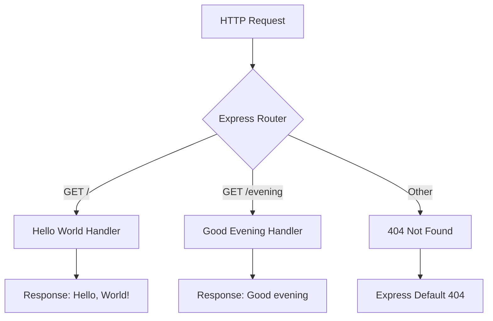

# Technical Specification

# 0. Agent Action Plan

## 0.1 Intent Clarification

This section transforms the user's feature request into precise technical requirements that guide implementation.

### 0.1.1 Core Feature Objective

Based on the prompt, the Blitzy platform understands that the new feature requirement is to:

- **Integrate Express.js Framework**: Add the Express.js web framework as a dependency to replace or augment the existing Node.js built-in `http` module implementation
- **Maintain Existing Functionality**: Preserve the current "Hello world" endpoint that responds with "Hello, World!" to ensure backward compatibility
- **Add New Endpoint**: Create an additional HTTP endpoint that returns the response "Good evening" as specified by the user

**Implicit Requirements Detected:**

- The Express.js integration should follow modern Express patterns and conventions
- The new endpoint should be accessible via a distinct route path (e.g., `/evening` or `/good-evening`)
- The existing server should maintain the same port (3000) and host configuration
- Response format should remain consistent with the existing text/plain content type pattern

**Feature Dependencies and Prerequisites:**

- Node.js runtime (v18+) must be available to support Express.js 5.x
- npm package manager for dependency installation
- No additional middleware dependencies required for this basic implementation

### 0.1.2 Special Instructions and Constraints

**User-Specified Directives:**

- User Example: `"add expressjs into the project"` - This requires installing Express.js as a project dependency
- User Example: `"add another endpoint that return the response of 'Good evening'"` - This specifies the exact response text

**Architectural Requirements:**

- Follow existing repository conventions for file organization
- Maintain backward compatibility with the existing "Hello World" response
- Use standard Express.js routing patterns for endpoint definition

**Research Requirements:**

- Express.js latest stable version verification: **v5.2.1** confirmed as current stable release
- Express.js requires Node.js 18 or higher

### 0.1.3 Technical Interpretation

These feature requirements translate to the following technical implementation strategy:

- **To integrate Express.js**, we will modify `package.json` to add Express.js as a dependency and refactor `server.js` to use Express's application factory pattern instead of the native `http.createServer()` method
- **To maintain the existing "Hello World" endpoint**, we will define an Express route handler for the root path (`/`) that responds with the existing "Hello, World!" message
- **To add the "Good evening" endpoint**, we will create an additional route handler (at path `/evening`) that responds with "Good evening" as specified
- **To ensure proper project configuration**, we will update `package-lock.json` through npm install to lock dependency versions and potentially update `package.json` scripts for better developer experience

| Requirement | Technical Action | Target Component |
|-------------|------------------|------------------|
| Add Express.js | Install via npm, import in server | `package.json`, `server.js` |
| Keep "Hello World" | Create GET route at `/` | `server.js` |
| Add "Good evening" | Create GET route at `/evening` | `server.js` |
| Maintain port 3000 | Configure Express app.listen() | `server.js` |


## 0.2 Repository Scope Discovery

This section provides a comprehensive analysis of all repository files affected by the Express.js integration feature.

### 0.2.1 Comprehensive File Analysis

**Existing Files to Modify:**

| File Path | Type | Purpose | Modification Required |
|-----------|------|---------|----------------------|
| `server.js` | Source | Main server entry point using Node.js http module | Refactor to use Express.js application pattern |
| `package.json` | Config | npm package manifest with project metadata | Add Express.js dependency, update scripts |
| `package-lock.json` | Lock | Dependency version lock file | Auto-generated upon npm install |
| `README.md` | Docs | Project documentation | Update to document new endpoints and Express usage |

**Existing Files - No Modification Required:**

| File Path | Type | Reason for Exclusion |
|-----------|------|---------------------|
| `LoginTest.java` | Java stub | Unrelated Java test harness placeholder |
| `industry.csv` | Data | Static industry taxonomy data file |
| `test.py.txt` | Placeholder | Empty Python test placeholder |
| `test.txt.txt` | Placeholder | Empty text file placeholder |
| `100Pages.pdf` | Asset | Static PDF document |
| `demo.jpg` | Asset | Static image file |
| `sample.doc` | Asset | Static document file |

**Integration Point Discovery:**

- **API Endpoints**: Current single endpoint at root `/` returning "Hello, World!" must be preserved; new endpoint `/evening` to be added
- **Server Configuration**: Port 3000 and hostname 127.0.0.1 to remain unchanged
- **Module System**: CommonJS (`require()`) pattern currently used; maintain consistency

### 0.2.2 Current Implementation Analysis

**Current `server.js` Structure:**

```javascript
const http = require('http');
// Creates server using Node.js native http module
```

**Current `package.json` Structure:**

```javascript
{
  "name": "hello_world",
  "main": "index.js"
  // No dependencies defined
}
```

### 0.2.3 New File Requirements

**New Source Files to Create:**

No new source files are required. The feature can be implemented entirely by modifying the existing `server.js` file.

**New Test Files (Recommended):**

| File Path | Purpose |
|-----------|---------|
| `test/server.test.js` | Unit tests for Express endpoints (optional enhancement) |

**New Configuration Files:**

No new configuration files are strictly required. Express.js will be added as a dependency to the existing `package.json`.

### 0.2.4 Web Search Research Conducted

The following research was conducted to inform implementation:

- **Express.js Version**: Latest stable version confirmed as 5.2.1 (published within the last week)
- **Node.js Compatibility**: Express 5.x requires Node.js 18 or higher
- **Best Practices**: Express.js standard routing pattern with `app.get()` for GET endpoints
- **Migration Pattern**: Transition from `http.createServer()` to `express()` application factory

### 0.2.5 Directory Structure Impact

**Before Implementation:**

```
/
├── server.js              (Node.js http module)
├── package.json           (No dependencies)
├── package-lock.json      (Empty dependency tree)
├── README.md
├── LoginTest.java
├── industry.csv
├── test.py.txt
├── test.txt.txt
└── [asset files]
```

**After Implementation:**

```
/
├── server.js              (Express.js application)
├── package.json           (Express dependency added)
├── package-lock.json      (Express + transitive deps)
├── node_modules/          (Installed dependencies)
│   └── express/
├── README.md              (Updated documentation)
├── LoginTest.java
├── industry.csv
├── test.py.txt
├── test.txt.txt
└── [asset files]
```


## 0.3 Dependency Inventory

This section documents all package dependencies required for the Express.js integration feature.

### 0.3.1 Private and Public Packages

**New Dependencies to Add:**

| Registry | Package Name | Version | Purpose |
|----------|-------------|---------|---------|
| npm (public) | express | ^5.2.1 | Core web framework for HTTP server and routing |

**Transitive Dependencies (Auto-installed):**

Express.js 5.x brings the following key transitive dependencies (managed automatically by npm):

| Package | Purpose |
|---------|---------|
| body-parser | Request body parsing middleware (bundled) |
| path-to-regexp | Route pattern matching |
| debug | Debugging utility |
| accepts | Content negotiation |
| content-type | Content-Type header parsing |

**Existing Dependencies:**

| Package | Version | Status |
|---------|---------|--------|
| None | - | Project currently has zero dependencies |

### 0.3.2 Dependency Updates

**Package.json Modifications:**

The following changes are required to `package.json`:

```json
{
  "dependencies": {
    "express": "^5.2.1"
  }
}
```

**Import Updates:**

Files requiring import/require updates:

| File Pattern | Update Required |
|--------------|----------------|
| `server.js` | Change from `require('http')` to `require('express')` |

**Import Transformation Rules:**

- Old: `const http = require('http');`
- New: `const express = require('express');`
- Apply to: `server.js`

### 0.3.3 External Reference Updates

**Configuration Files:**

| File | Update Type |
|------|-------------|
| `package.json` | Add dependencies section with express |
| `package-lock.json` | Auto-regenerated by npm install |

**Documentation:**

| File | Update Type |
|------|-------------|
| `README.md` | Document Express.js usage and new endpoints |

**Build Files:**

| File | Update Type |
|------|-------------|
| `package.json` | Optionally add `start` script for `node server.js` |

### 0.3.4 Version Compatibility Matrix

| Component | Minimum Version | Recommended Version | Notes |
|-----------|-----------------|---------------------|-------|
| Node.js | 18.0.0 | 20.x (LTS) | Express 5.x requirement |
| npm | 8.0.0 | 10.x+ | Modern lockfile support |
| Express.js | 5.0.0 | 5.2.1 | Latest stable release |

**Current Environment Verification:**

- Node.js version: v20.19.6 ✓ (Compatible)
- npm version: 11.1.0 ✓ (Compatible)

### 0.3.5 Installation Commands

**To install the new dependency:**

```bash
npm install express@^5.2.1
```

**Expected Changes to package-lock.json:**

The lockfile will be updated to include:
- express@5.2.1 as a direct dependency
- All transitive dependencies with locked versions
- Integrity hashes for reproducible installs


## 0.4 Integration Analysis

This section analyzes existing code touchpoints and integration requirements for the Express.js migration.

### 0.4.1 Existing Code Touchpoints

**Direct Modifications Required:**

| File | Location | Modification |
|------|----------|--------------|
| `server.js` | Lines 1-14 | Complete refactor from http module to Express application |
| `server.js` | Line 1 | Replace `require('http')` with `require('express')` |
| `server.js` | Lines 3-4 | Maintain hostname and port constants |
| `server.js` | Lines 6-10 | Convert `http.createServer()` to Express route handlers |
| `server.js` | Lines 12-14 | Update `server.listen()` to `app.listen()` |

**Current Implementation vs. Target Implementation:**

| Aspect | Current (http module) | Target (Express.js) |
|--------|----------------------|---------------------|
| Server Creation | `http.createServer(callback)` | `express()` |
| Routing | Manual URL parsing in callback | `app.get(path, handler)` |
| Response | `res.end('text')` | `res.send('text')` |
| Headers | `res.setHeader()` | Automatic content-type |
| Status Code | `res.statusCode = 200` | Default 200 or `res.status()` |

### 0.4.2 Route Mapping

**Existing Route:**

| Method | Path | Response | Handler Location |
|--------|------|----------|------------------|
| ALL | `/` (any path) | "Hello, World!\n" | `server.js:6-10` |

**Target Routes:**

| Method | Path | Response | Handler Type |
|--------|------|----------|--------------|
| GET | `/` | "Hello, World!\n" | Express route handler |
| GET | `/evening` | "Good evening" | Express route handler (new) |

### 0.4.3 Dependency Injections

**Service Registration:**

This simple implementation does not require dependency injection patterns. Express application instance serves as the central service container.

**Configuration Points:**

| Configuration | Current Value | Modification |
|---------------|---------------|--------------|
| Port | `3000` | Maintain as-is |
| Hostname | `127.0.0.1` | Maintain as-is |
| Content-Type | `text/plain` | Express auto-detects for `res.send()` |

### 0.4.4 Database/Schema Updates

**Not Applicable**: This feature does not involve database operations. The implementation is purely in-memory HTTP routing.

### 0.4.5 Middleware Considerations

**Required Middleware:**

No additional middleware is required for this basic implementation. Express.js core provides all necessary functionality.

**Optional Future Middleware:**

| Middleware | Purpose | Status |
|------------|---------|--------|
| `express.json()` | JSON body parsing | Not required |
| `express.urlencoded()` | Form data parsing | Not required |
| `morgan` | HTTP request logging | Optional enhancement |

### 0.4.6 Integration Flow Diagram



### 0.4.7 Backward Compatibility Analysis

**Preserved Behaviors:**

- Root endpoint `/` continues to return "Hello, World!\n"
- Server listens on same port (3000) and host (127.0.0.1)
- Console log message format preserved
- HTTP GET requests supported

**Behavioral Changes:**

| Behavior | Before | After |
|----------|--------|-------|
| Unknown routes | Returns "Hello, World!" for all paths | Returns 404 for unmatched routes |
| HTTP methods | All methods return same response | Only GET routes are defined |
| Content-Type | Explicit `text/plain` | Auto-detected by Express |


## 0.5 Technical Implementation

This section provides the file-by-file execution plan for implementing the Express.js integration feature.

### 0.5.1 File-by-File Execution Plan

**CRITICAL**: Every file listed below MUST be created or modified as specified.

**Group 1 - Core Dependency Setup:**

| Action | File | Purpose |
|--------|------|---------|
| MODIFY | `package.json` | Add Express.js dependency to dependencies section |
| REGENERATE | `package-lock.json` | Lock Express.js and transitive dependency versions |

**Group 2 - Server Implementation:**

| Action | File | Purpose |
|--------|------|---------|
| MODIFY | `server.js` | Refactor from http module to Express.js application with two route handlers |

**Group 3 - Documentation:**

| Action | File | Purpose |
|--------|------|---------|
| MODIFY | `README.md` | Document new Express.js setup and available endpoints |

### 0.5.2 Detailed Implementation Specifications

**File: `package.json`**

- Add `dependencies` object with Express.js entry
- Optionally add `start` script for improved developer experience

```json
{
  "dependencies": {
    "express": "^5.2.1"
  },
  "scripts": {
    "start": "node server.js"
  }
}
```

**File: `server.js`**

Complete replacement implementation:

```javascript
const express = require('express');
const app = express();
```

Route handlers to implement:
- `app.get('/', ...)` - Returns "Hello, World!\n"
- `app.get('/evening', ...)` - Returns "Good evening"

Server startup:
- `app.listen(3000, '127.0.0.1', callback)`

**File: `README.md`**

Add documentation section covering:
- How to install dependencies (`npm install`)
- How to start the server (`node server.js` or `npm start`)
- Available endpoints with expected responses

### 0.5.3 Implementation Approach per File

| Phase | Activity | Files Affected |
|-------|----------|----------------|
| 1 | Install Express dependency | `package.json`, `package-lock.json` |
| 2 | Refactor server implementation | `server.js` |
| 3 | Verify functionality | Runtime testing |
| 4 | Update documentation | `README.md` |

### 0.5.4 Server Implementation Pattern

**Express Application Factory Pattern:**

```javascript
const express = require('express');
const app = express();
```

**Route Handler Pattern:**

```javascript
app.get('/path', (req, res) => {
  res.send('Response text');
});
```

**Server Startup Pattern:**

```javascript
app.listen(port, hostname, () => {
  console.log(`Server running...`);
});
```

### 0.5.5 Expected Runtime Behavior

**Endpoint Testing Matrix:**

| Request | Expected Response | Status Code |
|---------|-------------------|-------------|
| `GET /` | "Hello, World!\n" | 200 |
| `GET /evening` | "Good evening" | 200 |
| `GET /unknown` | Express 404 page | 404 |
| `POST /` | Express 404 (method not allowed pattern) | 404 |

**Console Output:**

```
Server running at http://127.0.0.1:3000/
```

### 0.5.6 Validation Commands

**Install dependencies:**

```bash
npm install
```

**Start server:**

```bash
node server.js
```

**Test endpoints:**

```bash
curl http://127.0.0.1:3000/
curl http://127.0.0.1:3000/evening
```

**Expected test outputs:**

```
Hello, World!
Good evening
```


## 0.6 Scope Boundaries

This section defines the explicit boundaries of what is included and excluded from this feature implementation.

### 0.6.1 Exhaustively In Scope

**Source Files:**

| File Pattern | Scope Description |
|--------------|-------------------|
| `server.js` | Complete refactoring to Express.js application |
| `package.json` | Add Express.js dependency and optional scripts |
| `package-lock.json` | Regenerate with Express dependency tree |

**Documentation Files:**

| File Pattern | Scope Description |
|--------------|-------------------|
| `README.md` | Update with Express setup and endpoint documentation |

**Configuration Changes:**

| Configuration | Scope Description |
|---------------|-------------------|
| Dependencies | Add `express@^5.2.1` |
| Scripts (optional) | Add `start` script |

**Endpoints:**

| Endpoint | Method | Response | Status |
|----------|--------|----------|--------|
| `/` | GET | "Hello, World!\n" | Modify existing |
| `/evening` | GET | "Good evening" | Create new |

**Runtime Artifacts:**

| Artifact | Scope Description |
|----------|-------------------|
| `node_modules/` | Generated upon `npm install` |
| `node_modules/express/**` | Express.js framework files |

### 0.6.2 Explicitly Out of Scope

**Unrelated Files - No Modification:**

| File | Reason for Exclusion |
|------|---------------------|
| `LoginTest.java` | Java test stub unrelated to Node.js server |
| `industry.csv` | Static data file with no server relationship |
| `test.py.txt` | Empty Python placeholder file |
| `test.txt.txt` | Empty text placeholder file |
| `100Pages.pdf` | Static PDF asset |
| `demo.jpg` | Static image asset |
| `sample.doc` | Static document asset |

**Features Not Included:**

| Feature | Reason for Exclusion |
|---------|---------------------|
| Database integration | Not requested by user |
| Authentication/Authorization | Not requested by user |
| Additional middleware | Not required for basic endpoints |
| Unit/Integration tests | Not explicitly requested |
| Docker containerization | Not requested by user |
| CI/CD configuration | Not requested by user |
| Environment configuration (.env) | Not required for simple implementation |
| Error handling middleware | Basic Express defaults sufficient |
| Logging middleware | Not explicitly requested |
| CORS configuration | Not required for localhost testing |

**Architectural Changes Excluded:**

| Change | Reason for Exclusion |
|--------|---------------------|
| TypeScript migration | Not requested |
| ES Modules conversion | Maintain CommonJS for consistency |
| Route modularization | Single file sufficient for two endpoints |
| Middleware extraction | Not needed for basic implementation |
| Configuration externalization | Hard-coded values acceptable |

### 0.6.3 Boundary Conditions

**Port Configuration:**

- IN SCOPE: Maintain port 3000 as currently configured
- OUT OF SCOPE: Environment-based port configuration

**Response Format:**

- IN SCOPE: Plain text responses as specified
- OUT OF SCOPE: JSON response formatting, content negotiation

**HTTP Methods:**

- IN SCOPE: GET method for both endpoints
- OUT OF SCOPE: POST, PUT, DELETE, PATCH method handlers

**Error Handling:**

- IN SCOPE: Express default 404 handling
- OUT OF SCOPE: Custom error pages, error logging

### 0.6.4 Acceptance Criteria

The implementation is considered complete when:

- [ ] Express.js is installed as a project dependency
- [ ] `GET /` returns "Hello, World!\n" with status 200
- [ ] `GET /evening` returns "Good evening" with status 200
- [ ] Server starts successfully on port 3000
- [ ] Console outputs server running message
- [ ] No breaking changes to existing functionality


## 0.7 Special Instructions

This section captures feature-specific requirements and implementation guidelines explicitly emphasized by the user.

### 0.7.1 Feature-Specific Requirements

**User-Specified Patterns to Follow:**

- Maintain the existing "Hello world" functionality while adding Express.js
- The new endpoint must return exactly "Good evening" as specified
- Integration should be additive, not destructive to existing behavior

**Integration Requirements with Existing Features:**

| Existing Feature | Integration Approach |
|------------------|---------------------|
| "Hello, World!" endpoint | Preserve response text, convert to Express route |
| Port 3000 configuration | Maintain existing port binding |
| Console logging | Preserve startup message format |

**Performance Considerations:**

Express.js introduces minimal overhead compared to the native http module:
- Slightly higher memory footprint due to framework
- Route matching adds negligible latency
- Acceptable trade-off for improved developer experience and maintainability

**Security Requirements:**

| Requirement | Implementation |
|-------------|----------------|
| No sensitive data exposure | Responses contain only static text |
| Input validation | Not required (no user input accepted) |
| HTTPS | Out of scope (localhost development) |

### 0.7.2 Response Text Specifications

**CRITICAL - Exact Response Requirements:**

| Endpoint | Exact Response Text | Notes |
|----------|---------------------|-------|
| `/` | `Hello, World!\n` | Include newline character for consistency with original |
| `/evening` | `Good evening` | As specified by user, no trailing newline unless preferred |

### 0.7.3 Code Style Guidelines

**Maintain Existing Conventions:**

| Convention | Current Style | Maintain |
|------------|---------------|----------|
| Module system | CommonJS (`require()`) | Yes |
| Quotes | Single quotes | Yes |
| Semicolons | Yes | Yes |
| Indentation | 2 spaces | Yes |
| Variable declaration | `const` | Yes |

**Express-Specific Patterns:**

```javascript
const express = require('express');
const app = express();
```

### 0.7.4 Testing Recommendations

**Manual Testing Steps:**

1. Install dependencies: `npm install`
2. Start server: `node server.js`
3. Test root endpoint: `curl http://127.0.0.1:3000/`
4. Test evening endpoint: `curl http://127.0.0.1:3000/evening`
5. Verify responses match specifications

**Expected Test Results:**

```bash
$ curl http://127.0.0.1:3000/
Hello, World!

$ curl http://127.0.0.1:3000/evening
Good evening
```

### 0.7.5 Migration Notes

**From Native http to Express.js:**

| Before (http module) | After (Express.js) |
|----------------------|-------------------|
| `http.createServer((req, res) => {...})` | `express()` with route handlers |
| `res.statusCode = 200` | Automatic (default 200) |
| `res.setHeader('Content-Type', 'text/plain')` | Automatic content detection |
| `res.end('text')` | `res.send('text')` |
| All requests → same handler | Route-specific handlers |

### 0.7.6 Rollback Strategy

If issues arise, rollback procedure:

1. Remove Express dependency: `npm uninstall express`
2. Restore original `server.js` implementation
3. Remove `node_modules/` directory
4. Run `npm install` to regenerate clean state

**Original server.js for reference:**

```javascript
const http = require('http');
const hostname = '127.0.0.1';
const port = 3000;
```

### 0.7.7 Post-Implementation Verification Checklist

| Verification Step | Command | Expected Result |
|-------------------|---------|-----------------|
| Dependencies installed | `npm ls express` | express@5.2.1 listed |
| Server starts | `node server.js` | Console: "Server running..." |
| Root endpoint works | `curl localhost:3000/` | "Hello, World!" |
| Evening endpoint works | `curl localhost:3000/evening` | "Good evening" |
| Unknown route handling | `curl localhost:3000/unknown` | 404 response |


